# Table of Contents

1. [Introduction](#intro)
1. [Data preprocessing](#dat_pre)
    1. [Importing the data](#import)
    1. [Creating data columns](#create_col)
    1. [Census Data](#census)
        1. [New York City Population by Borough, 1950 - 2040](#nyopen)
1. [Exploratory Data Analysis](#eda)
    1. [Info and Summary](#basics)
    1. [Pair Plot](#pair_plot)
    1. [Correlation Matrix](#corr)
    1. [Racial and ethnic diversity of NYC boroughs](#race_bor)
        1. [Absolute population values](#abs_pop)
        1. [Relative population values](#rel_pop)
    1. [Population of NYC over time](#pop_change)
1. [Complaints per Officer and per Precinct](#complaints)
    1. [Absolute number and relative proportion of complaints](#abs_comp)
    1. [Complaints broken down by race](#comp_race)
        1. [Race of complainants](#race_complainants)
        1. [Race of officers](#race_officers)
1. [Complaints over the years](#comp_years)
    1. [Absolute number and relative proportion of complaints](#abs_comp_yr)
    1. [Absolute and relative number of Complaints per borough](#comp_boro_person)
         1. [Absolute number of complaints](#comp_boro_person_abs)
         1. [Relative number of complaints](#comp_boro_person_rel)
1. [Officers with most complaints](#top_offend)
    1. [First Officer](#offend1)
    1. [Second Officer](#offend2)
    1. [Officers with top 5% of complaints](#top10)
1. [Conclusion](#conclu)

# Civilian Complaints Against NYC Police Officers from 1985-2020
### DATS 6103 Individual Project 3
### Izzy Illari (GWID: G38518463)
## Introduction
<a id = "intro"></a>

This data has been taken from the following <a href="https://www.kaggle.com/mrmorj/civilian-complaints-against-nyc-police-officers">kaggle dataset</a> which states:

<blockquote>After New York state repealed the statute that kept police disciplinary records secret, known as 50-a, ProPublica filed a records request with New York City’s Civilian Complaint Review Board, which investigates complaints by the public about NYPD officers. The board provided us with records about closed cases for every police officer still on the force as of late June 2020 who had at least one substantiated allegation against them. The records span decades, from September 1985 to January 2020.</blockquote>

Each record lists:
1. name, 
1. shield number, 
1. rank of officer as of today and at the time of the incident, 
1. precinct of officer as of today and at the time of the incident,
1. age, race, and gender of the complainant, 
1. age, race, and gender of the officer,
1. category describing the alleged misconduct,
1. whether the CCRB concluded the officers’ conduct violated NYPD rules

Currently in the USA we are experiencing another surge of BLM protests that echoes the movements that started back during the Obama administration in 2013. The BLM movement speaks out against the police brutality and systemic racism that has caused the deaths of Black Americans such as Trayvon Martin, Sandra Bland, Tamir Rice, Eric Garner, George Floyd, Breonna Taylor, and many more. The BLM movement has brought the public's attention to the thousands of violent incidents that happen to Black Americans that are not seen and not heard. For incidents that are recorded, we can turn to police reports. 

Although these police reports are insufficient in analyzing the sheer breadth of police encounters that Black Americans must endure with on a daily basis, this does give us a place to start: do the numbers prove what the BLM movement states, and are Black Americans forced to endure more incidents with the police than any other racial and ethnic groups? 

For this project I focus on the number one most populous city in the USA: NYC. NYC is incredibly racially diverse, and each of the five boroughs have different racial and ethnic populations. It is the aim of this project to analyze the available data of incidents with the NYPD and see if any patterns arise from the data that might support the conclusion that Black Americans are disproportionately targeted by the police.

# Data preprocessing
<a id = "dat_pre"></a>

## Importing the data
<a id = "import"></a>


```python
import os
import pandas as pd

# get current working idrectory
path = os.getcwd()
# get path of allegations_202007271729.csv
allegations_path = os.path.join(path, "archive/", "allegations_202007271729.csv")
# create dataframe from the csv
df_allegations = pd.read_csv(allegations_path)
# look at top of csv
df_allegations.head()
```


<div>
<style scoped>
    .dataframe tbody tr th:only-of-type {
        vertical-align: middle;
    }

    .dataframe tbody tr th {
        vertical-align: top;
    }

    .dataframe thead th {
        text-align: right;
    }
</style>
<table border="1" class="dataframe">
  <thead>
    <tr style="text-align: right;">
      <th></th>
      <th>unique_mos_id</th>
      <th>first_name</th>
      <th>last_name</th>
      <th>command_now</th>
      <th>shield_no</th>
      <th>complaint_id</th>
      <th>month_received</th>
      <th>year_received</th>
      <th>month_closed</th>
      <th>year_closed</th>
      <th>...</th>
      <th>mos_age_incident</th>
      <th>complainant_ethnicity</th>
      <th>complainant_gender</th>
      <th>complainant_age_incident</th>
      <th>fado_type</th>
      <th>allegation</th>
      <th>precinct</th>
      <th>contact_reason</th>
      <th>outcome_description</th>
      <th>board_disposition</th>
    </tr>
  </thead>
  <tbody>
    <tr>
      <th>0</th>
      <td>10004</td>
      <td>Jonathan</td>
      <td>Ruiz</td>
      <td>078 PCT</td>
      <td>8409</td>
      <td>42835</td>
      <td>7</td>
      <td>2019</td>
      <td>5</td>
      <td>2020</td>
      <td>...</td>
      <td>32</td>
      <td>Black</td>
      <td>Female</td>
      <td>38.0</td>
      <td>Abuse of Authority</td>
      <td>Failure to provide RTKA card</td>
      <td>78.0</td>
      <td>Report-domestic dispute</td>
      <td>No arrest made or summons issued</td>
      <td>Substantiated (Command Lvl Instructions)</td>
    </tr>
    <tr>
      <th>1</th>
      <td>10007</td>
      <td>John</td>
      <td>Sears</td>
      <td>078 PCT</td>
      <td>5952</td>
      <td>24601</td>
      <td>11</td>
      <td>2011</td>
      <td>8</td>
      <td>2012</td>
      <td>...</td>
      <td>24</td>
      <td>Black</td>
      <td>Male</td>
      <td>26.0</td>
      <td>Discourtesy</td>
      <td>Action</td>
      <td>67.0</td>
      <td>Moving violation</td>
      <td>Moving violation summons issued</td>
      <td>Substantiated (Charges)</td>
    </tr>
    <tr>
      <th>2</th>
      <td>10007</td>
      <td>John</td>
      <td>Sears</td>
      <td>078 PCT</td>
      <td>5952</td>
      <td>24601</td>
      <td>11</td>
      <td>2011</td>
      <td>8</td>
      <td>2012</td>
      <td>...</td>
      <td>24</td>
      <td>Black</td>
      <td>Male</td>
      <td>26.0</td>
      <td>Offensive Language</td>
      <td>Race</td>
      <td>67.0</td>
      <td>Moving violation</td>
      <td>Moving violation summons issued</td>
      <td>Substantiated (Charges)</td>
    </tr>
    <tr>
      <th>3</th>
      <td>10007</td>
      <td>John</td>
      <td>Sears</td>
      <td>078 PCT</td>
      <td>5952</td>
      <td>26146</td>
      <td>7</td>
      <td>2012</td>
      <td>9</td>
      <td>2013</td>
      <td>...</td>
      <td>25</td>
      <td>Black</td>
      <td>Male</td>
      <td>45.0</td>
      <td>Abuse of Authority</td>
      <td>Question</td>
      <td>67.0</td>
      <td>PD suspected C/V of violation/crime - street</td>
      <td>No arrest made or summons issued</td>
      <td>Substantiated (Charges)</td>
    </tr>
    <tr>
      <th>4</th>
      <td>10009</td>
      <td>Noemi</td>
      <td>Sierra</td>
      <td>078 PCT</td>
      <td>24058</td>
      <td>40253</td>
      <td>8</td>
      <td>2018</td>
      <td>2</td>
      <td>2019</td>
      <td>...</td>
      <td>39</td>
      <td>NaN</td>
      <td>NaN</td>
      <td>16.0</td>
      <td>Force</td>
      <td>Physical force</td>
      <td>67.0</td>
      <td>Report-dispute</td>
      <td>Arrest - other violation/crime</td>
      <td>Substantiated (Command Discipline A)</td>
    </tr>
  </tbody>
</table>
<p>5 rows × 27 columns</p>
</div>


For the `CCRB Data Layout Table` we will need to import the individual sheets from the excel file.import os


```python
# get path of CCRB Data Layout Table.xlsx
ccrb_path = os.path.join(path, "archive/", "CCRB Data Layout Table.xlsx")
# excel file class to read in the xlsx file using path
xl = pd.ExcelFile(ccrb_path)
# get all the sheet names in the xlsx file
sheet_names = xl.sheet_names
sheet_names
```


    ['Layout', 'Rank Abbrevs', 'Command Abbrevs', 'FADO', 'Dispositions']


```python
# create an empty list of datafreames
df_ccrb_list = [None] * len(sheet_names)
# loop through all the sheet names
for i in range(len(sheet_names)):
    # create df from sheet name
    df_temp = pd.read_excel(ccrb_path, sheet_names[i])
    # add temporary df to the list
    df_ccrb_list[i] = df_temp
    print("Dataframe for sheet name", sheet_names[i], ":")
    print()
    print(df_ccrb_list[i].head())
    print("*" * 100)
```

    Dataframe for sheet name Layout :
    
          field name                                      description   glossary
    0  unique_mos_id  unique ID of the officer ("member of service")         NaN
    1     first_name                             Officer's first name        NaN
    2      last_name                              Officer's last name        NaN
    3    command_now     Officer's command assignment as of July 2020  See Tab 3
    4   complaint_id                       Unique ID of the complaint        NaN
    ****************************************************************************************************
    Dataframe for sheet name Rank Abbrevs :
    
      Abbreviation                               Rank
    0          POM                     Police Officer
    1          POF                     Police Officer
    2           PO                     Police Officer
    3          PSA  Police Officer Special Assignment
    4          SGT                           Sergeant
    ****************************************************************************************************
    Dataframe for sheet name Command Abbrevs :
    
      Abbreviation               Command Name
    0        C R C  Critical Response Command
    1      WARRSEC            Warrant Section
    2      075 PCT               075 Precinct
    3       I.A.B.    Internal Affairs Bureau
    4      046 PCT               046 Precinct
    ****************************************************************************************************
    Dataframe for sheet name FADO :
    
            FADO Category  Allegation type  Count of records
    0  Offensive Language            Black                56
    1  Offensive Language        Ethnicity                84
    2  Offensive Language           Gender               115
    3  Offensive Language  Gender Identity                 4
    4  Offensive Language         Hispanic                 9
    ****************************************************************************************************
    Dataframe for sheet name Dispositions :
    
           Disposition                                        Description
    0    Substantiated  The alleged conduct occurred and it violated t...
    1       Exonerated  The alleged conduct occurred but did not viola...
    2  Unsubstantiated  The CCRB has fully investigated but could not ...
    ****************************************************************************************************


The `CCRB Data Layout Table` is needed to explain some of the abbreviations and categories in `allegations_202007271729.csv`, which is why we have imported it. 

## Creating data columns
<a id = "create_col"></a>

Now we're going to create a few new columns. One of these columns will be a full name. Another will be the full date the complaint was received and the full date the incident was closed.


```python
# empty list the length of the number of row in allegations
full_name_all = [None] * len(df_allegations) 
date_received = [None] * len(df_allegations)
date_closed = [None] * len(df_allegations)
for i in range(len(df_allegations)):
    # combine first and last name
    full_name_all[i] = df_allegations.first_name[i] + " " + df_allegations.last_name[i]
    # combine year and month received
    date_received[i] = str(df_allegations.year_received[i]) + "-" + str(df_allegations.month_received[i])
    # combine year and month closed
    date_closed[i] = str(df_allegations.year_closed[i]) + "-" + str(df_allegations.month_closed[i])
# find column number of last name
insert_loc_name = df_allegations.columns.get_loc("last_name")+1
# insert full name after last name column
df_allegations.insert(insert_loc_name, "full_name", full_name_all)
# get location of year_received
insert_loc_rec = df_allegations.columns.get_loc("year_received")+1
# insert date_received after year_receive column
df_allegations.insert(insert_loc_rec, "date_received", date_received)
# get location of year_closed column
insert_loc_close = df_allegations.columns.get_loc("year_closed")+1
# insert date_closed after year_closed column
df_allegations.insert(insert_loc_close, "date_closed", date_closed)
df_allegations.head()
```


<div>
<style scoped>
    .dataframe tbody tr th:only-of-type {
        vertical-align: middle;
    }

    .dataframe tbody tr th {
        vertical-align: top;
    }

    .dataframe thead th {
        text-align: right;
    }
</style>
<table border="1" class="dataframe">
  <thead>
    <tr style="text-align: right;">
      <th></th>
      <th>unique_mos_id</th>
      <th>first_name</th>
      <th>last_name</th>
      <th>full_name</th>
      <th>command_now</th>
      <th>shield_no</th>
      <th>complaint_id</th>
      <th>month_received</th>
      <th>year_received</th>
      <th>date_received</th>
      <th>...</th>
      <th>mos_age_incident</th>
      <th>complainant_ethnicity</th>
      <th>complainant_gender</th>
      <th>complainant_age_incident</th>
      <th>fado_type</th>
      <th>allegation</th>
      <th>precinct</th>
      <th>contact_reason</th>
      <th>outcome_description</th>
      <th>board_disposition</th>
    </tr>
  </thead>
  <tbody>
    <tr>
      <th>0</th>
      <td>10004</td>
      <td>Jonathan</td>
      <td>Ruiz</td>
      <td>Jonathan Ruiz</td>
      <td>078 PCT</td>
      <td>8409</td>
      <td>42835</td>
      <td>7</td>
      <td>2019</td>
      <td>2019-7</td>
      <td>...</td>
      <td>32</td>
      <td>Black</td>
      <td>Female</td>
      <td>38.0</td>
      <td>Abuse of Authority</td>
      <td>Failure to provide RTKA card</td>
      <td>78.0</td>
      <td>Report-domestic dispute</td>
      <td>No arrest made or summons issued</td>
      <td>Substantiated (Command Lvl Instructions)</td>
    </tr>
    <tr>
      <th>1</th>
      <td>10007</td>
      <td>John</td>
      <td>Sears</td>
      <td>John Sears</td>
      <td>078 PCT</td>
      <td>5952</td>
      <td>24601</td>
      <td>11</td>
      <td>2011</td>
      <td>2011-11</td>
      <td>...</td>
      <td>24</td>
      <td>Black</td>
      <td>Male</td>
      <td>26.0</td>
      <td>Discourtesy</td>
      <td>Action</td>
      <td>67.0</td>
      <td>Moving violation</td>
      <td>Moving violation summons issued</td>
      <td>Substantiated (Charges)</td>
    </tr>
    <tr>
      <th>2</th>
      <td>10007</td>
      <td>John</td>
      <td>Sears</td>
      <td>John Sears</td>
      <td>078 PCT</td>
      <td>5952</td>
      <td>24601</td>
      <td>11</td>
      <td>2011</td>
      <td>2011-11</td>
      <td>...</td>
      <td>24</td>
      <td>Black</td>
      <td>Male</td>
      <td>26.0</td>
      <td>Offensive Language</td>
      <td>Race</td>
      <td>67.0</td>
      <td>Moving violation</td>
      <td>Moving violation summons issued</td>
      <td>Substantiated (Charges)</td>
    </tr>
    <tr>
      <th>3</th>
      <td>10007</td>
      <td>John</td>
      <td>Sears</td>
      <td>John Sears</td>
      <td>078 PCT</td>
      <td>5952</td>
      <td>26146</td>
      <td>7</td>
      <td>2012</td>
      <td>2012-7</td>
      <td>...</td>
      <td>25</td>
      <td>Black</td>
      <td>Male</td>
      <td>45.0</td>
      <td>Abuse of Authority</td>
      <td>Question</td>
      <td>67.0</td>
      <td>PD suspected C/V of violation/crime - street</td>
      <td>No arrest made or summons issued</td>
      <td>Substantiated (Charges)</td>
    </tr>
    <tr>
      <th>4</th>
      <td>10009</td>
      <td>Noemi</td>
      <td>Sierra</td>
      <td>Noemi Sierra</td>
      <td>078 PCT</td>
      <td>24058</td>
      <td>40253</td>
      <td>8</td>
      <td>2018</td>
      <td>2018-8</td>
      <td>...</td>
      <td>39</td>
      <td>NaN</td>
      <td>NaN</td>
      <td>16.0</td>
      <td>Force</td>
      <td>Physical force</td>
      <td>67.0</td>
      <td>Report-dispute</td>
      <td>Arrest - other violation/crime</td>
      <td>Substantiated (Command Discipline A)</td>
    </tr>
  </tbody>
</table>
<p>5 rows × 30 columns</p>
</div>


```python
print("The smallest precinct number is", min(df_allegations.precinct))
print("The largest precinct number is", max(df_allegations.precinct))
```

    The smallest precinct number is 0.0
    The largest precinct number is 1000.0


There is an odd case where a few of the offices have their precinct labelled as `1000` or `0`. There are only 77 police precincts in NYC. The highest number is the 123rd Precinct on Staten Island and the smallest number is the 1st Precinct in Manhattan. I'm going to remove row where `precinct == 1000` and `precinct == 0` because I am not sure which precinct this is supposed to be refering to (it could be an internal number being used to reference a specific entity within the NYPD structure). 


```python
# get rid of rows with the 1000
df_allegations = df_allegations[df_allegations.precinct != 1000]
df_allegations = df_allegations[df_allegations.precinct != 0]
# get rid of rows with the 0
print("The smallest precinct number is", min(df_allegations.precinct))
print("The largest precinct number is", max(df_allegations.precinct))
```

    The smallest precinct number is 1.0
    The largest precinct number is 123.0


Now this makes sense! We see that by removing 1000 and 0 we are left with the 123rd Precinct and the 1st Precinct, which is what we expected in the first place.

I'm going to make a new column for `borough`, which will represent the df.name.unique() in which the precinct of the complain was filed. 


```python
# look at the unique values 
df_allegations.precinct.unique()
```


    array([ 78.,  67.,  79.,  77.,  81.,  73.,  90.,  75., 120.,  10.,  25.,
           110.,  83.,  46.,   9.,  28.,   1.,  68.,  70.,  72., 122., 113.,
           101., 100.,   7.,  13.,  71.,  23., 112.,  69.,  32.,  94.,  63.,
            76.,  52.,  47.,  62.,  42.,  84., 115., 109.,   5.,  88.,  14.,
           103., 107., 104.,  40., 108.,  50.,  45.,  18., 102., 114.,  19.,
            20., 106., 105.,  17.,  60.,  34.,  44.,  48.,  41.,  43., 111.,
            49.,  26.,  30.,  33.,   6.,  61., 123., 121.,  66.,  24.,  22.,
            nan])


```python
def borough_conditions(df_in, column_name):
    """
    function to create a list of conditions for boroughs based on a number in precinct

    Parameters
    ----------
    df_in: input dataframe
    column_name: feature name
    
    Returns
    ----------
    conditions: list of conditions via which we will create a new datacolumn based upon these results
    """
    conditions = [
        (df_in[column_name] <= 34), # Manhattan
        (df_in[column_name] >= 40) & (df_in[column_name] <= 52), # Bronx
        (df_in[column_name] >= 60) & (df_in[column_name] <= 94), # Brooklyn
        (df_in[column_name] >= 100) & (df_in[column_name] <= 115), # Queens
        (df_in[column_name] >= 120) & (df_in[column_name] <= 123) # Staten Island
    ]
    return conditions
```


```python
import numpy as np

# set the conditions
cond_borough = borough_conditions(df_allegations, "precinct")
# create a list with the boroughs we will assign to each condition
borough_names = ["Manhattan", "Bronx", "Brooklyn", "Queens", "Staten Island"]
# get location of precinct column
insert_loc_prec = df_allegations.columns.get_loc("precinct")+1
# create a new column and use np.select to assign values to it using our lists as arguments
df_allegations["borough"] = np.select(cond_borough, borough_names)
# replace 0
df_allegations["borough"] = df_allegations["borough"].replace({"0":np.nan, 0:np.nan})
# look at uniques
df_allegations.borough.unique()
```


    array(['Brooklyn', 'Staten Island', 'Manhattan', 'Queens', 'Bronx', nan],
          dtype=object)


Okay, it looks like that worked! We now have the borough associated with the precincts. 

## Census Data
<a id = "census"></a>

Now let's import the `County Population by Characteristics: 2010-2019` from <a href="https://www.census.gov/data/tables/time-series/demo/popest/2010s-counties-detail.html">The US Census</a>. This data contains the Annual County Resident Population Estimates by Age, Sex, Race, and Hispanic Origin from April 1, 2010 to July 1, 2019 (`cc-est2019-alldata-36.csv`). This csv file is going to need serious reformatting to get the information that I want, but it will be interesting to see the demographics of the boroughs and what conclusions we can draw when compared to the NYPC officer complaints.


```python
# get path of cc-est2019-alldata-36.csv
census_path = os.path.join(path, "archive/", "cc-est2019-alldata-36.csv")
# create dataframe from the csv
df_census = pd.read_csv(census_path)
# look at top of csv
df_census.head()
```


<div>
<style scoped>
    .dataframe tbody tr th:only-of-type {
        vertical-align: middle;
    }

    .dataframe tbody tr th {
        vertical-align: top;
    }

    .dataframe thead th {
        text-align: right;
    }
</style>
<table border="1" class="dataframe">
  <thead>
    <tr style="text-align: right;">
      <th></th>
      <th>SUMLEV</th>
      <th>STATE</th>
      <th>COUNTY</th>
      <th>STNAME</th>
      <th>CTYNAME</th>
      <th>YEAR</th>
      <th>AGEGRP</th>
      <th>TOT_POP</th>
      <th>TOT_MALE</th>
      <th>TOT_FEMALE</th>
      <th>...</th>
      <th>HWAC_MALE</th>
      <th>HWAC_FEMALE</th>
      <th>HBAC_MALE</th>
      <th>HBAC_FEMALE</th>
      <th>HIAC_MALE</th>
      <th>HIAC_FEMALE</th>
      <th>HAAC_MALE</th>
      <th>HAAC_FEMALE</th>
      <th>HNAC_MALE</th>
      <th>HNAC_FEMALE</th>
    </tr>
  </thead>
  <tbody>
    <tr>
      <th>0</th>
      <td>50</td>
      <td>36</td>
      <td>1</td>
      <td>New York</td>
      <td>Albany County</td>
      <td>1</td>
      <td>0</td>
      <td>304204</td>
      <td>147076</td>
      <td>157128</td>
      <td>...</td>
      <td>5236</td>
      <td>5416</td>
      <td>2125</td>
      <td>2295</td>
      <td>361</td>
      <td>410</td>
      <td>139</td>
      <td>141</td>
      <td>41</td>
      <td>41</td>
    </tr>
    <tr>
      <th>1</th>
      <td>50</td>
      <td>36</td>
      <td>1</td>
      <td>New York</td>
      <td>Albany County</td>
      <td>1</td>
      <td>1</td>
      <td>15286</td>
      <td>7821</td>
      <td>7465</td>
      <td>...</td>
      <td>488</td>
      <td>514</td>
      <td>288</td>
      <td>277</td>
      <td>44</td>
      <td>40</td>
      <td>18</td>
      <td>12</td>
      <td>5</td>
      <td>3</td>
    </tr>
    <tr>
      <th>2</th>
      <td>50</td>
      <td>36</td>
      <td>1</td>
      <td>New York</td>
      <td>Albany County</td>
      <td>1</td>
      <td>2</td>
      <td>16131</td>
      <td>8224</td>
      <td>7907</td>
      <td>...</td>
      <td>452</td>
      <td>443</td>
      <td>275</td>
      <td>258</td>
      <td>31</td>
      <td>36</td>
      <td>15</td>
      <td>11</td>
      <td>5</td>
      <td>3</td>
    </tr>
    <tr>
      <th>3</th>
      <td>50</td>
      <td>36</td>
      <td>1</td>
      <td>New York</td>
      <td>Albany County</td>
      <td>1</td>
      <td>3</td>
      <td>17639</td>
      <td>9065</td>
      <td>8574</td>
      <td>...</td>
      <td>448</td>
      <td>435</td>
      <td>230</td>
      <td>204</td>
      <td>33</td>
      <td>28</td>
      <td>13</td>
      <td>12</td>
      <td>2</td>
      <td>1</td>
    </tr>
    <tr>
      <th>4</th>
      <td>50</td>
      <td>36</td>
      <td>1</td>
      <td>New York</td>
      <td>Albany County</td>
      <td>1</td>
      <td>4</td>
      <td>23752</td>
      <td>11925</td>
      <td>11827</td>
      <td>...</td>
      <td>632</td>
      <td>627</td>
      <td>271</td>
      <td>283</td>
      <td>50</td>
      <td>46</td>
      <td>16</td>
      <td>15</td>
      <td>4</td>
      <td>6</td>
    </tr>
  </tbody>
</table>
<p>5 rows × 80 columns</p>
</div>


```python
df_census.shape
```


    (14136, 80)


According to the key for the YEAR variable, a year of 12 means a 7/1/2019 population estimate. We will only look at the 2019 estimates. We will also only be looking at the 5 boroughs. However, this data is sorted by county name, meaning we will need to look at the Bronx County (Bronx),  Kings County (Brooklyn), Queens County (Queens), New York County (Manhattan), and Richmond County (Staten Island). An Age Group of 0 is the population across all ages, which will also be the only age group that we will keep. There are a few columns that I will be combing as well, but first let's reduce the rows before tackling the columns.


```python
# filter for 2019 data
df_census = df_census[df_census["YEAR"] == 12] 
# filter for all combined age groups
df_census = df_census[df_census["AGEGRP"] == 0]
# condition for the relevant counties
condition_counties = [
    "Bronx County", 
    "Kings County",
    "Queens County",
    "New York County",
    "Richmond County"
]
# loop through counties
df_counties = pd.DataFrame(columns = list(df_census.columns))
for i in range(len(condition_counties)):
    df_temp = df_census[df_census["CTYNAME"] == condition_counties[i]]
    df_counties = pd.concat([df_counties, df_temp], ignore_index=True)
df_counties
```


<div>
<style scoped>
    .dataframe tbody tr th:only-of-type {
        vertical-align: middle;
    }

    .dataframe tbody tr th {
        vertical-align: top;
    }

    .dataframe thead th {
        text-align: right;
    }
</style>
<table border="1" class="dataframe">
  <thead>
    <tr style="text-align: right;">
      <th></th>
      <th>SUMLEV</th>
      <th>STATE</th>
      <th>COUNTY</th>
      <th>STNAME</th>
      <th>CTYNAME</th>
      <th>YEAR</th>
      <th>AGEGRP</th>
      <th>TOT_POP</th>
      <th>TOT_MALE</th>
      <th>TOT_FEMALE</th>
      <th>...</th>
      <th>HWAC_MALE</th>
      <th>HWAC_FEMALE</th>
      <th>HBAC_MALE</th>
      <th>HBAC_FEMALE</th>
      <th>HIAC_MALE</th>
      <th>HIAC_FEMALE</th>
      <th>HAAC_MALE</th>
      <th>HAAC_FEMALE</th>
      <th>HNAC_MALE</th>
      <th>HNAC_FEMALE</th>
    </tr>
  </thead>
  <tbody>
    <tr>
      <th>0</th>
      <td>50</td>
      <td>36</td>
      <td>5</td>
      <td>New York</td>
      <td>Bronx County</td>
      <td>12</td>
      <td>0</td>
      <td>1418207</td>
      <td>669548</td>
      <td>748659</td>
      <td>...</td>
      <td>254417</td>
      <td>283816</td>
      <td>110369</td>
      <td>127199</td>
      <td>24227</td>
      <td>26648</td>
      <td>5061</td>
      <td>5348</td>
      <td>3479</td>
      <td>3915</td>
    </tr>
    <tr>
      <th>1</th>
      <td>50</td>
      <td>36</td>
      <td>47</td>
      <td>New York</td>
      <td>Kings County</td>
      <td>12</td>
      <td>0</td>
      <td>2559903</td>
      <td>1212194</td>
      <td>1347709</td>
      <td>...</td>
      <td>171663</td>
      <td>178258</td>
      <td>55280</td>
      <td>64253</td>
      <td>12836</td>
      <td>12815</td>
      <td>4048</td>
      <td>4454</td>
      <td>1686</td>
      <td>1614</td>
    </tr>
    <tr>
      <th>2</th>
      <td>50</td>
      <td>36</td>
      <td>81</td>
      <td>New York</td>
      <td>Queens County</td>
      <td>12</td>
      <td>0</td>
      <td>2253858</td>
      <td>1093889</td>
      <td>1159969</td>
      <td>...</td>
      <td>268254</td>
      <td>266116</td>
      <td>37355</td>
      <td>39703</td>
      <td>15320</td>
      <td>13754</td>
      <td>7247</td>
      <td>7353</td>
      <td>2010</td>
      <td>1988</td>
    </tr>
    <tr>
      <th>3</th>
      <td>50</td>
      <td>36</td>
      <td>61</td>
      <td>New York</td>
      <td>New York County</td>
      <td>12</td>
      <td>0</td>
      <td>1628706</td>
      <td>771478</td>
      <td>857228</td>
      <td>...</td>
      <td>145445</td>
      <td>156774</td>
      <td>48264</td>
      <td>56355</td>
      <td>11435</td>
      <td>12356</td>
      <td>4042</td>
      <td>4569</td>
      <td>1515</td>
      <td>1692</td>
    </tr>
    <tr>
      <th>4</th>
      <td>50</td>
      <td>36</td>
      <td>85</td>
      <td>New York</td>
      <td>Richmond County</td>
      <td>12</td>
      <td>0</td>
      <td>476143</td>
      <td>231330</td>
      <td>244813</td>
      <td>...</td>
      <td>36610</td>
      <td>37037</td>
      <td>6094</td>
      <td>6982</td>
      <td>1756</td>
      <td>1652</td>
      <td>789</td>
      <td>776</td>
      <td>277</td>
      <td>259</td>
    </tr>
  </tbody>
</table>
<p>5 rows × 80 columns</p>
</div>


Okay! We've reduced the rows from 14136 to just 5: the 5 boroughs for population esitmates in 2019 for all age groups. Now I need to combine certain columns. For example, they have `WAC_MALE`/`WAC_FEMALE` (White alone or in combination male/female population), and `WA_MALE`/`WA_FEMALE` (White alone male/female population). i only want the alone or in combination for every race. I will also be creating a column that is the total alone and combined population for both male and female for each race. We also have columns for `Not-Hispanic` and `Hispanic`. This could be useful information to see if, perhaps, individuals that are Hispanic are targeted more, but the original complaints data includes race but not if a person is Hispanic or not. I will exclude these columns.


```python
df_counties.columns
```


    Index(['SUMLEV', 'STATE', 'COUNTY', 'STNAME', 'CTYNAME', 'YEAR', 'AGEGRP',
           'TOT_POP', 'TOT_MALE', 'TOT_FEMALE', 'WA_MALE', 'WA_FEMALE', 'BA_MALE',
           'BA_FEMALE', 'IA_MALE', 'IA_FEMALE', 'AA_MALE', 'AA_FEMALE', 'NA_MALE',
           'NA_FEMALE', 'TOM_MALE', 'TOM_FEMALE', 'WAC_MALE', 'WAC_FEMALE',
           'BAC_MALE', 'BAC_FEMALE', 'IAC_MALE', 'IAC_FEMALE', 'AAC_MALE',
           'AAC_FEMALE', 'NAC_MALE', 'NAC_FEMALE', 'NH_MALE', 'NH_FEMALE',
           'NHWA_MALE', 'NHWA_FEMALE', 'NHBA_MALE', 'NHBA_FEMALE', 'NHIA_MALE',
           'NHIA_FEMALE', 'NHAA_MALE', 'NHAA_FEMALE', 'NHNA_MALE', 'NHNA_FEMALE',
           'NHTOM_MALE', 'NHTOM_FEMALE', 'NHWAC_MALE', 'NHWAC_FEMALE',
           'NHBAC_MALE', 'NHBAC_FEMALE', 'NHIAC_MALE', 'NHIAC_FEMALE',
           'NHAAC_MALE', 'NHAAC_FEMALE', 'NHNAC_MALE', 'NHNAC_FEMALE', 'H_MALE',
           'H_FEMALE', 'HWA_MALE', 'HWA_FEMALE', 'HBA_MALE', 'HBA_FEMALE',
           'HIA_MALE', 'HIA_FEMALE', 'HAA_MALE', 'HAA_FEMALE', 'HNA_MALE',
           'HNA_FEMALE', 'HTOM_MALE', 'HTOM_FEMALE', 'HWAC_MALE', 'HWAC_FEMALE',
           'HBAC_MALE', 'HBAC_FEMALE', 'HIAC_MALE', 'HIAC_FEMALE', 'HAAC_MALE',
           'HAAC_FEMALE', 'HNAC_MALE', 'HNAC_FEMALE'],
          dtype='object')


It looks like every alone or combined population column has `AC_` in the title, which is what I'll use to filter the columns. The not Hispanic columns start with `NH` and the Hispanic columns start with `H`. I'll also exclude those. 


```python
# search for the specific substring
substring1 = "AC_"
substring2 = "TOM_"
# create empty list
columns_AC = [None] * len(df_counties.columns)
for i in range(len(df_counties.columns)):
    # check if "AC_" is in the column name and it does not start with `NH` or `H`
    if (
        (substring1 in df_counties.columns[i] or substring2 in df_counties.columns[i])  
        and df_counties.columns[i].startswith("NH") == False 
        and df_counties.columns[i].startswith("H") == False):
        # add to list if yes
        columns_AC[i] = df_counties.columns[i]
    else:
        # NAN if not found
        columns_AC[i] = "NAN"
# remove NANs from list
columns_AC = [x for x in columns_AC if str(x) != "NAN"]
# print first 5 results from list
columns_AC[:5]
```


    ['TOM_MALE', 'TOM_FEMALE', 'WAC_MALE', 'WAC_FEMALE', 'BAC_MALE']


We need to also keep a few of the other columns in our data, such as the county name.


```python
# first few columns from original dataset
first_cols = ['SUMLEV', 'STATE', 'COUNTY', 'STNAME', 'CTYNAME', 'YEAR', 'AGEGRP', 'TOT_POP', 'TOT_MALE', 'TOT_FEMALE']
first_cols.reverse()
# loop through and instert these into the list
for i in first_cols:
    columns_AC.insert(0, i)
columns_AC[:5]
```


    ['SUMLEV', 'STATE', 'COUNTY', 'STNAME', 'CTYNAME']


```python
# keep only the columns that are in the list
df_counties = df_counties[columns_AC]
df_counties
```


<div>
<style scoped>
    .dataframe tbody tr th:only-of-type {
        vertical-align: middle;
    }

    .dataframe tbody tr th {
        vertical-align: top;
    }

    .dataframe thead th {
        text-align: right;
    }
</style>
<table border="1" class="dataframe">
  <thead>
    <tr style="text-align: right;">
      <th></th>
      <th>SUMLEV</th>
      <th>STATE</th>
      <th>COUNTY</th>
      <th>STNAME</th>
      <th>CTYNAME</th>
      <th>YEAR</th>
      <th>AGEGRP</th>
      <th>TOT_POP</th>
      <th>TOT_MALE</th>
      <th>TOT_FEMALE</th>
      <th>...</th>
      <th>WAC_MALE</th>
      <th>WAC_FEMALE</th>
      <th>BAC_MALE</th>
      <th>BAC_FEMALE</th>
      <th>IAC_MALE</th>
      <th>IAC_FEMALE</th>
      <th>AAC_MALE</th>
      <th>AAC_FEMALE</th>
      <th>NAC_MALE</th>
      <th>NAC_FEMALE</th>
    </tr>
  </thead>
  <tbody>
    <tr>
      <th>0</th>
      <td>50</td>
      <td>36</td>
      <td>5</td>
      <td>New York</td>
      <td>Bronx County</td>
      <td>12</td>
      <td>0</td>
      <td>1418207</td>
      <td>669548</td>
      <td>748659</td>
      <td>...</td>
      <td>321774</td>
      <td>353945</td>
      <td>309177</td>
      <td>354397</td>
      <td>28052</td>
      <td>31239</td>
      <td>34585</td>
      <td>36813</td>
      <td>4297</td>
      <td>4847</td>
    </tr>
    <tr>
      <th>1</th>
      <td>50</td>
      <td>36</td>
      <td>47</td>
      <td>New York</td>
      <td>Kings County</td>
      <td>12</td>
      <td>0</td>
      <td>2559903</td>
      <td>1212194</td>
      <td>1347709</td>
      <td>...</td>
      <td>651056</td>
      <td>676707</td>
      <td>404476</td>
      <td>503891</td>
      <td>19628</td>
      <td>20878</td>
      <td>169645</td>
      <td>182853</td>
      <td>3724</td>
      <td>4003</td>
    </tr>
    <tr>
      <th>2</th>
      <td>50</td>
      <td>36</td>
      <td>81</td>
      <td>New York</td>
      <td>Queens County</td>
      <td>12</td>
      <td>0</td>
      <td>2253858</td>
      <td>1093889</td>
      <td>1159969</td>
      <td>...</td>
      <td>558054</td>
      <td>564330</td>
      <td>233757</td>
      <td>273631</td>
      <td>23842</td>
      <td>22858</td>
      <td>309718</td>
      <td>332162</td>
      <td>5032</td>
      <td>5447</td>
    </tr>
    <tr>
      <th>3</th>
      <td>50</td>
      <td>36</td>
      <td>61</td>
      <td>New York</td>
      <td>New York County</td>
      <td>12</td>
      <td>0</td>
      <td>1628706</td>
      <td>771478</td>
      <td>857228</td>
      <td>...</td>
      <td>530574</td>
      <td>569504</td>
      <td>149738</td>
      <td>173474</td>
      <td>15222</td>
      <td>16994</td>
      <td>102176</td>
      <td>128276</td>
      <td>2509</td>
      <td>2874</td>
    </tr>
    <tr>
      <th>4</th>
      <td>50</td>
      <td>36</td>
      <td>85</td>
      <td>New York</td>
      <td>Richmond County</td>
      <td>12</td>
      <td>0</td>
      <td>476143</td>
      <td>231330</td>
      <td>244813</td>
      <td>...</td>
      <td>177474</td>
      <td>185845</td>
      <td>28825</td>
      <td>32815</td>
      <td>2812</td>
      <td>2816</td>
      <td>27421</td>
      <td>28756</td>
      <td>497</td>
      <td>476</td>
    </tr>
  </tbody>
</table>
<p>5 rows × 22 columns</p>
</div>


```python
def insert_colum_location(df_in, ethnicity):
    """
    function to add the male and female populations for a specified ethnicity 
    and then inserts this total as a new column right after the FEMALE column for said ethnicity

    Parameters
    ----------
    df_in: input dataframe
    ethnicity: ethnicity as a single character 
        W for white, 
        B for Black, 
        I for American Indian and Alaska Native, 
        A for Asian, 
        N for Native Hawaiian and Other Pacific Islander, and
        TOM for Two or More Races
    
    Returns
    ----------
    df_in: dataframe with the new column
    """
    # column names
    if ethnicity == "TOM":
        male = ethnicity + "_MALE"
        female = ethnicity + "_FEMALE"
        tot = ethnicity + "_TOT"
    else:
        male = ethnicity + "AC_MALE"
        female = ethnicity + "AC_FEMALE"
        tot = ethnicity + "AC_TOT"
    
    # add male and female populations for specific ethnicity
    total_vals = df_in[male] + df_in[female]
    
    # insert location
    insert_loc = df_in.columns.get_loc(female)+1
    
    # insert series into dataframe
    df_in.insert(insert_loc, tot, total_vals)
    
    return df_in
```


```python
# list of all possible ethnicities
ethnicities_list = ["W", "B", "I", "A", "N", "TOM"]
# loop thru this list
for i in ethnicities_list:
    # call the above function with the specific ethnicity and our dataframe
    df_counties = insert_colum_location(df_counties, i)
```


```python
# list of the 5 boroughs
boroughs_list = ["Bronx", "Brooklyn", "Queens", "Manhattan", "Staten Island"]
# location of county names
insert_bor = df_counties.columns.get_loc("CTYNAME")+1
# insert boroughs
df_counties.insert(insert_bor, "BOROUGH", boroughs_list)
# delete unnecessary columns
del df_counties["SUMLEV"]
del df_counties["STATE"]
del df_counties["AGEGRP"]
del df_counties["YEAR"]
# location of BOROUGH
insert_yr = df_counties.columns.get_loc("BOROUGH")+1
# insert year
df_counties.insert(insert_yr, "YEAR", 2019)
# change time of year to int
df_counties = df_counties.astype({"YEAR": int})
```


```python
df_counties
```


<div>
<style scoped>
    .dataframe tbody tr th:only-of-type {
        vertical-align: middle;
    }

    .dataframe tbody tr th {
        vertical-align: top;
    }

    .dataframe thead th {
        text-align: right;
    }
</style>
<table border="1" class="dataframe">
  <thead>
    <tr style="text-align: right;">
      <th></th>
      <th>COUNTY</th>
      <th>STNAME</th>
      <th>CTYNAME</th>
      <th>BOROUGH</th>
      <th>YEAR</th>
      <th>TOT_POP</th>
      <th>TOT_MALE</th>
      <th>TOT_FEMALE</th>
      <th>TOM_MALE</th>
      <th>TOM_FEMALE</th>
      <th>...</th>
      <th>BAC_TOT</th>
      <th>IAC_MALE</th>
      <th>IAC_FEMALE</th>
      <th>IAC_TOT</th>
      <th>AAC_MALE</th>
      <th>AAC_FEMALE</th>
      <th>AAC_TOT</th>
      <th>NAC_MALE</th>
      <th>NAC_FEMALE</th>
      <th>NAC_TOT</th>
    </tr>
  </thead>
  <tbody>
    <tr>
      <th>0</th>
      <td>5</td>
      <td>New York</td>
      <td>Bronx County</td>
      <td>Bronx</td>
      <td>2019</td>
      <td>1418207</td>
      <td>669548</td>
      <td>748659</td>
      <td>24883</td>
      <td>28508</td>
      <td>...</td>
      <td>663574</td>
      <td>28052</td>
      <td>31239</td>
      <td>59291</td>
      <td>34585</td>
      <td>36813</td>
      <td>71398</td>
      <td>4297</td>
      <td>4847</td>
      <td>9144</td>
    </tr>
    <tr>
      <th>1</th>
      <td>47</td>
      <td>New York</td>
      <td>Kings County</td>
      <td>Brooklyn</td>
      <td>2019</td>
      <td>2559903</td>
      <td>1212194</td>
      <td>1347709</td>
      <td>33203</td>
      <td>36965</td>
      <td>...</td>
      <td>908367</td>
      <td>19628</td>
      <td>20878</td>
      <td>40506</td>
      <td>169645</td>
      <td>182853</td>
      <td>352498</td>
      <td>3724</td>
      <td>4003</td>
      <td>7727</td>
    </tr>
    <tr>
      <th>2</th>
      <td>81</td>
      <td>New York</td>
      <td>Queens County</td>
      <td>Queens</td>
      <td>2019</td>
      <td>2253858</td>
      <td>1093889</td>
      <td>1159969</td>
      <td>33428</td>
      <td>34939</td>
      <td>...</td>
      <td>507388</td>
      <td>23842</td>
      <td>22858</td>
      <td>46700</td>
      <td>309718</td>
      <td>332162</td>
      <td>641880</td>
      <td>5032</td>
      <td>5447</td>
      <td>10479</td>
    </tr>
    <tr>
      <th>3</th>
      <td>61</td>
      <td>New York</td>
      <td>New York County</td>
      <td>Manhattan</td>
      <td>2019</td>
      <td>1628706</td>
      <td>771478</td>
      <td>857228</td>
      <td>25779</td>
      <td>30180</td>
      <td>...</td>
      <td>323212</td>
      <td>15222</td>
      <td>16994</td>
      <td>32216</td>
      <td>102176</td>
      <td>128276</td>
      <td>230452</td>
      <td>2509</td>
      <td>2874</td>
      <td>5383</td>
    </tr>
    <tr>
      <th>4</th>
      <td>85</td>
      <td>New York</td>
      <td>Richmond County</td>
      <td>Staten Island</td>
      <td>2019</td>
      <td>476143</td>
      <td>231330</td>
      <td>244813</td>
      <td>5170</td>
      <td>5259</td>
      <td>...</td>
      <td>61640</td>
      <td>2812</td>
      <td>2816</td>
      <td>5628</td>
      <td>27421</td>
      <td>28756</td>
      <td>56177</td>
      <td>497</td>
      <td>476</td>
      <td>973</td>
    </tr>
  </tbody>
</table>
<p>5 rows × 26 columns</p>
</div>


```python
df_counties.columns
```


    Index(['COUNTY', 'STNAME', 'CTYNAME', 'BOROUGH', 'YEAR', 'TOT_POP', 'TOT_MALE',
           'TOT_FEMALE', 'TOM_MALE', 'TOM_FEMALE', 'TOM_TOT', 'WAC_MALE',
           'WAC_FEMALE', 'WAC_TOT', 'BAC_MALE', 'BAC_FEMALE', 'BAC_TOT',
           'IAC_MALE', 'IAC_FEMALE', 'IAC_TOT', 'AAC_MALE', 'AAC_FEMALE',
           'AAC_TOT', 'NAC_MALE', 'NAC_FEMALE', 'NAC_TOT'],
          dtype='object')


Great! That worked. We now have only the columns and rows we need from the census data.

### New York City Population by Borough, 1950 - 2040
<a id = "nyopen"></a>

The Department of City Planning (DCP) in the city of New York has provided the unadjusted decennial census data from 1950-2000 and projected figures from 2010-2040: summary table of New York City population numbers and percentage share by Borough, including school-age (5 to 17), 65 and Over, and total population. This data can be found on <a href="https://data.cityofnewyork.us/City-Government/New-York-City-Population-by-Borough-1950-2040/xywu-7bv9">the city of New York website</a>. The data was last updated on February 7, 2020, and does not include the racial breakdown of the population but will be useful for when we check how the number of complaints changes over the years in comparison to the population changes.


```python
# get path of New_York_City_Population_by_Borough__1950_-_2040.csv
nycpop_path = os.path.join(path, "archive/", "New_York_City_Population_by_Borough__1950_-_2040.csv")
# create dataframe from the csv
df_nycpop = pd.read_csv(nycpop_path)
# look at top of csv
df_nycpop.head()
```


<div>
<style scoped>
    .dataframe tbody tr th:only-of-type {
        vertical-align: middle;
    }

    .dataframe tbody tr th {
        vertical-align: top;
    }

    .dataframe thead th {
        text-align: right;
    }
</style>
<table border="1" class="dataframe">
  <thead>
    <tr style="text-align: right;">
      <th></th>
      <th>Age Group</th>
      <th>Borough</th>
      <th>1950</th>
      <th>1950 - Boro share of NYC total</th>
      <th>1960</th>
      <th>1960 - Boro share of NYC total</th>
      <th>1970</th>
      <th>1970 - Boro share of NYC total</th>
      <th>1980</th>
      <th>1980 - Boro share of NYC total</th>
      <th>...</th>
      <th>2000</th>
      <th>2000 - Boro share of NYC total</th>
      <th>2010</th>
      <th>2010 - Boro share of NYC total</th>
      <th>2020</th>
      <th>2020 - Boro share of NYC total</th>
      <th>2030</th>
      <th>2030 - Boro share of NYC total</th>
      <th>2040</th>
      <th>2040 - Boro share of NYC total</th>
    </tr>
  </thead>
  <tbody>
    <tr>
      <th>0</th>
      <td>Total Population</td>
      <td>NYC Total</td>
      <td>7891957</td>
      <td>100.00</td>
      <td>7781984</td>
      <td>100.00</td>
      <td>7894862</td>
      <td>100.00</td>
      <td>7071639</td>
      <td>100.00</td>
      <td>...</td>
      <td>8008278</td>
      <td>100.00</td>
      <td>8242624</td>
      <td>100.00</td>
      <td>8550971</td>
      <td>100.00</td>
      <td>8821027</td>
      <td>100.00</td>
      <td>9025145</td>
      <td>100.00</td>
    </tr>
    <tr>
      <th>1</th>
      <td>Total Population</td>
      <td>Bronx</td>
      <td>1451277</td>
      <td>18.39</td>
      <td>1424815</td>
      <td>18.31</td>
      <td>1471701</td>
      <td>18.64</td>
      <td>1168972</td>
      <td>16.53</td>
      <td>...</td>
      <td>1332650</td>
      <td>16.64</td>
      <td>1385108</td>
      <td>16.80</td>
      <td>1446788</td>
      <td>16.92</td>
      <td>1518998</td>
      <td>17.22</td>
      <td>1579245</td>
      <td>17.50</td>
    </tr>
    <tr>
      <th>2</th>
      <td>Total Population</td>
      <td>Brooklyn</td>
      <td>2738175</td>
      <td>34.70</td>
      <td>2627319</td>
      <td>33.76</td>
      <td>2602012</td>
      <td>32.96</td>
      <td>2230936</td>
      <td>31.55</td>
      <td>...</td>
      <td>2465326</td>
      <td>30.78</td>
      <td>2552911</td>
      <td>30.97</td>
      <td>2648452</td>
      <td>30.97</td>
      <td>2754009</td>
      <td>31.22</td>
      <td>2840525</td>
      <td>31.47</td>
    </tr>
    <tr>
      <th>3</th>
      <td>Total Population</td>
      <td>Manhattan</td>
      <td>1960101</td>
      <td>24.84</td>
      <td>1698281</td>
      <td>21.82</td>
      <td>1539233</td>
      <td>19.50</td>
      <td>1428285</td>
      <td>20.20</td>
      <td>...</td>
      <td>1537195</td>
      <td>19.20</td>
      <td>1585873</td>
      <td>19.24</td>
      <td>1638281</td>
      <td>19.16</td>
      <td>1676720</td>
      <td>19.01</td>
      <td>1691617</td>
      <td>18.74</td>
    </tr>
    <tr>
      <th>4</th>
      <td>Total Population</td>
      <td>Queens</td>
      <td>1550849</td>
      <td>19.65</td>
      <td>1809578</td>
      <td>23.25</td>
      <td>1986473</td>
      <td>25.16</td>
      <td>1891325</td>
      <td>26.75</td>
      <td>...</td>
      <td>2229379</td>
      <td>27.84</td>
      <td>2250002</td>
      <td>27.30</td>
      <td>2330295</td>
      <td>27.25</td>
      <td>2373551</td>
      <td>26.91</td>
      <td>2412649</td>
      <td>26.73</td>
    </tr>
  </tbody>
</table>
<p>5 rows × 22 columns</p>
</div>


This data is terribly formatted, we're going to need to adjust it alot.


```python
# make copy of nycpop data
df_nycpop_copy = df_nycpop.copy(deep=True)
# delete columns
del df_nycpop_copy["Age Group"]
# melt the data to convert columns to rows
df_nycpop_copy.melt(id_vars=["Borough"], 
        var_name = [], 
        value_name = "Value")
# show data
df_nycpop_copy.head()
```


<div>
<style scoped>
    .dataframe tbody tr th:only-of-type {
        vertical-align: middle;
    }

    .dataframe tbody tr th {
        vertical-align: top;
    }

    .dataframe thead th {
        text-align: right;
    }
</style>
<table border="1" class="dataframe">
  <thead>
    <tr style="text-align: right;">
      <th></th>
      <th>Borough</th>
      <th>1950</th>
      <th>1950 - Boro share of NYC total</th>
      <th>1960</th>
      <th>1960 - Boro share of NYC total</th>
      <th>1970</th>
      <th>1970 - Boro share of NYC total</th>
      <th>1980</th>
      <th>1980 - Boro share of NYC total</th>
      <th>1990</th>
      <th>...</th>
      <th>2000</th>
      <th>2000 - Boro share of NYC total</th>
      <th>2010</th>
      <th>2010 - Boro share of NYC total</th>
      <th>2020</th>
      <th>2020 - Boro share of NYC total</th>
      <th>2030</th>
      <th>2030 - Boro share of NYC total</th>
      <th>2040</th>
      <th>2040 - Boro share of NYC total</th>
    </tr>
  </thead>
  <tbody>
    <tr>
      <th>0</th>
      <td>NYC Total</td>
      <td>7891957</td>
      <td>100.00</td>
      <td>7781984</td>
      <td>100.00</td>
      <td>7894862</td>
      <td>100.00</td>
      <td>7071639</td>
      <td>100.00</td>
      <td>7322564</td>
      <td>...</td>
      <td>8008278</td>
      <td>100.00</td>
      <td>8242624</td>
      <td>100.00</td>
      <td>8550971</td>
      <td>100.00</td>
      <td>8821027</td>
      <td>100.00</td>
      <td>9025145</td>
      <td>100.00</td>
    </tr>
    <tr>
      <th>1</th>
      <td>Bronx</td>
      <td>1451277</td>
      <td>18.39</td>
      <td>1424815</td>
      <td>18.31</td>
      <td>1471701</td>
      <td>18.64</td>
      <td>1168972</td>
      <td>16.53</td>
      <td>1203789</td>
      <td>...</td>
      <td>1332650</td>
      <td>16.64</td>
      <td>1385108</td>
      <td>16.80</td>
      <td>1446788</td>
      <td>16.92</td>
      <td>1518998</td>
      <td>17.22</td>
      <td>1579245</td>
      <td>17.50</td>
    </tr>
    <tr>
      <th>2</th>
      <td>Brooklyn</td>
      <td>2738175</td>
      <td>34.70</td>
      <td>2627319</td>
      <td>33.76</td>
      <td>2602012</td>
      <td>32.96</td>
      <td>2230936</td>
      <td>31.55</td>
      <td>2300664</td>
      <td>...</td>
      <td>2465326</td>
      <td>30.78</td>
      <td>2552911</td>
      <td>30.97</td>
      <td>2648452</td>
      <td>30.97</td>
      <td>2754009</td>
      <td>31.22</td>
      <td>2840525</td>
      <td>31.47</td>
    </tr>
    <tr>
      <th>3</th>
      <td>Manhattan</td>
      <td>1960101</td>
      <td>24.84</td>
      <td>1698281</td>
      <td>21.82</td>
      <td>1539233</td>
      <td>19.50</td>
      <td>1428285</td>
      <td>20.20</td>
      <td>1487536</td>
      <td>...</td>
      <td>1537195</td>
      <td>19.20</td>
      <td>1585873</td>
      <td>19.24</td>
      <td>1638281</td>
      <td>19.16</td>
      <td>1676720</td>
      <td>19.01</td>
      <td>1691617</td>
      <td>18.74</td>
    </tr>
    <tr>
      <th>4</th>
      <td>Queens</td>
      <td>1550849</td>
      <td>19.65</td>
      <td>1809578</td>
      <td>23.25</td>
      <td>1986473</td>
      <td>25.16</td>
      <td>1891325</td>
      <td>26.75</td>
      <td>1951598</td>
      <td>...</td>
      <td>2229379</td>
      <td>27.84</td>
      <td>2250002</td>
      <td>27.30</td>
      <td>2330295</td>
      <td>27.25</td>
      <td>2373551</td>
      <td>26.91</td>
      <td>2412649</td>
      <td>26.73</td>
    </tr>
  </tbody>
</table>
<p>5 rows × 21 columns</p>
</div>


```python
# create list from column names
nypop_cols = df_nycpop_copy.columns.to_list()
# get rid of first column
nypop_cols.pop(0)
# empty lists
list_rawdat = ["nan"] * len(nypop_cols)
list_remove = ["nan"] * len(nypop_cols)
# sreach string
substring_search = "- Boro share of NYC total"
for i in range(len(nypop_cols)):
    if substring_search in nypop_cols[i]:
        list_remove[i] = nypop_cols[i]
    else:
        list_rawdat[i] = nypop_cols[i]
# remove "nan" entries
list_remove = [x for x in list_remove if str(x) != 'nan']
list_rawdat = [x for x in list_rawdat if str(x) != 'nan']
```


```python
# remove last 2 elements
list_rawdat.pop(len(list_rawdat)-1)
list_rawdat.pop(len(list_rawdat)-1)
# check list
list_rawdat
```


    ['1950', '1960', '1970', '1980', '1990', '2000', '2010', '2020']


```python
# add last two elements of previous list
list_remove.append('2030')
list_remove.append('2040')
# check list
list_remove
```


    ['1950 - Boro share of NYC total',
     '1960 - Boro share of NYC total',
     '1970 - Boro share of NYC total',
     '1980 - Boro share of NYC total',
     '1990 - Boro share of NYC total',
     '2000 - Boro share of NYC total',
     '2010 - Boro share of NYC total',
     '2020 - Boro share of NYC total',
     '2030 - Boro share of NYC total',
     '2040 - Boro share of NYC total',
     '2030',
     '2040']


```python
# remove specified columns
for i in list_remove:
    del df_nycpop_copy[i]
df_nycpop_copy
```


<div>
<style scoped>
    .dataframe tbody tr th:only-of-type {
        vertical-align: middle;
    }

    .dataframe tbody tr th {
        vertical-align: top;
    }

    .dataframe thead th {
        text-align: right;
    }
</style>
<table border="1" class="dataframe">
  <thead>
    <tr style="text-align: right;">
      <th></th>
      <th>Borough</th>
      <th>1950</th>
      <th>1960</th>
      <th>1970</th>
      <th>1980</th>
      <th>1990</th>
      <th>2000</th>
      <th>2010</th>
      <th>2020</th>
    </tr>
  </thead>
  <tbody>
    <tr>
      <th>0</th>
      <td>NYC Total</td>
      <td>7891957</td>
      <td>7781984</td>
      <td>7894862</td>
      <td>7071639</td>
      <td>7322564</td>
      <td>8008278</td>
      <td>8242624</td>
      <td>8550971</td>
    </tr>
    <tr>
      <th>1</th>
      <td>Bronx</td>
      <td>1451277</td>
      <td>1424815</td>
      <td>1471701</td>
      <td>1168972</td>
      <td>1203789</td>
      <td>1332650</td>
      <td>1385108</td>
      <td>1446788</td>
    </tr>
    <tr>
      <th>2</th>
      <td>Brooklyn</td>
      <td>2738175</td>
      <td>2627319</td>
      <td>2602012</td>
      <td>2230936</td>
      <td>2300664</td>
      <td>2465326</td>
      <td>2552911</td>
      <td>2648452</td>
    </tr>
    <tr>
      <th>3</th>
      <td>Manhattan</td>
      <td>1960101</td>
      <td>1698281</td>
      <td>1539233</td>
      <td>1428285</td>
      <td>1487536</td>
      <td>1537195</td>
      <td>1585873</td>
      <td>1638281</td>
    </tr>
    <tr>
      <th>4</th>
      <td>Queens</td>
      <td>1550849</td>
      <td>1809578</td>
      <td>1986473</td>
      <td>1891325</td>
      <td>1951598</td>
      <td>2229379</td>
      <td>2250002</td>
      <td>2330295</td>
    </tr>
    <tr>
      <th>5</th>
      <td>Staten Island</td>
      <td>191555</td>
      <td>221991</td>
      <td>295443</td>
      <td>352121</td>
      <td>378977</td>
      <td>443728</td>
      <td>468730</td>
      <td>487155</td>
    </tr>
  </tbody>
</table>
</div>


```python
# melt all columns except borough into rows
df_nycpop_copy = df_nycpop_copy.melt(id_vars=["Borough"], 
        var_name = "Year", 
        value_name = "Population")
df_nycpop_copy.head()
```


<div>
<style scoped>
    .dataframe tbody tr th:only-of-type {
        vertical-align: middle;
    }

    .dataframe tbody tr th {
        vertical-align: top;
    }

    .dataframe thead th {
        text-align: right;
    }
</style>
<table border="1" class="dataframe">
  <thead>
    <tr style="text-align: right;">
      <th></th>
      <th>Borough</th>
      <th>Year</th>
      <th>Population</th>
    </tr>
  </thead>
  <tbody>
    <tr>
      <th>0</th>
      <td>NYC Total</td>
      <td>1950</td>
      <td>7891957</td>
    </tr>
    <tr>
      <th>1</th>
      <td>Bronx</td>
      <td>1950</td>
      <td>1451277</td>
    </tr>
    <tr>
      <th>2</th>
      <td>Brooklyn</td>
      <td>1950</td>
      <td>2738175</td>
    </tr>
    <tr>
      <th>3</th>
      <td>Manhattan</td>
      <td>1950</td>
      <td>1960101</td>
    </tr>
    <tr>
      <th>4</th>
      <td>Queens</td>
      <td>1950</td>
      <td>1550849</td>
    </tr>
  </tbody>
</table>
</div>


```python
# change variable type
df_nycpop_copy = df_nycpop_copy.astype({"Year": int, "Population": int})
df_nycpop_copy.dtypes
```


    Borough       object
    Year           int64
    Population     int64
    dtype: object


```python
# remove all years smaller than 1980
df_nycpop_copy = df_nycpop_copy[df_nycpop_copy.Year > 1970]
df_nycpop_copy.head()
```


<div>
<style scoped>
    .dataframe tbody tr th:only-of-type {
        vertical-align: middle;
    }

    .dataframe tbody tr th {
        vertical-align: top;
    }

    .dataframe thead th {
        text-align: right;
    }
</style>
<table border="1" class="dataframe">
  <thead>
    <tr style="text-align: right;">
      <th></th>
      <th>Borough</th>
      <th>Year</th>
      <th>Population</th>
    </tr>
  </thead>
  <tbody>
    <tr>
      <th>18</th>
      <td>NYC Total</td>
      <td>1980</td>
      <td>7071639</td>
    </tr>
    <tr>
      <th>19</th>
      <td>Bronx</td>
      <td>1980</td>
      <td>1168972</td>
    </tr>
    <tr>
      <th>20</th>
      <td>Brooklyn</td>
      <td>1980</td>
      <td>2230936</td>
    </tr>
    <tr>
      <th>21</th>
      <td>Manhattan</td>
      <td>1980</td>
      <td>1428285</td>
    </tr>
    <tr>
      <th>22</th>
      <td>Queens</td>
      <td>1980</td>
      <td>1891325</td>
    </tr>
  </tbody>
</table>
</div>


I want to create a "normalized" population value, where I will take the 1980 values and essentially set those to "zero", or my base line. Then I will take the population as a change in population from 1980, rather than an absolute value. 


```python
# create lists
loc_list = list(df_nycpop_copy["Borough"].unique())
pop_1980_list = ["nan"] * len(loc_list)
# make df of only 1980
df_pop_1980 = df_nycpop_copy.loc[df_nycpop_copy["Year"] == 1980, ["Borough", "Population"]]
# loop through boroughs
for i in range(len(loc_list)):
    pop_1980_list[i] = df_pop_1980.loc[df_pop_1980["Borough"] == loc_list[i], ["Population"]].iloc[0]["Population"]
# population vals
pop_1980_list
```


    [7071639, 1168972, 2230936, 1428285, 1891325, 352121]


```python
# new list of 1980 populations length of df
pop_1980_full = pop_1980_list + pop_1980_list + pop_1980_list + pop_1980_list + pop_1980_list
# divide populations by 1980s vals
df_nycpop_copy["Population Change Since 1980"] = df_nycpop_copy["Population"]/pop_1980_full
df_nycpop_copy.tail()
```


<div>
<style scoped>
    .dataframe tbody tr th:only-of-type {
        vertical-align: middle;
    }

    .dataframe tbody tr th {
        vertical-align: top;
    }

    .dataframe thead th {
        text-align: right;
    }
</style>
<table border="1" class="dataframe">
  <thead>
    <tr style="text-align: right;">
      <th></th>
      <th>Borough</th>
      <th>Year</th>
      <th>Population</th>
      <th>Population Change Since 1980</th>
    </tr>
  </thead>
  <tbody>
    <tr>
      <th>43</th>
      <td>Bronx</td>
      <td>2020</td>
      <td>1446788</td>
      <td>1.237658</td>
    </tr>
    <tr>
      <th>44</th>
      <td>Brooklyn</td>
      <td>2020</td>
      <td>2648452</td>
      <td>1.187148</td>
    </tr>
    <tr>
      <th>45</th>
      <td>Manhattan</td>
      <td>2020</td>
      <td>1638281</td>
      <td>1.147027</td>
    </tr>
    <tr>
      <th>46</th>
      <td>Queens</td>
      <td>2020</td>
      <td>2330295</td>
      <td>1.232097</td>
    </tr>
    <tr>
      <th>47</th>
      <td>Staten Island</td>
      <td>2020</td>
      <td>487155</td>
      <td>1.383487</td>
    </tr>
  </tbody>
</table>
</div>


Great, we've got our absolute population for NYC and her boroughs from 1980-2020 as well as the change in population from 1980 levels. I'm also going to want the percentages as well to combine to this.


```python
# add column names to list
list_rawdat.append('2030')
list_rawdat.append('2040')
list_rawdat.append('2030 - Boro share of NYC total')
list_rawdat.append('2040 - Boro share of NYC total')
list_rawdat.append('1950 - Boro share of NYC total')
list_rawdat.append('1960 - Boro share of NYC total')
list_rawdat.append('1970 - Boro share of NYC total')
list_rawdat.append('Age Group')
list_rawdat
```


    ['1950',
     '1960',
     '1970',
     '1980',
     '1990',
     '2000',
     '2010',
     '2020',
     '2030',
     '2040',
     '2030 - Boro share of NYC total',
     '2040 - Boro share of NYC total',
     '1950 - Boro share of NYC total',
     '1960 - Boro share of NYC total',
     '1970 - Boro share of NYC total',
     'Age Group']


```python
# make another copy of the original data
df_nycpop_copy2 = df_nycpop.copy(deep=True)
# remove unncesessary columns
for i in list_rawdat:
    del df_nycpop_copy2[i]
df_nycpop_copy2
```


<div>
<style scoped>
    .dataframe tbody tr th:only-of-type {
        vertical-align: middle;
    }

    .dataframe tbody tr th {
        vertical-align: top;
    }

    .dataframe thead th {
        text-align: right;
    }
</style>
<table border="1" class="dataframe">
  <thead>
    <tr style="text-align: right;">
      <th></th>
      <th>Borough</th>
      <th>1980 - Boro share of NYC total</th>
      <th>1990 - Boro share of NYC total</th>
      <th>2000 - Boro share of NYC total</th>
      <th>2010 - Boro share of NYC total</th>
      <th>2020 - Boro share of NYC total</th>
    </tr>
  </thead>
  <tbody>
    <tr>
      <th>0</th>
      <td>NYC Total</td>
      <td>100.00</td>
      <td>100.00</td>
      <td>100.00</td>
      <td>100.00</td>
      <td>100.00</td>
    </tr>
    <tr>
      <th>1</th>
      <td>Bronx</td>
      <td>16.53</td>
      <td>16.44</td>
      <td>16.64</td>
      <td>16.80</td>
      <td>16.92</td>
    </tr>
    <tr>
      <th>2</th>
      <td>Brooklyn</td>
      <td>31.55</td>
      <td>31.42</td>
      <td>30.78</td>
      <td>30.97</td>
      <td>30.97</td>
    </tr>
    <tr>
      <th>3</th>
      <td>Manhattan</td>
      <td>20.20</td>
      <td>20.31</td>
      <td>19.20</td>
      <td>19.24</td>
      <td>19.16</td>
    </tr>
    <tr>
      <th>4</th>
      <td>Queens</td>
      <td>26.75</td>
      <td>26.65</td>
      <td>27.84</td>
      <td>27.30</td>
      <td>27.25</td>
    </tr>
    <tr>
      <th>5</th>
      <td>Staten Island</td>
      <td>4.98</td>
      <td>5.18</td>
      <td>5.54</td>
      <td>5.69</td>
      <td>5.70</td>
    </tr>
  </tbody>
</table>
</div>


```python
# rename columns
df_nycpop_copy2 = df_nycpop_copy2.rename(columns = {
    '1980 - Boro share of NYC total': '1980', 
    '1990 - Boro share of NYC total': '1990',
    '2000 - Boro share of NYC total': '2000',
    '2010 - Boro share of NYC total': '2010',
    '2020 - Boro share of NYC total': '2020'
})
# melt columns into row
df_nycpop_copy2 = df_nycpop_copy2.melt(id_vars=["Borough"], 
        var_name = "Year", 
        value_name = "Boro share of NYC total")
df_nycpop_copy2.head()
```


<div>
<style scoped>
    .dataframe tbody tr th:only-of-type {
        vertical-align: middle;
    }

    .dataframe tbody tr th {
        vertical-align: top;
    }

    .dataframe thead th {
        text-align: right;
    }
</style>
<table border="1" class="dataframe">
  <thead>
    <tr style="text-align: right;">
      <th></th>
      <th>Borough</th>
      <th>Year</th>
      <th>Boro share of NYC total</th>
    </tr>
  </thead>
  <tbody>
    <tr>
      <th>0</th>
      <td>NYC Total</td>
      <td>1980</td>
      <td>100.00</td>
    </tr>
    <tr>
      <th>1</th>
      <td>Bronx</td>
      <td>1980</td>
      <td>16.53</td>
    </tr>
    <tr>
      <th>2</th>
      <td>Brooklyn</td>
      <td>1980</td>
      <td>31.55</td>
    </tr>
    <tr>
      <th>3</th>
      <td>Manhattan</td>
      <td>1980</td>
      <td>20.20</td>
    </tr>
    <tr>
      <th>4</th>
      <td>Queens</td>
      <td>1980</td>
      <td>26.75</td>
    </tr>
  </tbody>
</table>
</div>


Great, now we have all the population data we'll need (for now). Any additional changes (such as taking the log of values) will be performed later.

# Exploratory Data Analysis
<a id = "eda"></a>

## Info and Summary
<a id = "basics"></a>

Let's take a look at the data! We'll be looking at a summary of the data as well as some pairplots and correlation matrices, just to get a feel for what we're working with.


```python
df_allegations.info()
```

    <class 'pandas.core.frame.DataFrame'>
    Int64Index: 33334 entries, 0 to 33357
    Data columns (total 31 columns):
     #   Column                    Non-Null Count  Dtype  
    ---  ------                    --------------  -----  
     0   unique_mos_id             33334 non-null  int64  
     1   first_name                33334 non-null  object 
     2   last_name                 33334 non-null  object 
     3   full_name                 33334 non-null  object 
     4   command_now               33334 non-null  object 
     5   shield_no                 33334 non-null  int64  
     6   complaint_id              33334 non-null  int64  
     7   month_received            33334 non-null  int64  
     8   year_received             33334 non-null  int64  
     9   date_received             33334 non-null  object 
     10  month_closed              33334 non-null  int64  
     11  year_closed               33334 non-null  int64  
     12  date_closed               33334 non-null  object 
     13  command_at_incident       31802 non-null  object 
     14  rank_abbrev_incident      33334 non-null  object 
     15  rank_abbrev_now           33334 non-null  object 
     16  rank_now                  33334 non-null  object 
     17  rank_incident             33334 non-null  object 
     18  mos_ethnicity             33334 non-null  object 
     19  mos_gender                33334 non-null  object 
     20  mos_age_incident          33334 non-null  int64  
     21  complainant_ethnicity     28889 non-null  object 
     22  complainant_gender        29158 non-null  object 
     23  complainant_age_incident  28541 non-null  float64
     24  fado_type                 33334 non-null  object 
     25  allegation                33333 non-null  object 
     26  precinct                  33310 non-null  float64
     27  contact_reason            33138 non-null  object 
     28  outcome_description       33278 non-null  object 
     29  board_disposition         33334 non-null  object 
     30  borough                   33310 non-null  object 
    dtypes: float64(2), int64(8), object(21)
    memory usage: 8.1+ MB


## Pair Plot
<a id = "pair_plot"></a>

Let's see if anything interesting can be observed in a pairplot of the allegation data.


```python
import seaborn as sns
sns.set(color_codes=True)
from  matplotlib import pyplot as plt
%matplotlib inline 
#ignore warnings
import warnings
warnings.filterwarnings('ignore')
```


```python
plot_pair = sns.pairplot(
    data = df_allegations, 
    hue = "rank_abbrev_incident"
)

plt.show()
```


    
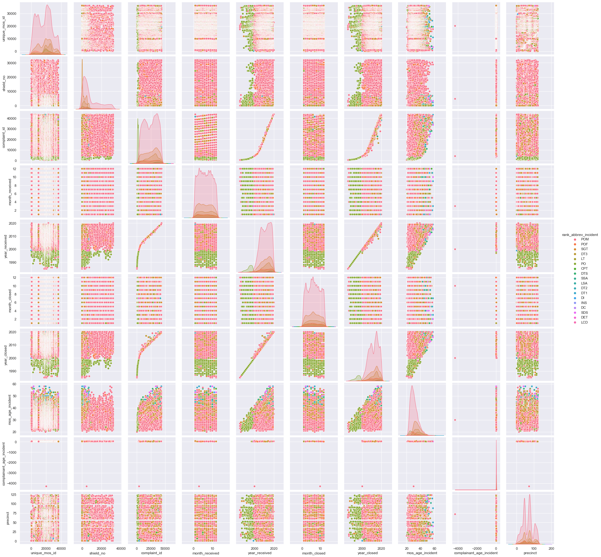
    


This pairsplot is not *great* to look at. We see that most of these compalaints are made about `Police Officers` (as opposed to `Sergeant` or `Lieutenant`). 

## Correlation Matrix
<a id = "corr"></a>

Let's see if anything interesting can be observed in a correlation matrix of the allegation data.


```python
corr = df_allegations.corr(method='pearson')
corr = round(corr, 2)

# set the context as a talk with larger font 
sns.set_context("talk", font_scale = 1) 

# manually set the figure size
fig, ax = plt.subplots(figsize=(10, 10))

hm1 = sns.heatmap(
    data = corr,
    center = 0, 
    cmap = sns.color_palette("magma", as_cmap=True),
    square = True, 
    annot = True, 
    linewidths=.5,
    ax = ax
)

hm1.set_xticklabels(
    hm1.get_xticklabels(),
    rotation = 45, 
    horizontalalignment = 'right'
);

hm1.set_title("Correlation matrix");
```


    
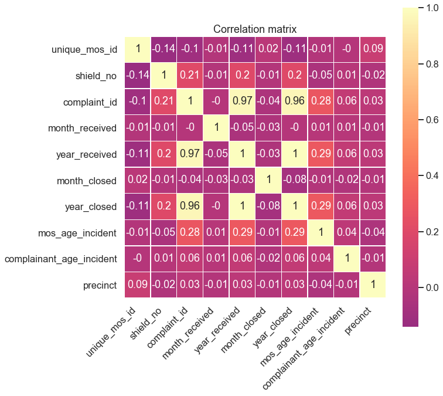
    


It doesn't look like there are any surprising correlations in this data. We have that the `year_received` and `year_closed` are highly correlated, and that the `complaint_id` is highly correlated with the `year_closed`, leading me to believe that the `complaint_id` must be a number that involves the year the complaint is closed. However, for the most part, the correlations amongst the features are fairly weak.

## Racial and ethnic diversity of NYC boroughs
<a id = "race_bor"></a>

### Absolute population values
<a id = "abs_pop"></a>

Since we have the data let's change the racial and ethnic diversity of the five NYC boroughs. First we will look at the raw population values.


```python
import matplotlib.ticker as ticker

def make_barplot_census(df_in, xVal, yVal, position, yscale, yscaleChara, titleVal, ylabelVal, xlabelVal):
    """
    function to create the barplots for the census data

    Parameters
    ----------
    df_in: input dataframe
    xVal: the column for the x axis
    yVal: the column for the y axis
    position: position of the figure (ax)
    yscale: scale of the y axis (e.g. 1e6)
    yscaleChara: letter to represent y axis scale (e.g. M)
    rotationVal: rotation (in degrees) of the x axis labels
    titleVal: the main title string 
    ylabelVal: the y axis title string 
    xlabelVal: the x axis title string
    
    Returns
    ----------
    plot: the formatted barplot with data
    """
    plot = sns.barplot(
        data = df_in, 
        x = xVal,
        y = yVal,
        hue = xVal,
        palette = "colorblind", 
        ax = position
    )
    
    # set plot labels
    plot.set(
        title = titleVal,
        ylabel = ylabelVal, 
        xlabel = xlabelVal,
        xticklabels = []
    )
    
    # set yaxis scale
    position.yaxis.set_major_formatter(ticker.FuncFormatter(lambda x, pos: '{:,.2f}'.format(x/yscale) + yscaleChara))
    
    # remove legend
    #plot.legend_.remove()
    
    return plot
```


```python
fig, ((ax00, ax01, ax02, ax03), (ax10, ax11, ax12, ax14)) = plt.subplots(2, 4, sharey = False, figsize=(35, 20))

# total population
plot_totpop_count = make_barplot_census(df_counties, "BOROUGH", "TOT_POP", 
                                        ax00, 1e6, "M", 
                                        "Absolute Total \n2019 Population Estimates", 
                                        "Population (Millions)", "Borough"
                                       )
# total white population
plot_totwac_count = make_barplot_census(df_counties, "BOROUGH", "WAC_TOT", 
                                        ax01, 1e6, "M", 
                                        "Absolute Total White \n2019 Population Estimates", 
                                        "Population (Millions)", "Borough"
                                       )
# total black population
plot_totbac_count = make_barplot_census(df_counties, "BOROUGH", "BAC_TOT", 
                                        ax02, 1e6, "M", 
                                        "Absolute Total Black \n2019 Population Estimates", 
                                        "Population (Millions)", "Borough"
                                       )
# total native american population
plot_totnac_count = make_barplot_census(df_counties, "BOROUGH", "IAC_TOT", 
                                        ax03, 1e3, "K", 
                                        "Absolute Total Native American \n2019 Population Estimates", 
                                        "Population (Thousands)", "Borough"
                                       )
# total asian population
plot_totaac_count = make_barplot_census(df_counties, "BOROUGH", "AAC_TOT", 
                                        ax10, 1e3, "K", 
                                        "Absolute Total Asian\n2019 Population Estimates", 
                                        "Population (Thousands)", "Borough"
                                       )
# total native hawaiian population
plot_totnac_count = make_barplot_census(df_counties, "BOROUGH", "NAC_TOT", 
                                        ax11, 1e3, "K", 
                                        "Absolute Total Native Hawaiian \n2019 Population Estimates", 
                                        "Population (Thousands)", "Borough"
                                       )
# total tom population
plot_tottom_count = make_barplot_census(df_counties, "BOROUGH", "TOM_TOT", 
                                        ax12, 1e3, "K", 
                                        "Absolute Total Two or more Races \n2019 Population Estimates", 
                                        "Population (Thousands)", "Borough"
                                       )

plt.show()
```


    
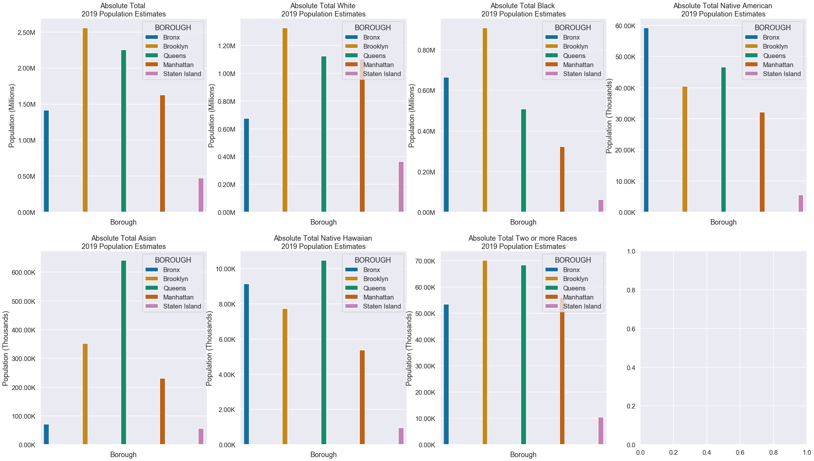
    


We can see that Brooklyn (\~2.5 million) and Queens (\~2.3 million) have the highest populations and that Staten Island (\~0.5 million) has the lowest. Brooklyn has the most white and black people of all the boroughs, whereas Queens has the most Asiand and Native Hawaiian individuals. Brooklyn and Queens appear to be pretty much tied for the number of people that are two or more races, whereas the Bronx has the most Native American individuals. 

### Relative population values
<a id = "rel_pop"></a>

Let's look at the relative population of the boroughs for racial and ethnic diversity. This will require me to make a few new columns in the data.


```python
tot_list = ["nan"] * len(df_counties.columns)
substring3 = "_TOT"
for i in df_counties.columns:
    if substring3 in i:
        tot_list.append(i)
tot_list = [x for x in tot_list if str(x) != 'nan']
tot_list
```


    ['TOM_TOT', 'WAC_TOT', 'BAC_TOT', 'IAC_TOT', 'AAC_TOT', 'NAC_TOT']


```python
for i in tot_list:
    temp_series = (df_counties[i]/df_counties["TOT_POP"])*100
    temp_colName = i.replace("_TOT", "_REL")
    df_counties[temp_colName] = temp_series
```


```python
df_counties
```


<div>
<style scoped>
    .dataframe tbody tr th:only-of-type {
        vertical-align: middle;
    }

    .dataframe tbody tr th {
        vertical-align: top;
    }

    .dataframe thead th {
        text-align: right;
    }
</style>
<table border="1" class="dataframe">
  <thead>
    <tr style="text-align: right;">
      <th></th>
      <th>COUNTY</th>
      <th>STNAME</th>
      <th>CTYNAME</th>
      <th>BOROUGH</th>
      <th>YEAR</th>
      <th>TOT_POP</th>
      <th>TOT_MALE</th>
      <th>TOT_FEMALE</th>
      <th>TOM_MALE</th>
      <th>TOM_FEMALE</th>
      <th>...</th>
      <th>AAC_TOT</th>
      <th>NAC_MALE</th>
      <th>NAC_FEMALE</th>
      <th>NAC_TOT</th>
      <th>TOM_REL</th>
      <th>WAC_REL</th>
      <th>BAC_REL</th>
      <th>IAC_REL</th>
      <th>AAC_REL</th>
      <th>NAC_REL</th>
    </tr>
  </thead>
  <tbody>
    <tr>
      <th>0</th>
      <td>5</td>
      <td>New York</td>
      <td>Bronx County</td>
      <td>Bronx</td>
      <td>2019</td>
      <td>1418207</td>
      <td>669548</td>
      <td>748659</td>
      <td>24883</td>
      <td>28508</td>
      <td>...</td>
      <td>71398</td>
      <td>4297</td>
      <td>4847</td>
      <td>9144</td>
      <td>3.76468</td>
      <td>47.646</td>
      <td>46.7896</td>
      <td>4.1807</td>
      <td>5.03438</td>
      <td>0.644758</td>
    </tr>
    <tr>
      <th>1</th>
      <td>47</td>
      <td>New York</td>
      <td>Kings County</td>
      <td>Brooklyn</td>
      <td>2019</td>
      <td>2559903</td>
      <td>1212194</td>
      <td>1347709</td>
      <td>33203</td>
      <td>36965</td>
      <td>...</td>
      <td>352498</td>
      <td>3724</td>
      <td>4003</td>
      <td>7727</td>
      <td>2.74104</td>
      <td>51.8677</td>
      <td>35.4844</td>
      <td>1.58233</td>
      <td>13.77</td>
      <td>0.301847</td>
    </tr>
    <tr>
      <th>2</th>
      <td>81</td>
      <td>New York</td>
      <td>Queens County</td>
      <td>Queens</td>
      <td>2019</td>
      <td>2253858</td>
      <td>1093889</td>
      <td>1159969</td>
      <td>33428</td>
      <td>34939</td>
      <td>...</td>
      <td>641880</td>
      <td>5032</td>
      <td>5447</td>
      <td>10479</td>
      <td>3.03333</td>
      <td>49.7983</td>
      <td>22.512</td>
      <td>2.072</td>
      <td>28.4792</td>
      <td>0.464936</td>
    </tr>
    <tr>
      <th>3</th>
      <td>61</td>
      <td>New York</td>
      <td>New York County</td>
      <td>Manhattan</td>
      <td>2019</td>
      <td>1628706</td>
      <td>771478</td>
      <td>857228</td>
      <td>25779</td>
      <td>30180</td>
      <td>...</td>
      <td>230452</td>
      <td>2509</td>
      <td>2874</td>
      <td>5383</td>
      <td>3.4358</td>
      <td>67.5431</td>
      <td>19.8447</td>
      <td>1.97801</td>
      <td>14.1494</td>
      <td>0.330508</td>
    </tr>
    <tr>
      <th>4</th>
      <td>85</td>
      <td>New York</td>
      <td>Richmond County</td>
      <td>Staten Island</td>
      <td>2019</td>
      <td>476143</td>
      <td>231330</td>
      <td>244813</td>
      <td>5170</td>
      <td>5259</td>
      <td>...</td>
      <td>56177</td>
      <td>497</td>
      <td>476</td>
      <td>973</td>
      <td>2.19031</td>
      <td>76.3046</td>
      <td>12.9457</td>
      <td>1.182</td>
      <td>11.7983</td>
      <td>0.20435</td>
    </tr>
  </tbody>
</table>
<p>5 rows × 32 columns</p>
</div>


With our relative populations we can plot these results.


```python
fig, ((ax00, ax01, ax02), (ax10, ax11, ax12)) = plt.subplots(2, 3, sharey = False, figsize=(35, 20))

# total white population
plot_rel_wac = make_barplot_census(df_counties, "BOROUGH", "WAC_REL", 
                                        ax00, 1, "%", 
                                        "Relative Total White \n2019 Population Estimates", 
                                        "Population (%)", "Borough"
                                       )
# total black population
plot_rel_bac = make_barplot_census(df_counties, "BOROUGH", "BAC_REL", 
                                        ax01, 1, "%", 
                                        "Relative Total Black \n2019 Population Estimates", 
                                        "Population (%)", "Borough"
                                       )
# total native american population
plot_rel_iac = make_barplot_census(df_counties, "BOROUGH", "IAC_REL", 
                                        ax02, 1, "%", 
                                        "Relative Total Native American \n2019 Population Estimates", 
                                        "Population (%)", "Borough"
                                       )
# total asian population
plot_rel_aac = make_barplot_census(df_counties, "BOROUGH", "AAC_REL", 
                                        ax10, 1, "%", 
                                        "Relative Total Asian\n2019 Population Estimates", 
                                        "Population (%)", "Borough"
                                       )
# total native hawaiian population
plot_rel_nac = make_barplot_census(df_counties, "BOROUGH", "NAC_REL", 
                                        ax11, 1, "%", 
                                        "Relative Total Native Hawaiian \n2019 Population Estimates", 
                                        "Population (%)", "Borough"
                                       )
# total tom population
plot_rel_tom = make_barplot_census(df_counties, "BOROUGH", "TOM_REL", 
                                        ax12, 1, "%", 
                                        "Relative Total Two or more Races \n2019 Population Estimates", 
                                        "Population (%)", "Borough"
                                       )

plt.show()
```


    
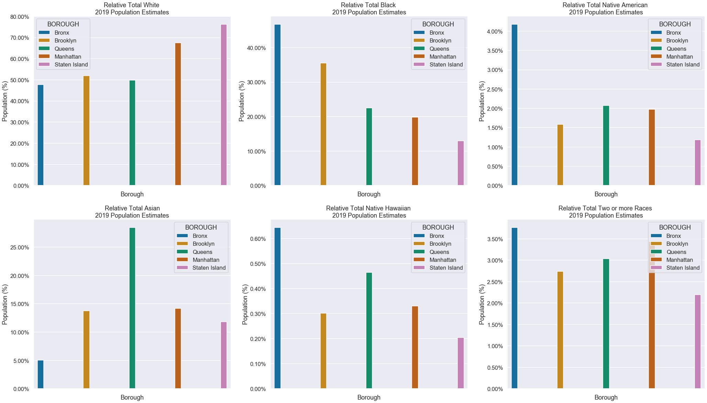
    


This paints a different picture than the raw/absolute population values. We can see that even though Staten Island has the smallest absolute population, it has the highest proportion of white people, as opposed to how Brooklyn had the highest absolute population of whites. Queens still has (propostionally) the most Asian individuals, but now we see that the Bronx leads in black, Native Hawaiian, and Two or more Races categories. We see that proportionally Manhattan is \~70% white, and does not lead in any other category of race. We see that the Bronx is fairly diverse, it has the smallest proportional white population but does very well in every other category (except for Asians). We also see that Brooklyn is fairly diverse as well. with large proportional black and mixed race groups. 

It will be interesting to see which boroughs have the most amount of complaints. We expect that the more racially diverse boroughs have large numbers of police complaints, whereas the whiter boroughs might have fewer complaints against the NYPD.

## Population of NYC over time
<a id = "pop_change"></a>

Let's look at how the population in NYC has changed over time. This will be usefull when looking at the change in the number of complaints.


```python
def make_linplot(df_in, xVal, yVal, hueVal, axPosition, yScale, yScaleChar, titleLab, xLab, yLab):
    """
    function to create a custom lineplot

    Parameters
    ----------
    df_in: input dataframe
    xVal: column for x axis
    yVal: column for y axis
    hueVal: column for hue
    axPosition: position of plot in the subplot grid
    yScale: scale of y axis
    yScaleChar: character to represent scale of y axis
    titleLab: the main title string
    xLab: the x axis title string
    yLab: the y axis title string
    
    Returns
    ----------
    plot: the custom line plot
    """
    
    plot = sns.lineplot(
        data = df_in, 
        x = xVal, 
        y = yVal,
        palette = "colorblind",
        hue = hueVal,
        ax = axPosition
    )

    plot.set(
        title = titleLab,
        xlabel = xLab, 
        ylabel = yLab
    )

    axPosition.yaxis.set_major_formatter(ticker.FuncFormatter(lambda x, pos: '{:,.2f}'.format(x/yScale) + yScaleChar))
```


```python
# take the log of the population 
df_nycpop_copy["Log of Population"] = np.log(df_nycpop_copy["Population"])
df_nycpop_copy.head()
```


<div>
<style scoped>
    .dataframe tbody tr th:only-of-type {
        vertical-align: middle;
    }

    .dataframe tbody tr th {
        vertical-align: top;
    }

    .dataframe thead th {
        text-align: right;
    }
</style>
<table border="1" class="dataframe">
  <thead>
    <tr style="text-align: right;">
      <th></th>
      <th>Borough</th>
      <th>Year</th>
      <th>Population</th>
      <th>Population Change Since 1980</th>
      <th>Log of Population</th>
    </tr>
  </thead>
  <tbody>
    <tr>
      <th>18</th>
      <td>NYC Total</td>
      <td>1980</td>
      <td>7071639</td>
      <td>1.0</td>
      <td>15.771603</td>
    </tr>
    <tr>
      <th>19</th>
      <td>Bronx</td>
      <td>1980</td>
      <td>1168972</td>
      <td>1.0</td>
      <td>13.971635</td>
    </tr>
    <tr>
      <th>20</th>
      <td>Brooklyn</td>
      <td>1980</td>
      <td>2230936</td>
      <td>1.0</td>
      <td>14.617932</td>
    </tr>
    <tr>
      <th>21</th>
      <td>Manhattan</td>
      <td>1980</td>
      <td>1428285</td>
      <td>1.0</td>
      <td>14.171985</td>
    </tr>
    <tr>
      <th>22</th>
      <td>Queens</td>
      <td>1980</td>
      <td>1891325</td>
      <td>1.0</td>
      <td>14.452788</td>
    </tr>
  </tbody>
</table>
</div>


```python
# remove NYC tot from percentages
df_nycpop_copy2 = df_nycpop_copy2[df_nycpop_copy2.Borough != "NYC Total"]
df_nycpop_copy2.head()
```


<div>
<style scoped>
    .dataframe tbody tr th:only-of-type {
        vertical-align: middle;
    }

    .dataframe tbody tr th {
        vertical-align: top;
    }

    .dataframe thead th {
        text-align: right;
    }
</style>
<table border="1" class="dataframe">
  <thead>
    <tr style="text-align: right;">
      <th></th>
      <th>Borough</th>
      <th>Year</th>
      <th>Boro share of NYC total</th>
    </tr>
  </thead>
  <tbody>
    <tr>
      <th>1</th>
      <td>Bronx</td>
      <td>1980</td>
      <td>16.53</td>
    </tr>
    <tr>
      <th>2</th>
      <td>Brooklyn</td>
      <td>1980</td>
      <td>31.55</td>
    </tr>
    <tr>
      <th>3</th>
      <td>Manhattan</td>
      <td>1980</td>
      <td>20.20</td>
    </tr>
    <tr>
      <th>4</th>
      <td>Queens</td>
      <td>1980</td>
      <td>26.75</td>
    </tr>
    <tr>
      <th>5</th>
      <td>Staten Island</td>
      <td>1980</td>
      <td>4.98</td>
    </tr>
  </tbody>
</table>
</div>


```python
fig, ((ax00, ax01), (ax10, ax11)) = plt.subplots(2, 2, sharey = False, figsize = (20, 20))

plot_nycpop = make_linplot(df_nycpop_copy, "Year", "Population", "Borough", ax00, 1e6, "M", 
                           "Population of NYC from 1980-2020", "Year", "Population (Millions)")

plot_nycpop_log = make_linplot(df_nycpop_copy, "Year", "Log of Population", "Borough", ax01, 1, "", 
                           "Log of the NYC Population from 1980-2020", "Year", "Log(Population)")

plot_nycpop_rel = make_linplot(df_nycpop_copy, "Year", "Population Change Since 1980", "Borough", ax10, 1, "x", 
                           "Change in NYC Population from 1980-2020 \n Using 1980 population as base value", 
                               "Year", "Population (Change)")

plot_nycpop_share = make_linplot(df_nycpop_copy2, "Year", "Boro share of NYC total", "Borough", ax11, 1, "%", 
                           "Borough share of NYC total Population from 1980-2020", 
                               "Year", "Population (% of NYC Total)")

plt.show()
```


    
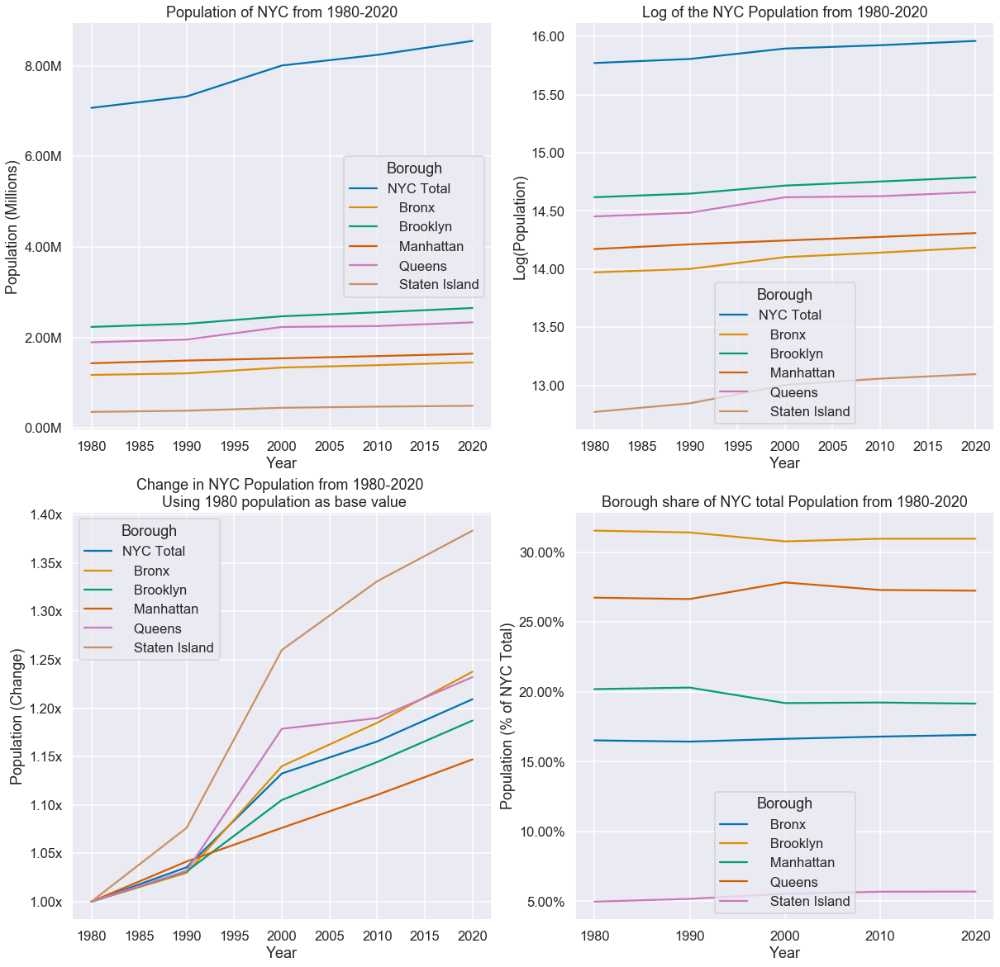
    


In terms of population growth each borough increases at a slower rate than the total of NYC, which makes sense. The log of the population was included to tease out the behavior of the boroughs bunched together with populations of \~1 million. It seems that most of the boroughs have pretty much been around the same percentage of NYC's total population, in that Brooklyn is consistently over 30% of NYC total, Queens is around 27%, Statent Island stays around 5% and so on. The biggest observable change is if we compare the population change from 1980 to 2020. If we take the 1980 population as the "base" value and normalize the other years by this value, we can find a change from the 1980 Population. We see that in 2020 the Bronx is at almost 1.4x that of what it was in 1980. The Bronx has had the most dramatic change in population from 1980, Queens experienced a small spike in 2000, and Manhattan has been noticeably linear in its growth. 

We will see how the number of complaints from the boroughs compare to the population increases. Naturally one would imagine that the number of complaints would increase as the population increases, However, we are looking to see if any of the boroughs have a number of complaints that is wildly different than their population growth.

# Complaints per Officer and per Precinct
<a id = "complaints"></a>

## Absolute number and relative proportion of complaints
<a id = "abs_comp"></a>

Let's look at some of the values like `unique_mos_id` and `precinct` and see just the counts of them first. It would be interesting to see, for example, if one particular officer or precinct has a particularly high number of filed complaints as compared to the others. 


```python
import matplotlib.patches as mpatches

def create_legend(locNum):
    """
    function to create custom legend for the 5 boroughs

    Parameters
    ----------
    locNum: location of the legend
    
    Returns
    ----------
    
    """
    # colors in legend and labels
    patch_bro = mpatches.Patch(color = "#3B91C2", label = "Brooklyn")
    patch_si = mpatches.Patch(color = "#E1A640", label = "Staten Island")
    patch_m = mpatches.Patch(color = "#3CB193", label = "Manhattan")
    patch_q = mpatches.Patch(color = "#DA813C", label = "Queens")
    patch_brx = mpatches.Patch(color = "#D394C9", label = "Bronx")
    
    # list of patches
    handles_list = [patch_bro, patch_si, patch_m, patch_q, patch_brx]

    # place this new legend outside of both plots
    plt.legend(
        handles = handles_list, 
        title = "Borough", 
        bbox_to_anchor = (1.05, 1), 
        loc = locNum, 
        borderaxespad = 0.
    )
```


```python
def make_histplot(df_in, xVal, statVal, hueVal, binNum, axPosition, titleVal, xLabVal):
    """
    function to create histograms

    Parameters
    ----------
    df_in: input dataframe
    xVal: column to use for x axis
    statVal: aggregate statistic to compute in each bin (e.g. count or porbability)
    binNum: number of bins
    axPosition: position of plot in grid of subplots
    titleVal: the main title string
    xLabVal: the x axis title string
    
    Returns
    ----------
    plot: the customized histogram
    """
    plot = sns.histplot(
        data = df_in, 
        x = xVal,
        stat = statVal,
        hue = hueVal,
        multiple = "stack",
        palette = "colorblind",
        bins = binNum,
        ax = axPosition
    )
    
    # remove legend 
    plot.legend_.remove()
    
    # set plot labels
    plot.set(
        title = titleVal, 
        xlabel = xLabVal
    )
    
    return plot
```


```python
# plot side by side
fig, ((ax00, ax01), (ax10, ax11)) = plt.subplots(2, 2, sharey = False, figsize=(15, 25))

sns.set()
sns.set_context("talk", font_scale = 1) 

# counts for officers
plot_uniqueMosID = make_histplot(df_allegations, "unique_mos_id", "count", "borough", 50, ax00, 
                                 "Number of complaints received \nby individual officers for all years", 
                                 "Unique ID of Officer")
# probability for officiers
plot_uniqueMosID_prob = make_histplot(df_allegations, "unique_mos_id", "probability", "borough", 50, ax01, 
                                 "Percentage of complaints received \nby individual officers for all years", 
                                 "Unique ID of Officer")
# counts for precincts
plot_precinct = make_histplot(df_allegations, "precinct", "count", "borough", 77, ax10, 
                                 "Number of complaints received \nat a specific precinct for all years", 
                                 "Precinct # associated with the complaint")
# probability for precincts
plot_precinct_prob = make_histplot(df_allegations, "precinct", "probability", "borough", 77, ax11, 
                                 "Percentage of complaints received \nat a specific precinct for all years", 
                                 "Precinct # associated with the complaint")
# create manual legend
create_legend(2)

plt.show()
```


    
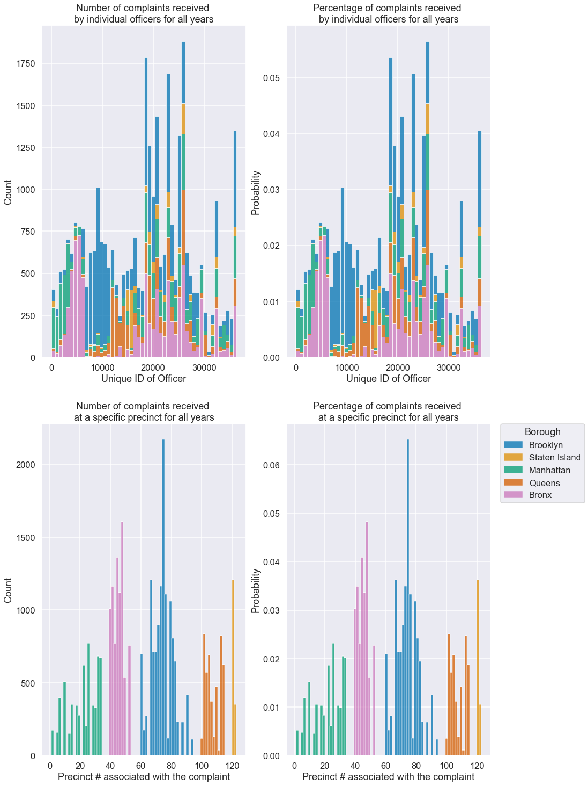
    


From looking at the above histograms I can see that the officers with the most complaints have an ID of roughly 20000-25000. It appears that these offices get a lot of complaints in the Bronx and Brooklyn. For the precincts we see that 40-50 (which are in the Bronx) and ~65-80 (which are in Brooklyn) have the most complaints. This seems to be the same issue as for where the cops get the complaints. It also appears that several cops receive much more complaints than other officers. 

Interestingly enough Queens has relatively few complaints despite its large non-white Asian population, where as Staten Island has more complaints despite its high proportion of whites. Manhattan has the least complaints, and is also majority white and incredibly wealthy. 

## Complaints broken down by race
<a id = "comp_race"></a>

In the above we looked at how the complaints broke down by borough, but the data does include the various features of both the officer and the complainant (age, gender, race). 

### Race of complainants
<a id = "race_complainants"></a>

Let's look to see who is filing the most complaints against the NYPD, and thus the individuals with the most exposure to and incidents with the NYPD.


```python
def make_histplotLegend(df_in, xVal, statVal, hueVal, binNum, axPosition, titleVal, xLabVal):
    """
    function to create histograms

    Parameters
    ----------
    df_in: input dataframe
    xVal: column to use for x axis
    statVal: aggregate statistic to compute in each bin (e.g. count or porbability)
    binNum: number of bins
    axPosition: position of plot in grid of subplots
    titleVal: the main title string
    xLabVal: the x axis title string
    
    Returns
    ----------
    plot: the customized histogram
    """
    plot = sns.histplot(
        data = df_in, 
        x = xVal,
        stat = statVal,
        hue = hueVal,
        multiple = "stack",
        palette = "colorblind",
        bins = binNum,
        ax = axPosition
    )
    
    # set plot labels
    plot.set(
        title = titleVal, 
        xlabel = xLabVal
    )
    
    return plot
```


```python
# plot side by side
fig, (ax0,ax1) = plt.subplots(1, 2, sharey = False, figsize=(15, 10))

sns.set()
sns.set_context("talk", font_scale = 1) 

# probability for officiers
hist_race_id_complain = make_histplotLegend(df_allegations, "unique_mos_id", "probability", "complainant_ethnicity", 50, ax0, 
                                 "Percentage of complaints received \nby individual officers for all years", 
                                 "Unique ID of Officer")
# probability for precincts
hist_race_pre_complain = make_histplotLegend(df_allegations, "precinct", "probability", "complainant_ethnicity", 77, ax1, 
                                 "Percentage of complaints received \nat a specific precinct for all years", 
                                 "Precinct # associated with the complaint")

plt.show()
```


    
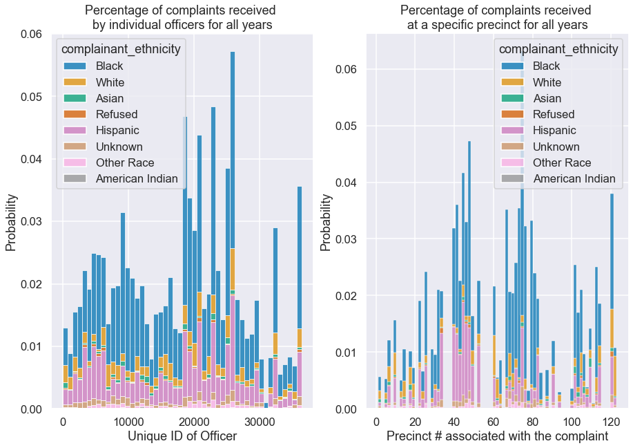
    


Indeed, the people filing the most complaints against the NYPD are black individuals, followed by Hispanic individuals. Even in boroughs that are majority white by large margins (Manhattan and Staten Island) we see that black individuals file the most incident complaints in every borough. Asian individuals file some of the smallest numbers of complaints, which might explain why Queens, with such a large population and such a large Asian community, files much less complaints than you might expect for its population (see section below for details).

### Race of officers
<a id = "race_officers"></a>

Let's look to see who the officers that receive the complaints are.


```python
# plot side by side
fig, (ax0,ax1) = plt.subplots(1, 2, sharey = False, figsize=(15, 10))

sns.set()
sns.set_context("talk", font_scale = 1) 

# probability for officiers
hist_race_id_mos = make_histplotLegend(df_allegations, "unique_mos_id", "probability", "mos_ethnicity", 50, ax0, 
                                 "Percentage of complaints received \nby individual officers for all years", 
                                 "Unique ID of Officer")
# probability for precincts
hist_race_pre_mos = make_histplotLegend(df_allegations, "precinct", "probability", "mos_ethnicity", 77, ax1, 
                                 "Percentage of complaints received \nat a specific precinct for all years", 
                                 "Precinct # associated with the complaint")

plt.show()
```


    
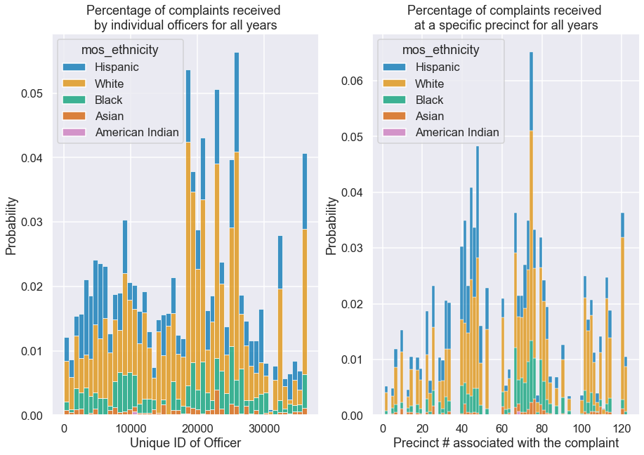
    


By and large police officers and precincts that receive complaints are white, with the next largest group being hispanic. Black individuals account for very few police officers.

# Complaints over the years
<a id = "comp_years"></a>

## Absolute number and relative proportion of complaints
<a id = "abs_comp_yr"></a>

Let's look at how the number of complaints each year has changed. But first, in order to do so, I'll need to create new data from which to plot.


```python
def make_df_count_uniques(df_in, featureName, colTitle, countTitle):
    """
    function to make a dataframe that contains the count of unique values in a column from an input dataframe

    Parameters
    ----------
    df_in: input dataframe
    featureName: column in which you wish to count unique values
    colTitle: title of the new column
    countTitle: title of count column
    
    Returns
    ----------
    df_out: dataframe with counts of unique values
    """
    # get the count of unique values in a column using value_counts()
    series = df_in[featureName].value_counts()
    # create a dict and pass this as the data param to the dataframe constructor
    df_out = pd.DataFrame({colTitle: series.index, countTitle: series.values})
    # convert all elements to int
    df_out.astype("int")
    # sort by the new column of unique values
    df_out = df_out.sort_values(by=[colTitle])
    # reset index
    df_out = df_out.reset_index(drop=True)
    return df_out
```


```python
# create dataframes of counts using above function
df_yr_rec = make_df_count_uniques(df_allegations, "year_received", "year_rec", "received")
df_yr_clo = make_df_count_uniques(df_allegations, "year_closed", "year_clo", "closed")
# combine two dataframes
df_yr_counts = pd.concat([df_yr_rec, df_yr_clo], axis=1, sort=False)
# delete year_clo
del df_yr_counts["year_clo"]
# rename year_rec
df_yr_counts = df_yr_counts.rename(columns={"year_rec": "year"})
# set index to year
df_yr_counts = df_yr_counts.set_index("year")
# tail
df_yr_counts.tail()
```


<div>
<style scoped>
    .dataframe tbody tr th:only-of-type {
        vertical-align: middle;
    }

    .dataframe tbody tr th {
        vertical-align: top;
    }

    .dataframe thead th {
        text-align: right;
    }
</style>
<table border="1" class="dataframe">
  <thead>
    <tr style="text-align: right;">
      <th></th>
      <th>received</th>
      <th>closed</th>
    </tr>
    <tr>
      <th>year</th>
      <th></th>
      <th></th>
    </tr>
  </thead>
  <tbody>
    <tr>
      <th>2016</th>
      <td>2345</td>
      <td>2408</td>
    </tr>
    <tr>
      <th>2017</th>
      <td>2178</td>
      <td>1945</td>
    </tr>
    <tr>
      <th>2018</th>
      <td>2278</td>
      <td>1635</td>
    </tr>
    <tr>
      <th>2019</th>
      <td>1642</td>
      <td>2323</td>
    </tr>
    <tr>
      <th>2020</th>
      <td>4</td>
      <td>1256</td>
    </tr>
  </tbody>
</table>
</div>


```python
# Make a copy of df_yr_counts
# deep = True means that modifications to the data or indices of the copy will not be reflected in the original object 
df_yr_cnt_rel = df_yr_counts.copy(deep=True)
# delete counts columns
del df_yr_cnt_rel["received"]
del df_yr_cnt_rel["closed"]
# total number of complaints
tot_num_counts = len(df_allegations)
# create new columns
df_yr_cnt_rel["received"] = (df_yr_counts["received"]/tot_num_counts)*100
df_yr_cnt_rel["closed"] = (df_yr_counts["closed"]/tot_num_counts)*100
# tail
df_yr_cnt_rel.tail()
```


<div>
<style scoped>
    .dataframe tbody tr th:only-of-type {
        vertical-align: middle;
    }

    .dataframe tbody tr th {
        vertical-align: top;
    }

    .dataframe thead th {
        text-align: right;
    }
</style>
<table border="1" class="dataframe">
  <thead>
    <tr style="text-align: right;">
      <th></th>
      <th>received</th>
      <th>closed</th>
    </tr>
    <tr>
      <th>year</th>
      <th></th>
      <th></th>
    </tr>
  </thead>
  <tbody>
    <tr>
      <th>2016</th>
      <td>7.034859</td>
      <td>7.223856</td>
    </tr>
    <tr>
      <th>2017</th>
      <td>6.533869</td>
      <td>5.834883</td>
    </tr>
    <tr>
      <th>2018</th>
      <td>6.833863</td>
      <td>4.904902</td>
    </tr>
    <tr>
      <th>2019</th>
      <td>4.925901</td>
      <td>6.968861</td>
    </tr>
    <tr>
      <th>2020</th>
      <td>0.012000</td>
      <td>3.767925</td>
    </tr>
  </tbody>
</table>
</div>


```python
fig, (ax0, ax1) = plt.subplots(1, 2, sharey = False, figsize=(15, 5)) 

plot_yrs_cnt_abs = sns.lineplot(data = df_yr_counts, ax = ax0)

plot_yrs_cnt_abs.set(
    title = "Absolute number of complaints over time", 
    ylabel = "Count",
    xlabel = "Year"
)

plot_yrs_cnt_rel = sns.lineplot(data = df_yr_cnt_rel, ax = ax1)

plot_yrs_cnt_rel.set(
    title = "Relative proportion of complaints over time", 
    ylabel = "Percent (%)",
    xlabel = "Year"
)

# set yaxis scale
ax1.yaxis.set_major_formatter(ticker.FuncFormatter(lambda x, pos: '{:,.0f}'.format(x) + "%"))

plt.show()
```


    
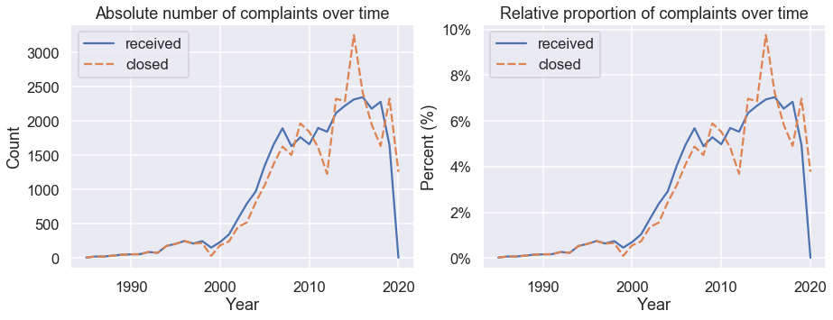
    


We see that as we move away from 1985 the number of complaints against the NYPD increases. The most requests received occured in 2016, and the most request closed occured in 2015. The BLM protests started back in 2013, which you might have expected to lead to an increase in complaints against the NYPD, and that does indeed appear to be the case. It seems the complaints escalated to a peak right before and during the election year. There is another peak in complaints in 2019, the start of a new wave of ongoing BLM protests, and 2020 rates of requests being received and closed might be so low due to the COVID-19 pandemic and quarantine restrictions.  

What I do find interesting is that for the most part the number of closed complaints followed the trend of received complaints up until about \~2009, and then the number of closed complaints takes a deep dip in \~2011 only to shoot back up in \~2015. For the most part from 1985 until the mid 2000s there was a steady growth in complaints which might simply be increasing due to increases in population in NYC. Luckily, we have the NYC census data starting 

## Absolute and relative number of Complaints per borough
<a id = "comp_boro_person"></a>

### Absolute number of complaints
<a id = "comp_boro_person_abs"></a>

Now let's see what the complaindf_allegationst numbers per borough and the complaints per borough per person look. I expect the Bronx and Brooklyn to have high numbers of complaints as we saw above, but maybe their large populations will mean each borough has roughly the same number of complaints per population.


```python
def makeDF_compYear(df_in, colNameYear, colNameComplaints):
    """
    function to make a dataframe that contains the count of coomplaints per year for a specific borough

    Parameters
    ----------
    df_in: input dataframe
    colNameYear: column name for the year (either received or closed)
    colNameComplaints: column name for the complaints (either received or closed)
    
    Returns
    ----------
    df_out: output dataframe
    """
    # make lists of years and boroughs
    yearTot_list = list(df_in[colNameYear].unique())
    boroTot_list = list(df_in["borough"].unique())
    # remove NANs from list
    yearTot_list = [x for x in yearTot_list if str(x) != "nan"]
    boroTot_list = [x for x in boroTot_list if str(x) != "nan"]
    # empty double nested list
    lst = [[] for _ in range(len(yearTot_list))]
    
    # 2 nested 4 loops
    # loop through the years
    for y in range(len(yearTot_list)):
        # loop through the boroughs
        for b in range(len(boroTot_list)):
            # Get a bool series representing which row satisfies the condition 
            temp_df = df_in.apply(lambda x : True 
                                           if (x[colNameYear] == yearTot_list[y] and x["borough"] == boroTot_list[b]) 
                                           else False, axis = 1)
            # Count number of True in the series 
            num_rows = len(temp_df[temp_df == True].index) 
            lst[y].append(yearTot_list[y])
            lst[y].append(boroTot_list[b])
            lst[y].append(num_rows)
    
    # column names have to be repeating bc of how double nested list was made
    newColNames = ["Year1", "Borough1", "Number of Complaints1", 
                   "Year2", "Borough2", "Number of Complaints2",
                   "Year3", "Borough3", "Number of Complaints3",
                   "Year4", "Borough4", "Number of Complaints4",
                   "Year5", "Borough5", "Number of Complaints5"
                  ]
    baseColNames = ["Year", "Borough", colNameComplaints]
    
    # create dataframe from double nested list
    df_new = pd.DataFrame(lst[0:], columns = newColNames)
    
    # get columns by 3 and create new df
    df1 = df_new[df_new.columns[:3]]
    df2 = df_new[df_new.columns[3:6]]
    df3 = df_new[df_new.columns[6:9]]
    df4 = df_new[df_new.columns[9:12]]
    df5 = df_new[df_new.columns[12:15]]
    
    # rename columns
    df1.columns = baseColNames
    df2.columns = baseColNames
    df3.columns = baseColNames
    df4.columns = baseColNames
    df5.columns = baseColNames
    
    # merge these dataframes row-wise
    df_out = pd.concat([df1, df2, df3, df4, df5])
    # change type of year and complaints to int
    df_out = df_out.astype({"Year": int, colNameComplaints: int})
    # sort by year
    df_out = df_out.sort_values(by=["Year"])
    # reset index
    df_out = df_out.reset_index(drop=True)
    
    return df_out
```


```python
# this function takes a little time to run
df_compBoroRec = makeDF_compYear(df_allegations, "year_received", "Num Complaints Received")
df_compBoroClo = makeDF_compYear(df_allegations, "year_closed", "Num Complaints Closed")
```


```python
df_CombineComplaints = df_compBoroRec
df_CombineComplaints["Num Complaints Closed"] = df_compBoroClo["Num Complaints Closed"]
df_CombineComplaints.tail()
```


<div>
<style scoped>
    .dataframe tbody tr th:only-of-type {
        vertical-align: middle;
    }

    .dataframe tbody tr th {
        vertical-align: top;
    }

    .dataframe thead th {
        text-align: right;
    }
</style>
<table border="1" class="dataframe">
  <thead>
    <tr style="text-align: right;">
      <th></th>
      <th>Year</th>
      <th>Borough</th>
      <th>Num Complaints Received</th>
      <th>Num Complaints Closed</th>
    </tr>
  </thead>
  <tbody>
    <tr>
      <th>175</th>
      <td>2020</td>
      <td>Queens</td>
      <td>0</td>
      <td>160</td>
    </tr>
    <tr>
      <th>176</th>
      <td>2020</td>
      <td>Manhattan</td>
      <td>1</td>
      <td>315</td>
    </tr>
    <tr>
      <th>177</th>
      <td>2020</td>
      <td>Staten Island</td>
      <td>0</td>
      <td>57</td>
    </tr>
    <tr>
      <th>178</th>
      <td>2020</td>
      <td>Brooklyn</td>
      <td>3</td>
      <td>184</td>
    </tr>
    <tr>
      <th>179</th>
      <td>2020</td>
      <td>Bronx</td>
      <td>0</td>
      <td>539</td>
    </tr>
  </tbody>
</table>
</div>


Now I need the sums of the number of complaints each year, because I need to divide the number of complaints each borough received in a year by the total for that year.


```python
# make lists of years and boroughs
yearTot_list = list(df_allegations["year_received"].unique())
# remove NANs from list
yearTot_list = [x for x in yearTot_list if str(x) != "nan"]
# empty dataframe with column names
df_allComplaints = pd.DataFrame(columns = ["Year", "Borough", "Num Complaints Received", "Num Complaints Closed"])
# loop through the years
for y in range(len(yearTot_list)):
    # gets sums of complaints
    dataTemp = list(df_CombineComplaints.loc[df_CombineComplaints['Year'] == yearTot_list[y], 
                                             ["Num Complaints Received", "Num Complaints Closed"]].sum())
    # get year and NYC total
    temp = [yearTot_list[y], "NYC Total"]
    # combine results
    to_append = temp + dataTemp
    # append to end of df
    df_allComplaints.loc[len(df_allComplaints)] = to_append
```


```python
# combine df
df_all2 = pd.concat([df_CombineComplaints, df_allComplaints])
# sort by year
df_all2 = df_all2.sort_values(by=["Year"])
# reset index
df_all2 = df_all2.reset_index(drop=True)
# change type of year and complaints to int
df_all2 = df_all2.astype({"Year": int, "Num Complaints Received": int, "Num Complaints Closed": int})
# take log of number complaints
df_all2["Log(Complaints Rec)"] = np.log(df_all2["Num Complaints Received"])
df_all2["Log(Complaints Clo)"] = np.log(df_all2["Num Complaints Closed"])
df_all2[:10]
```


<div>
<style scoped>
    .dataframe tbody tr th:only-of-type {
        vertical-align: middle;
    }

    .dataframe tbody tr th {
        vertical-align: top;
    }

    .dataframe thead th {
        text-align: right;
    }
</style>
<table border="1" class="dataframe">
  <thead>
    <tr style="text-align: right;">
      <th></th>
      <th>Year</th>
      <th>Borough</th>
      <th>Num Complaints Received</th>
      <th>Num Complaints Closed</th>
      <th>Log(Complaints Rec)</th>
      <th>Log(Complaints Clo)</th>
    </tr>
  </thead>
  <tbody>
    <tr>
      <th>0</th>
      <td>1985</td>
      <td>Queens</td>
      <td>0</td>
      <td>0</td>
      <td>-inf</td>
      <td>-inf</td>
    </tr>
    <tr>
      <th>1</th>
      <td>1985</td>
      <td>Bronx</td>
      <td>0</td>
      <td>0</td>
      <td>-inf</td>
      <td>-inf</td>
    </tr>
    <tr>
      <th>2</th>
      <td>1985</td>
      <td>Manhattan</td>
      <td>0</td>
      <td>0</td>
      <td>-inf</td>
      <td>-inf</td>
    </tr>
    <tr>
      <th>3</th>
      <td>1985</td>
      <td>Brooklyn</td>
      <td>7</td>
      <td>0</td>
      <td>1.945910</td>
      <td>-inf</td>
    </tr>
    <tr>
      <th>4</th>
      <td>1985</td>
      <td>Staten Island</td>
      <td>0</td>
      <td>7</td>
      <td>-inf</td>
      <td>1.945910</td>
    </tr>
    <tr>
      <th>5</th>
      <td>1985</td>
      <td>NYC Total</td>
      <td>7</td>
      <td>7</td>
      <td>1.945910</td>
      <td>1.945910</td>
    </tr>
    <tr>
      <th>6</th>
      <td>1986</td>
      <td>Staten Island</td>
      <td>0</td>
      <td>0</td>
      <td>-inf</td>
      <td>-inf</td>
    </tr>
    <tr>
      <th>7</th>
      <td>1986</td>
      <td>Brooklyn</td>
      <td>17</td>
      <td>0</td>
      <td>2.833213</td>
      <td>-inf</td>
    </tr>
    <tr>
      <th>8</th>
      <td>1986</td>
      <td>NYC Total</td>
      <td>22</td>
      <td>22</td>
      <td>3.091042</td>
      <td>3.091042</td>
    </tr>
    <tr>
      <th>9</th>
      <td>1986</td>
      <td>Bronx</td>
      <td>0</td>
      <td>0</td>
      <td>-inf</td>
      <td>-inf</td>
    </tr>
  </tbody>
</table>
</div>


```python
fig, ((ax00, ax01), (ax10, ax11)) = plt.subplots(2, 2, sharey = False, figsize = (15, 15))

plot_numRec = make_linplot(df_all2, "Year", "Num Complaints Received", "Borough", ax00, 1e3, "K", 
                           "Number complaints received", "Year", "Complaints (Thousands)")

plot_numRec_log = make_linplot(df_all2, "Year", "Log(Complaints Rec)", "Borough", ax01, 1, "", 
                           "Log(number complaints) received", "Year", "Log(Number of Complaints)")

plot_numClo = make_linplot(df_all2, "Year", "Num Complaints Closed", "Borough", ax10, 1e3, "K", 
                           "Number complaints closed", "Year", "Complaints (Thousands)")

plot_numClo_log = make_linplot(df_all2, "Year", "Log(Complaints Clo)", "Borough", ax11, 1, "", 
                           "Log(number complaints) closed", "Year", "Log(Number of Complaints)")

plt.show()
```


    
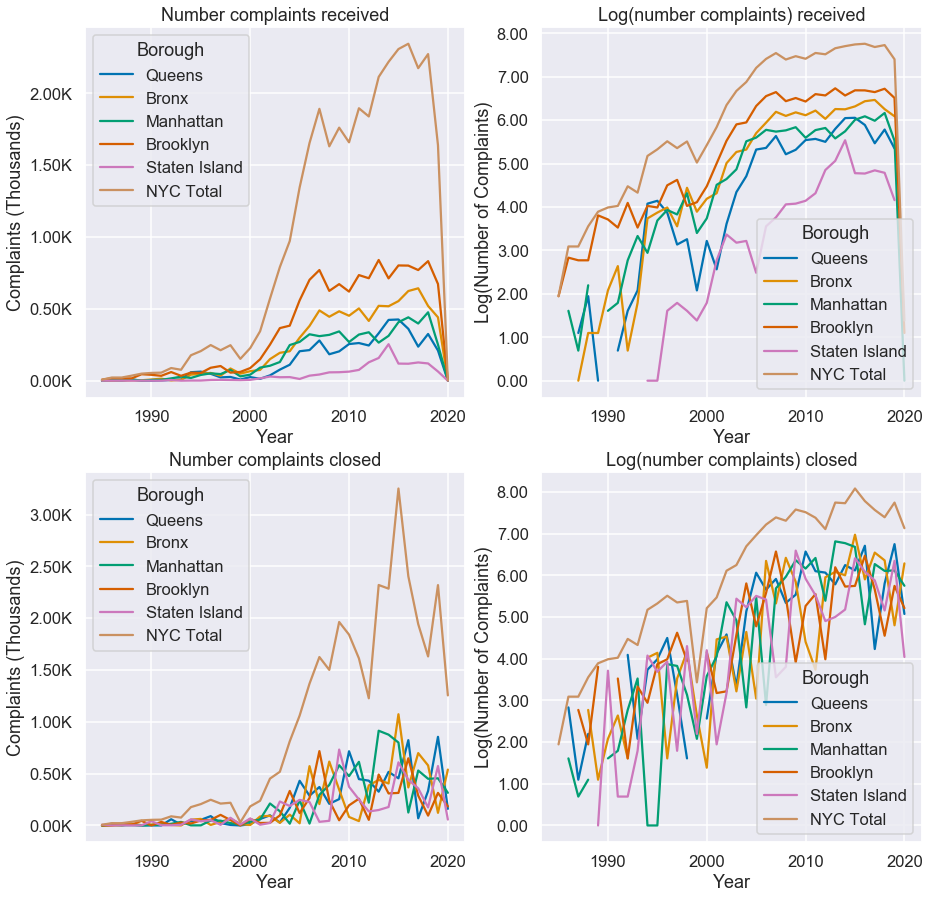
    


The number of complaints received does indeed reflect the populations of the five boroughs. Brooklyn receives the most complaints and is the most populous borough, whereas Staten Island receives the least complaints and is the least populous borough. Usually log plots help elucidate the difference between data by showing orders of magnitude, but there is a lot of overlap in the data.

The number of complaints closed does not seem to follow an appreciable pattern. We might have expected a similar curve to the complaints received, but it appears that complaints received in the boroughs almost get completed at random regardless of which borough you come from.

### Relative number of complaints
<a id = "comp_boro_person_rel"></a>

Let's look at how the boroughs compare with percentages of complaints.


```python
# repeat every row 5 times
newdf = pd.DataFrame(np.repeat(df_allComplaints.values, 5, axis=0))
# set columns
newdf.columns = df_allComplaints.columns
# set types of columns
newdf = newdf.astype({"Year": int, "Num Complaints Received": int, "Num Complaints Closed": int})
# sort by year
newdf = newdf.sort_values(by=["Year"])
# reset index
newdf = newdf.reset_index(drop=True)
newdf.dtypes
```


    Year                        int64
    Borough                    object
    Num Complaints Received     int64
    Num Complaints Closed       int64
    dtype: object


```python
# empty dataframe with column names
df_percents = pd.DataFrame(columns = ["Num Complaints Received", "Num Complaints Closed"])
# calculate % complaints for each year
for y in range(len(yearTot_list)):
    df_temp = (df_CombineComplaints.loc[df_CombineComplaints['Year'] == yearTot_list[y], ["Num Complaints Received", "Num Complaints Closed"]]/newdf.loc[newdf['Year'] == yearTot_list[y], ["Num Complaints Received", "Num Complaints Closed"]])*100
    df_percents = pd.concat([df_percents, df_temp])
# add year and borough data
    df_percents["Year"] = df_CombineComplaints['Year']
df_percents["Borough"] = df_CombineComplaints['Borough']
# rename columns
df_percents = df_percents.rename(columns={"Num Complaints Received": "% Received", "Num Complaints Closed": "% Closed"})
df_percents
```


<div>
<style scoped>
    .dataframe tbody tr th:only-of-type {
        vertical-align: middle;
    }

    .dataframe tbody tr th {
        vertical-align: top;
    }

    .dataframe thead th {
        text-align: right;
    }
</style>
<table border="1" class="dataframe">
  <thead>
    <tr style="text-align: right;">
      <th></th>
      <th>% Received</th>
      <th>% Closed</th>
      <th>Year</th>
      <th>Borough</th>
    </tr>
  </thead>
  <tbody>
    <tr>
      <th>170</th>
      <td>41.061623</td>
      <td>13.540319</td>
      <td>2019</td>
      <td>Brooklyn</td>
    </tr>
    <tr>
      <th>171</th>
      <td>12.812691</td>
      <td>36.869340</td>
      <td>2019</td>
      <td>Queens</td>
    </tr>
    <tr>
      <th>172</th>
      <td>15.314216</td>
      <td>19.620526</td>
      <td>2019</td>
      <td>Manhattan</td>
    </tr>
    <tr>
      <th>173</th>
      <td>3.904820</td>
      <td>24.708926</td>
      <td>2019</td>
      <td>Staten Island</td>
    </tr>
    <tr>
      <th>174</th>
      <td>26.906650</td>
      <td>5.260888</td>
      <td>2019</td>
      <td>Bronx</td>
    </tr>
    <tr>
      <th>...</th>
      <td>...</td>
      <td>...</td>
      <td>...</td>
      <td>...</td>
    </tr>
    <tr>
      <th>175</th>
      <td>0.000000</td>
      <td>12.749004</td>
      <td>2020</td>
      <td>Queens</td>
    </tr>
    <tr>
      <th>176</th>
      <td>25.000000</td>
      <td>25.099602</td>
      <td>2020</td>
      <td>Manhattan</td>
    </tr>
    <tr>
      <th>177</th>
      <td>0.000000</td>
      <td>4.541833</td>
      <td>2020</td>
      <td>Staten Island</td>
    </tr>
    <tr>
      <th>178</th>
      <td>75.000000</td>
      <td>14.661355</td>
      <td>2020</td>
      <td>Brooklyn</td>
    </tr>
    <tr>
      <th>179</th>
      <td>0.000000</td>
      <td>42.948207</td>
      <td>2020</td>
      <td>Bronx</td>
    </tr>
  </tbody>
</table>
<p>180 rows × 4 columns</p>
</div>


```python
fig, ((ax00, ax01),(ax10, ax11)) = plt.subplots(2, 2, sharey = False, figsize = (20, 15))

plot_nycpop_share = make_linplot(df_nycpop_copy2, "Year", "Boro share of NYC total", "Borough", ax00, 1, "%", 
                           "Borough share of NYC total Population from 1980-2020", 
                               "Year", "Population (% of NYC Total)")

plot_per_rec = make_linplot(df_percents, "Year", "% Received", "Borough", ax01, 1, "%", 
                           "% of total complaints received", "Year", "Complaints (%)")

plot_per_clo = make_linplot(df_percents, "Year", "% Closed", "Borough", ax11, 1, "%", 
                           "% of total complaints closed", "Year", "Complaints (%)")

plt.show()
```


    
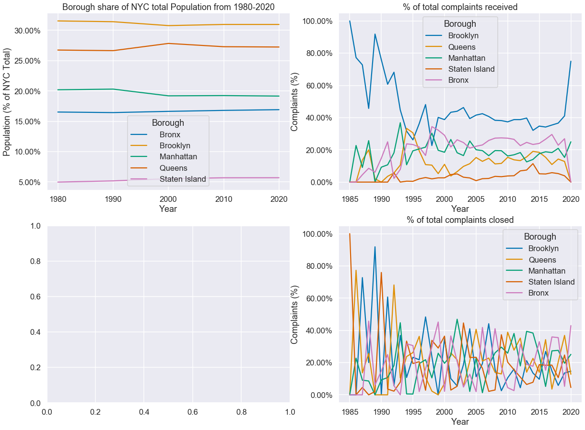
    


As we saw before the borough you come from has no effect on when the complaint is closed, it's basically a toss-up for when the complaint will be closed. As for the complaints received, we see something quite interesting. From earlier we know that Brooklyn \~30% of the NYC population, and yet they easily for almost every year we have data have over \~40% of the complaints received. We also know that proportionally Brooklyn has one of the largest black communities, right after the Bronx. We expect Queens to have \~27% of the complaints received but instead it falls below \~20% to sometimes even as low as \~10%.  The Bronx has \~15% of the population and yet \~30% of the complaints, and is the borough with the largest black population. We see that Staten Island does have both the smallest population and the smallest number of complaints, and Manhattan also has \~20% of the population and \~20% of the complaints. It seems, however, that the more diverse the borough the more complaints received against the police, and in numbers that cannot be explained by just the total population growth of said borough. 

# Officers with most complaints
<a id = "top_offend"></a>

Let's look to see which officers have the most complaints.


```python
officer_most_complaints = df_allegations.unique_mos_id.mode()
officer_most_complaints
```


    0    18731
    1    25861
    dtype: int64


```python
df_officer1 = df_allegations[df_allegations["unique_mos_id"] == officer_most_complaints[0]]
df_officer1.head()
```


<div>
<style scoped>
    .dataframe tbody tr th:only-of-type {
        vertical-align: middle;
    }

    .dataframe tbody tr th {
        vertical-align: top;
    }

    .dataframe thead th {
        text-align: right;
    }
</style>
<table border="1" class="dataframe">
  <thead>
    <tr style="text-align: right;">
      <th></th>
      <th>unique_mos_id</th>
      <th>first_name</th>
      <th>last_name</th>
      <th>full_name</th>
      <th>command_now</th>
      <th>shield_no</th>
      <th>complaint_id</th>
      <th>month_received</th>
      <th>year_received</th>
      <th>date_received</th>
      <th>...</th>
      <th>complainant_ethnicity</th>
      <th>complainant_gender</th>
      <th>complainant_age_incident</th>
      <th>fado_type</th>
      <th>allegation</th>
      <th>precinct</th>
      <th>contact_reason</th>
      <th>outcome_description</th>
      <th>board_disposition</th>
      <th>borough</th>
    </tr>
  </thead>
  <tbody>
    <tr>
      <th>7846</th>
      <td>18731</td>
      <td>Daniel</td>
      <td>Sbarra</td>
      <td>Daniel Sbarra</td>
      <td>DB CEIS</td>
      <td>0</td>
      <td>6832</td>
      <td>9</td>
      <td>2003</td>
      <td>2003-9</td>
      <td>...</td>
      <td>Hispanic</td>
      <td>Male</td>
      <td>39.0</td>
      <td>Discourtesy</td>
      <td>Word</td>
      <td>83.0</td>
      <td>Other</td>
      <td>No arrest made or summons issued</td>
      <td>Unsubstantiated</td>
      <td>Brooklyn</td>
    </tr>
    <tr>
      <th>7847</th>
      <td>18731</td>
      <td>Daniel</td>
      <td>Sbarra</td>
      <td>Daniel Sbarra</td>
      <td>DB CEIS</td>
      <td>0</td>
      <td>6832</td>
      <td>9</td>
      <td>2003</td>
      <td>2003-9</td>
      <td>...</td>
      <td>Hispanic</td>
      <td>Male</td>
      <td>39.0</td>
      <td>Force</td>
      <td>Physical force</td>
      <td>83.0</td>
      <td>Other</td>
      <td>No arrest made or summons issued</td>
      <td>Exonerated</td>
      <td>Brooklyn</td>
    </tr>
    <tr>
      <th>7848</th>
      <td>18731</td>
      <td>Daniel</td>
      <td>Sbarra</td>
      <td>Daniel Sbarra</td>
      <td>DB CEIS</td>
      <td>0</td>
      <td>7174</td>
      <td>1</td>
      <td>2004</td>
      <td>2004-1</td>
      <td>...</td>
      <td>Hispanic</td>
      <td>Male</td>
      <td>30.0</td>
      <td>Force</td>
      <td>Physical force</td>
      <td>83.0</td>
      <td>EDP aided case</td>
      <td>No arrest made or summons issued</td>
      <td>Unsubstantiated</td>
      <td>Brooklyn</td>
    </tr>
    <tr>
      <th>7849</th>
      <td>18731</td>
      <td>Daniel</td>
      <td>Sbarra</td>
      <td>Daniel Sbarra</td>
      <td>DB CEIS</td>
      <td>0</td>
      <td>7174</td>
      <td>1</td>
      <td>2004</td>
      <td>2004-1</td>
      <td>...</td>
      <td>Hispanic</td>
      <td>Male</td>
      <td>30.0</td>
      <td>Abuse of Authority</td>
      <td>Other</td>
      <td>83.0</td>
      <td>EDP aided case</td>
      <td>No arrest made or summons issued</td>
      <td>Unsubstantiated</td>
      <td>Brooklyn</td>
    </tr>
    <tr>
      <th>7850</th>
      <td>18731</td>
      <td>Daniel</td>
      <td>Sbarra</td>
      <td>Daniel Sbarra</td>
      <td>DB CEIS</td>
      <td>0</td>
      <td>8351</td>
      <td>10</td>
      <td>2004</td>
      <td>2004-10</td>
      <td>...</td>
      <td>Black</td>
      <td>Male</td>
      <td>28.0</td>
      <td>Abuse of Authority</td>
      <td>Vehicle stop</td>
      <td>83.0</td>
      <td>Other</td>
      <td>No arrest made or summons issued</td>
      <td>Substantiated (Charges)</td>
      <td>Brooklyn</td>
    </tr>
  </tbody>
</table>
<p>5 rows × 31 columns</p>
</div>


```python
df_officer2 = df_allegations[df_allegations["unique_mos_id"] == officer_most_complaints[1]]
df_officer2.head()
```


<div>
<style scoped>
    .dataframe tbody tr th:only-of-type {
        vertical-align: middle;
    }

    .dataframe tbody tr th {
        vertical-align: top;
    }

    .dataframe thead th {
        text-align: right;
    }
</style>
<table border="1" class="dataframe">
  <thead>
    <tr style="text-align: right;">
      <th></th>
      <th>unique_mos_id</th>
      <th>first_name</th>
      <th>last_name</th>
      <th>full_name</th>
      <th>command_now</th>
      <th>shield_no</th>
      <th>complaint_id</th>
      <th>month_received</th>
      <th>year_received</th>
      <th>date_received</th>
      <th>...</th>
      <th>complainant_ethnicity</th>
      <th>complainant_gender</th>
      <th>complainant_age_incident</th>
      <th>fado_type</th>
      <th>allegation</th>
      <th>precinct</th>
      <th>contact_reason</th>
      <th>outcome_description</th>
      <th>board_disposition</th>
      <th>borough</th>
    </tr>
  </thead>
  <tbody>
    <tr>
      <th>19373</th>
      <td>25861</td>
      <td>Mathew</td>
      <td>Reich</td>
      <td>Mathew Reich</td>
      <td>NARCBSI</td>
      <td>122</td>
      <td>9066</td>
      <td>3</td>
      <td>2005</td>
      <td>2005-3</td>
      <td>...</td>
      <td>Hispanic</td>
      <td>Male</td>
      <td>60.0</td>
      <td>Discourtesy</td>
      <td>Word</td>
      <td>75.0</td>
      <td>PD suspected C/V of violation/crime - street</td>
      <td>Summons - disorderly conduct</td>
      <td>Exonerated</td>
      <td>Brooklyn</td>
    </tr>
    <tr>
      <th>19374</th>
      <td>25861</td>
      <td>Mathew</td>
      <td>Reich</td>
      <td>Mathew Reich</td>
      <td>NARCBSI</td>
      <td>122</td>
      <td>9066</td>
      <td>3</td>
      <td>2005</td>
      <td>2005-3</td>
      <td>...</td>
      <td>Hispanic</td>
      <td>Male</td>
      <td>60.0</td>
      <td>Abuse of Authority</td>
      <td>Question and/or stop</td>
      <td>75.0</td>
      <td>PD suspected C/V of violation/crime - street</td>
      <td>Summons - disorderly conduct</td>
      <td>Substantiated (Charges)</td>
      <td>Brooklyn</td>
    </tr>
    <tr>
      <th>19375</th>
      <td>25861</td>
      <td>Mathew</td>
      <td>Reich</td>
      <td>Mathew Reich</td>
      <td>NARCBSI</td>
      <td>122</td>
      <td>9066</td>
      <td>3</td>
      <td>2005</td>
      <td>2005-3</td>
      <td>...</td>
      <td>Hispanic</td>
      <td>Male</td>
      <td>60.0</td>
      <td>Abuse of Authority</td>
      <td>Refusal to provide name/shield number</td>
      <td>75.0</td>
      <td>PD suspected C/V of violation/crime - street</td>
      <td>Summons - disorderly conduct</td>
      <td>Substantiated (Charges)</td>
      <td>Brooklyn</td>
    </tr>
    <tr>
      <th>19376</th>
      <td>25861</td>
      <td>Mathew</td>
      <td>Reich</td>
      <td>Mathew Reich</td>
      <td>NARCBSI</td>
      <td>122</td>
      <td>9335</td>
      <td>5</td>
      <td>2005</td>
      <td>2005-5</td>
      <td>...</td>
      <td>Unknown</td>
      <td>Male</td>
      <td>15.0</td>
      <td>Force</td>
      <td>Physical force</td>
      <td>75.0</td>
      <td>Report of other crime</td>
      <td>Arrest - other violation/crime</td>
      <td>Unsubstantiated</td>
      <td>Brooklyn</td>
    </tr>
    <tr>
      <th>19377</th>
      <td>25861</td>
      <td>Mathew</td>
      <td>Reich</td>
      <td>Mathew Reich</td>
      <td>NARCBSI</td>
      <td>122</td>
      <td>13162</td>
      <td>3</td>
      <td>2007</td>
      <td>2007-3</td>
      <td>...</td>
      <td>Black</td>
      <td>Male</td>
      <td>31.0</td>
      <td>Abuse of Authority</td>
      <td>Search (of person)</td>
      <td>67.0</td>
      <td>PD suspected C/V of violation/crime - auto</td>
      <td>No arrest made or summons issued</td>
      <td>Unsubstantiated</td>
      <td>Brooklyn</td>
    </tr>
  </tbody>
</table>
<p>5 rows × 31 columns</p>
</div>


```python
print("There are two officers tied for most complaints.")
print("The first is", df_officer1["full_name"].unique()[0], "with", len(df_officer1), "complaints.")
print("The second is", df_officer2["full_name"].unique()[0], "with", len(df_officer2), "complaints.")
```

    There are two officers tied for most complaints.
    The first is Daniel Sbarra with 75 complaints.
    The second is Mathew Reich with 75 complaints.


## First Officer
<a id = "offend1"></a>


```python
# plot side by side
fig, ((ax00,ax01),(ax10,ax11)) = plt.subplots(2, 2, sharey = False, figsize=(15, 15))

sns.set()
sns.set_context("talk", font_scale = 1) 

hist1 = make_histplotLegend(df_officer1, "year_received", "probability", "complainant_ethnicity", 50, ax00, 
                                 "Racial breakdown of complainants", 
                                 "Year")

hist2 = make_histplotLegend(df_officer1, "year_received", "probability", "board_disposition", 50, ax01, 
                                 "Board disposition of complaints", 
                                 "Year")


hist3 = make_histplotLegend(df_officer1, "year_received", "probability", "rank_incident", 50, ax10, 
                                 "Rank of officer at time of incident", 
                                 "Year")

hist4 = make_histplotLegend(df_officer1, "year_received", "probability", "fado_type", 50, ax11, 
                                 "FADO category of complaints", 
                                 "Year")

plt.show()
```


    
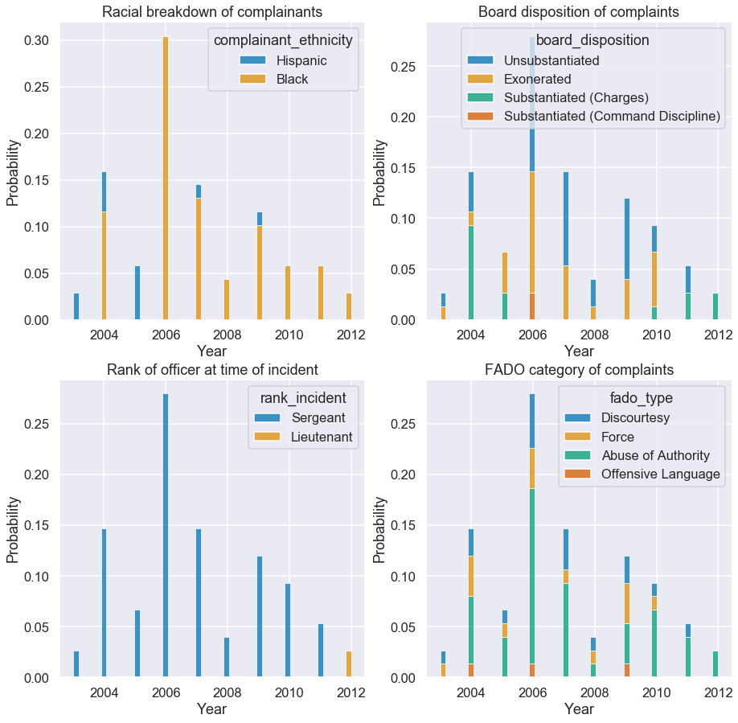
    


All of the complaints against Sbarra have been from either black individuals or hispanic individuals. It should be noted that he does work in Brooklyn. There are several board dispositions associated with the complaints. The decisions are as follows:
1. Substantiated: 
    1. The alleged conduct occurred and it violated the rules. The NYPD can choose to ignore those recommendations. It has discretion over what, if any, discipline is imposed.
1. Exonerated: 
    1. The alleged conduct occurred but did not violate the NYPD’s rules, which often give officers significant discretion over use of force.
1. Unsubstantiated:
    1. The CCRB has fully investigated but could not affirmatively conclude both that the conduct occurred and that it broke the rules.

It seems that the majority of the complaints against Sbarra were either found to be Unsubstantiated or Exonerated. There *were* several that were substantiated and resulted in command discipline, and a good majority of Sbarra's complaints were for abuse of authority. 

## Second Officer
<a id = "offend2"></a>


```python
# plot side by side
fig, ((ax00,ax01),(ax10,ax11)) = plt.subplots(2, 2, sharey = False, figsize=(15, 15))

sns.set()
sns.set_context("talk", font_scale = 1) 

hist1 = make_histplotLegend(df_officer2, "year_received", "probability", "complainant_ethnicity", 50, ax00, 
                                 "Racial breakdown of complainants", 
                                 "Year")

hist2 = make_histplotLegend(df_officer2, "year_received", "probability", "board_disposition", 50, ax01, 
                                 "Board disposition of complaints", 
                                 "Year")


hist3 = make_histplotLegend(df_officer2, "year_received", "probability", "rank_incident", 50, ax10, 
                                 "Rank of officer at time of incident", 
                                 "Year")

hist4 = make_histplotLegend(df_officer2, "year_received", "probability", "fado_type", 50, ax11, 
                                 "FADO category of complaints", 
                                 "Year")

plt.show()
```


    
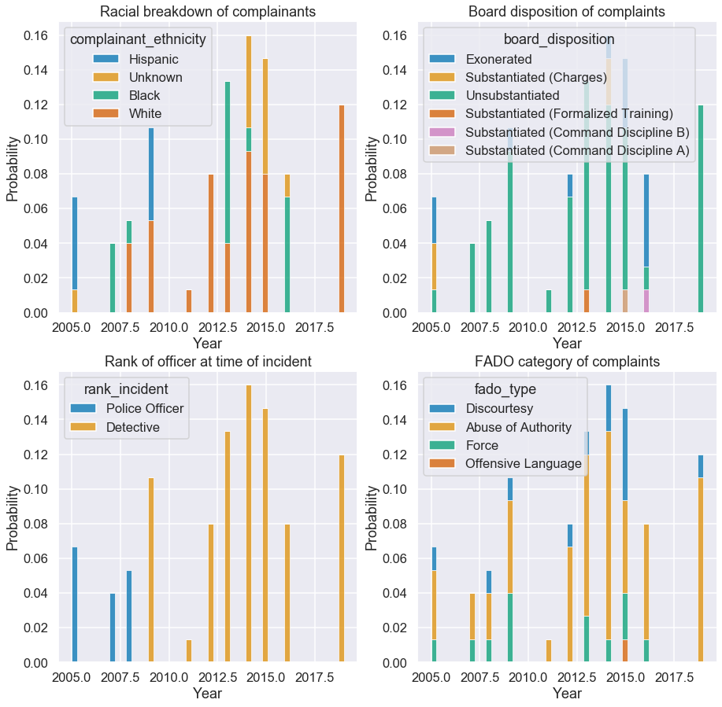
    


Reich has a much different history than Sbarra. Reich works in the Narcotics Borough of Staten Island and the majority of individuals filing incidents against Reich are white. The majority of the complaints against Reich were found to be unsubstantiated. Reich could be potentially dealing with a lot of individuals involved with narcotics in Staten Island, and that might explain the fact that white people are mostly filing incidents with him. 

## Officers with top 1% of complaints
<a id = "top10"></a>

It is possible that there is a trend of who files complaints against the cops that have tho most complaints. We will sort them by how many complaints each officer has, and take the top 1% of those. 


```python
import collections
# create list of officer IDs
IDs_list = list(df_allegations["unique_mos_id"])
# remove NANs from list
IDs_list = [x for x in IDs_list if str(x) != "nan"]
# frequency of elements in list
counter = collections.Counter(IDs_list)
# convert counter to df
df_counterIDs = pd.DataFrame.from_dict(counter, orient='index', columns=["Frequency"]).reset_index()
# rename index
df_counterIDs = df_counterIDs.rename(columns = {'index': 'Officer ID'})
# sort by frequency 
df_counterIDs = df_counterIDs.sort_values(by = ['Frequency'], ascending=False)
# show dataframe
df_counterIDs
```


<div>
<style scoped>
    .dataframe tbody tr th:only-of-type {
        vertical-align: middle;
    }

    .dataframe tbody tr th {
        vertical-align: top;
    }

    .dataframe thead th {
        text-align: right;
    }
</style>
<table border="1" class="dataframe">
  <thead>
    <tr style="text-align: right;">
      <th></th>
      <th>Officer ID</th>
      <th>Frequency</th>
    </tr>
  </thead>
  <tbody>
    <tr>
      <th>947</th>
      <td>18731</td>
      <td>75</td>
    </tr>
    <tr>
      <th>2168</th>
      <td>25861</td>
      <td>75</td>
    </tr>
    <tr>
      <th>1091</th>
      <td>19489</td>
      <td>73</td>
    </tr>
    <tr>
      <th>884</th>
      <td>18530</td>
      <td>73</td>
    </tr>
    <tr>
      <th>897</th>
      <td>18589</td>
      <td>72</td>
    </tr>
    <tr>
      <th>...</th>
      <td>...</td>
      <td>...</td>
    </tr>
    <tr>
      <th>682</th>
      <td>16694</td>
      <td>1</td>
    </tr>
    <tr>
      <th>675</th>
      <td>16633</td>
      <td>1</td>
    </tr>
    <tr>
      <th>673</th>
      <td>16604</td>
      <td>1</td>
    </tr>
    <tr>
      <th>3204</th>
      <td>3933</td>
      <td>1</td>
    </tr>
    <tr>
      <th>0</th>
      <td>10004</td>
      <td>1</td>
    </tr>
  </tbody>
</table>
<p>3994 rows × 2 columns</p>
</div>


Okay, we've got each officer's ID and the frequency of complaints against them. Let's look at the "top" officers, the ones that the most complaints. Because we're looking at the "top 5%" this will be most frequent 200 officers.


```python
# get only top 200 officers
df_counterID_top5 = df_counterIDs[:200]
# create list of their IDs
top200_ID = (df_counterID_top5["Officer ID"])
# use list of IDs to create new df of their results
df_top200 = df_allegations.loc[df_allegations['unique_mos_id'].isin(top200_ID)]
# show df
df_top200.head()
```


<div>
<style scoped>
    .dataframe tbody tr th:only-of-type {
        vertical-align: middle;
    }

    .dataframe tbody tr th {
        vertical-align: top;
    }

    .dataframe thead th {
        text-align: right;
    }
</style>
<table border="1" class="dataframe">
  <thead>
    <tr style="text-align: right;">
      <th></th>
      <th>unique_mos_id</th>
      <th>first_name</th>
      <th>last_name</th>
      <th>full_name</th>
      <th>command_now</th>
      <th>shield_no</th>
      <th>complaint_id</th>
      <th>month_received</th>
      <th>year_received</th>
      <th>date_received</th>
      <th>...</th>
      <th>complainant_ethnicity</th>
      <th>complainant_gender</th>
      <th>complainant_age_incident</th>
      <th>fado_type</th>
      <th>allegation</th>
      <th>precinct</th>
      <th>contact_reason</th>
      <th>outcome_description</th>
      <th>board_disposition</th>
      <th>borough</th>
    </tr>
  </thead>
  <tbody>
    <tr>
      <th>12</th>
      <td>10026</td>
      <td>Brian</td>
      <td>Alexander</td>
      <td>Brian Alexander</td>
      <td>079 DET</td>
      <td>3185</td>
      <td>35092</td>
      <td>5</td>
      <td>2016</td>
      <td>2016-5</td>
      <td>...</td>
      <td>Black</td>
      <td>Male</td>
      <td>30.0</td>
      <td>Abuse of Authority</td>
      <td>Search (of person)</td>
      <td>79.0</td>
      <td>Moving violation</td>
      <td>No arrest made or summons issued</td>
      <td>Unsubstantiated</td>
      <td>Brooklyn</td>
    </tr>
    <tr>
      <th>13</th>
      <td>10026</td>
      <td>Brian</td>
      <td>Alexander</td>
      <td>Brian Alexander</td>
      <td>079 DET</td>
      <td>3185</td>
      <td>26353</td>
      <td>8</td>
      <td>2012</td>
      <td>2012-8</td>
      <td>...</td>
      <td>Black</td>
      <td>Male</td>
      <td>35.0</td>
      <td>Force</td>
      <td>Pepper spray</td>
      <td>79.0</td>
      <td>PD suspected C/V of violation/crime - street</td>
      <td>Arrest - OGA</td>
      <td>Unsubstantiated</td>
      <td>Brooklyn</td>
    </tr>
    <tr>
      <th>14</th>
      <td>10026</td>
      <td>Brian</td>
      <td>Alexander</td>
      <td>Brian Alexander</td>
      <td>079 DET</td>
      <td>3185</td>
      <td>27482</td>
      <td>3</td>
      <td>2013</td>
      <td>2013-3</td>
      <td>...</td>
      <td>Black</td>
      <td>Female</td>
      <td>42.0</td>
      <td>Force</td>
      <td>Physical force</td>
      <td>79.0</td>
      <td>Regulatory inspection</td>
      <td>Arrest - other violation/crime</td>
      <td>Exonerated</td>
      <td>Brooklyn</td>
    </tr>
    <tr>
      <th>15</th>
      <td>10026</td>
      <td>Brian</td>
      <td>Alexander</td>
      <td>Brian Alexander</td>
      <td>079 DET</td>
      <td>3185</td>
      <td>27482</td>
      <td>3</td>
      <td>2013</td>
      <td>2013-3</td>
      <td>...</td>
      <td>Black</td>
      <td>Female</td>
      <td>42.0</td>
      <td>Offensive Language</td>
      <td>Race</td>
      <td>79.0</td>
      <td>Regulatory inspection</td>
      <td>Arrest - other violation/crime</td>
      <td>Unsubstantiated</td>
      <td>Brooklyn</td>
    </tr>
    <tr>
      <th>16</th>
      <td>10026</td>
      <td>Brian</td>
      <td>Alexander</td>
      <td>Brian Alexander</td>
      <td>079 DET</td>
      <td>3185</td>
      <td>27482</td>
      <td>3</td>
      <td>2013</td>
      <td>2013-3</td>
      <td>...</td>
      <td>Black</td>
      <td>Male</td>
      <td>46.0</td>
      <td>Force</td>
      <td>Handcuffs too tight</td>
      <td>79.0</td>
      <td>Regulatory inspection</td>
      <td>Arrest - other violation/crime</td>
      <td>Unsubstantiated</td>
      <td>Brooklyn</td>
    </tr>
  </tbody>
</table>
<p>5 rows × 31 columns</p>
</div>


Okay, let's give these results a look.


```python
# plot side by side
fig, ((ax00,ax01),(ax10,ax11)) = plt.subplots(2, 2, sharey = False, figsize=(15, 15))

sns.set()
sns.set_context("talk", font_scale = 1) 

hist11 = make_histplotLegend(df_top200, "unique_mos_id", "probability", "complainant_ethnicity", 100, ax00, 
                                 "Racial breakdown of complainants", 
                                 "Officer ID")

hist21 = make_histplotLegend(df_top200, "unique_mos_id", "probability", "mos_ethnicity", 100, ax01, 
                                 "Racial breakdown of officers", 
                                 "Officer ID")


hist31 = make_histplotLegend(df_top200, "precinct", "probability", "complainant_ethnicity", 100, ax10, 
                                 "Racial breakdown of complainants", 
                                 "Precinct Number")

hist41 = make_histplotLegend(df_top200, "precinct", "probability", "mos_ethnicity", 100, ax11, 
                                 "Racial breakdown of officers", 
                                 "Precinct Number")

plt.show()
```


    
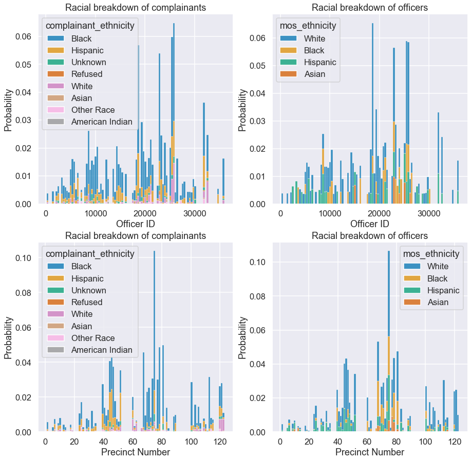
    


As we can see most of the complaints come from black individuals, followed by hispanic individuals. This is true across all the boroughs, when we consider the top 200 officers with the most complaints. This is true even in boroughs that have proportionally higher white populations, such as Manhattan or Staten Island. On the other hand, the majority of these cops are white. 

# Conclusion
<a id = "conclu"></a>

If there were no bias in targeting individuals of color we would expect the proportion of complaints to reflect the racial compositions of each borough. We would expect more black individuals to file complaints in the Bronx and Brooklyn simply because their populations are larger there, and that more white individuals would file in whiter boroughs such as Manhattan and Queens. We would also expect more Asian individuals to file complaints in Queens, which has such a large Asian community where compared proportionally to the other boroughs. However, this does not appear to be the case. Across the board we have seen that boroughs with more black individuals file more incidents against the NYPD than other boroughs, in percentages far greater than the borough's share of NYC's total population. In order to file an incident and complaint this means that you have had an encounter with the NYPD that was enough to make you file, meaning that in all boroughs, from what has been reported, black individuals have had more encounters with the NYPD than can be explained simply by increasing population values.
