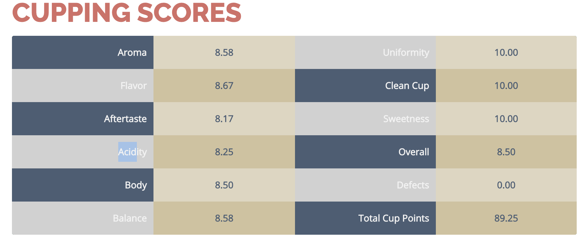
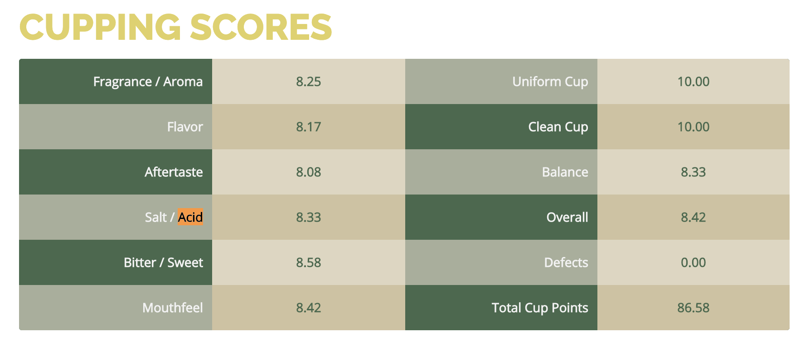

## Part 1: Importing the data and preprocessing


```python
# arabica dataset
df_arabica = pd.read_csv(r"./data/arabica_data_cleaned.csv")
df_arabica = df_arabica.drop(columns=["Unnamed: 0"])
df_arabica.head()
```


<div>
<style scoped>
    .dataframe tbody tr th:only-of-type {
        vertical-align: middle;
    }

    .dataframe tbody tr th {
        vertical-align: top;
    }

    .dataframe thead th {
        text-align: right;
    }
</style>
<table border="1" class="dataframe">
  <thead>
    <tr style="text-align: right;">
      <th></th>
      <th>Species</th>
      <th>Owner</th>
      <th>Country.of.Origin</th>
      <th>Farm.Name</th>
      <th>Lot.Number</th>
      <th>Mill</th>
      <th>ICO.Number</th>
      <th>Company</th>
      <th>Altitude</th>
      <th>Region</th>
      <th>...</th>
      <th>Color</th>
      <th>Category.Two.Defects</th>
      <th>Expiration</th>
      <th>Certification.Body</th>
      <th>Certification.Address</th>
      <th>Certification.Contact</th>
      <th>unit_of_measurement</th>
      <th>altitude_low_meters</th>
      <th>altitude_high_meters</th>
      <th>altitude_mean_meters</th>
    </tr>
  </thead>
  <tbody>
    <tr>
      <th>0</th>
      <td>Arabica</td>
      <td>metad plc</td>
      <td>Ethiopia</td>
      <td>metad plc</td>
      <td>NaN</td>
      <td>metad plc</td>
      <td>2014/2015</td>
      <td>metad agricultural developmet plc</td>
      <td>1950-2200</td>
      <td>guji-hambela</td>
      <td>...</td>
      <td>Green</td>
      <td>0</td>
      <td>April 3rd, 2016</td>
      <td>METAD Agricultural Development plc</td>
      <td>309fcf77415a3661ae83e027f7e5f05dad786e44</td>
      <td>19fef5a731de2db57d16da10287413f5f99bc2dd</td>
      <td>m</td>
      <td>1950.0</td>
      <td>2200.0</td>
      <td>2075.0</td>
    </tr>
    <tr>
      <th>1</th>
      <td>Arabica</td>
      <td>metad plc</td>
      <td>Ethiopia</td>
      <td>metad plc</td>
      <td>NaN</td>
      <td>metad plc</td>
      <td>2014/2015</td>
      <td>metad agricultural developmet plc</td>
      <td>1950-2200</td>
      <td>guji-hambela</td>
      <td>...</td>
      <td>Green</td>
      <td>1</td>
      <td>April 3rd, 2016</td>
      <td>METAD Agricultural Development plc</td>
      <td>309fcf77415a3661ae83e027f7e5f05dad786e44</td>
      <td>19fef5a731de2db57d16da10287413f5f99bc2dd</td>
      <td>m</td>
      <td>1950.0</td>
      <td>2200.0</td>
      <td>2075.0</td>
    </tr>
    <tr>
      <th>2</th>
      <td>Arabica</td>
      <td>grounds for health admin</td>
      <td>Guatemala</td>
      <td>san marcos barrancas "san cristobal cuch</td>
      <td>NaN</td>
      <td>NaN</td>
      <td>NaN</td>
      <td>NaN</td>
      <td>1600 - 1800 m</td>
      <td>NaN</td>
      <td>...</td>
      <td>NaN</td>
      <td>0</td>
      <td>May 31st, 2011</td>
      <td>Specialty Coffee Association</td>
      <td>36d0d00a3724338ba7937c52a378d085f2172daa</td>
      <td>0878a7d4b9d35ddbf0fe2ce69a2062cceb45a660</td>
      <td>m</td>
      <td>1600.0</td>
      <td>1800.0</td>
      <td>1700.0</td>
    </tr>
    <tr>
      <th>3</th>
      <td>Arabica</td>
      <td>yidnekachew dabessa</td>
      <td>Ethiopia</td>
      <td>yidnekachew dabessa coffee plantation</td>
      <td>NaN</td>
      <td>wolensu</td>
      <td>NaN</td>
      <td>yidnekachew debessa coffee plantation</td>
      <td>1800-2200</td>
      <td>oromia</td>
      <td>...</td>
      <td>Green</td>
      <td>2</td>
      <td>March 25th, 2016</td>
      <td>METAD Agricultural Development plc</td>
      <td>309fcf77415a3661ae83e027f7e5f05dad786e44</td>
      <td>19fef5a731de2db57d16da10287413f5f99bc2dd</td>
      <td>m</td>
      <td>1800.0</td>
      <td>2200.0</td>
      <td>2000.0</td>
    </tr>
    <tr>
      <th>4</th>
      <td>Arabica</td>
      <td>metad plc</td>
      <td>Ethiopia</td>
      <td>metad plc</td>
      <td>NaN</td>
      <td>metad plc</td>
      <td>2014/2015</td>
      <td>metad agricultural developmet plc</td>
      <td>1950-2200</td>
      <td>guji-hambela</td>
      <td>...</td>
      <td>Green</td>
      <td>2</td>
      <td>April 3rd, 2016</td>
      <td>METAD Agricultural Development plc</td>
      <td>309fcf77415a3661ae83e027f7e5f05dad786e44</td>
      <td>19fef5a731de2db57d16da10287413f5f99bc2dd</td>
      <td>m</td>
      <td>1950.0</td>
      <td>2200.0</td>
      <td>2075.0</td>
    </tr>
  </tbody>
</table>
<p>5 rows × 43 columns</p>
</div>


```python
# robusta dataset
df_robusta = pd.read_csv(r"./data/robusta_data_cleaned.csv")
df_robusta = df_robusta.drop(columns=["Unnamed: 0"])
df_robusta.head()
```


<div>
<style scoped>
    .dataframe tbody tr th:only-of-type {
        vertical-align: middle;
    }

    .dataframe tbody tr th {
        vertical-align: top;
    }

    .dataframe thead th {
        text-align: right;
    }
</style>
<table border="1" class="dataframe">
  <thead>
    <tr style="text-align: right;">
      <th></th>
      <th>Species</th>
      <th>Owner</th>
      <th>Country.of.Origin</th>
      <th>Farm.Name</th>
      <th>Lot.Number</th>
      <th>Mill</th>
      <th>ICO.Number</th>
      <th>Company</th>
      <th>Altitude</th>
      <th>Region</th>
      <th>...</th>
      <th>Color</th>
      <th>Category.Two.Defects</th>
      <th>Expiration</th>
      <th>Certification.Body</th>
      <th>Certification.Address</th>
      <th>Certification.Contact</th>
      <th>unit_of_measurement</th>
      <th>altitude_low_meters</th>
      <th>altitude_high_meters</th>
      <th>altitude_mean_meters</th>
    </tr>
  </thead>
  <tbody>
    <tr>
      <th>0</th>
      <td>Robusta</td>
      <td>ankole coffee producers coop</td>
      <td>Uganda</td>
      <td>kyangundu cooperative society</td>
      <td>NaN</td>
      <td>ankole coffee producers</td>
      <td>0</td>
      <td>ankole coffee producers coop</td>
      <td>1488</td>
      <td>sheema south western</td>
      <td>...</td>
      <td>Green</td>
      <td>2</td>
      <td>June 26th, 2015</td>
      <td>Uganda Coffee Development Authority</td>
      <td>e36d0270932c3b657e96b7b0278dfd85dc0fe743</td>
      <td>03077a1c6bac60e6f514691634a7f6eb5c85aae8</td>
      <td>m</td>
      <td>1488.0</td>
      <td>1488.0</td>
      <td>1488.0</td>
    </tr>
    <tr>
      <th>1</th>
      <td>Robusta</td>
      <td>nishant gurjer</td>
      <td>India</td>
      <td>sethuraman estate kaapi royale</td>
      <td>25</td>
      <td>sethuraman estate</td>
      <td>14/1148/2017/21</td>
      <td>kaapi royale</td>
      <td>3170</td>
      <td>chikmagalur karnataka indua</td>
      <td>...</td>
      <td>NaN</td>
      <td>2</td>
      <td>October 31st, 2018</td>
      <td>Specialty Coffee Association</td>
      <td>ff7c18ad303d4b603ac3f8cff7e611ffc735e720</td>
      <td>352d0cf7f3e9be14dad7df644ad65efc27605ae2</td>
      <td>m</td>
      <td>3170.0</td>
      <td>3170.0</td>
      <td>3170.0</td>
    </tr>
    <tr>
      <th>2</th>
      <td>Robusta</td>
      <td>andrew hetzel</td>
      <td>India</td>
      <td>sethuraman estate</td>
      <td>NaN</td>
      <td>NaN</td>
      <td>0000</td>
      <td>sethuraman estate</td>
      <td>1000m</td>
      <td>chikmagalur</td>
      <td>...</td>
      <td>Green</td>
      <td>0</td>
      <td>April 29th, 2016</td>
      <td>Specialty Coffee Association</td>
      <td>ff7c18ad303d4b603ac3f8cff7e611ffc735e720</td>
      <td>352d0cf7f3e9be14dad7df644ad65efc27605ae2</td>
      <td>m</td>
      <td>1000.0</td>
      <td>1000.0</td>
      <td>1000.0</td>
    </tr>
    <tr>
      <th>3</th>
      <td>Robusta</td>
      <td>ugacof</td>
      <td>Uganda</td>
      <td>ugacof project area</td>
      <td>NaN</td>
      <td>ugacof</td>
      <td>0</td>
      <td>ugacof ltd</td>
      <td>1212</td>
      <td>central</td>
      <td>...</td>
      <td>Green</td>
      <td>7</td>
      <td>July 14th, 2015</td>
      <td>Uganda Coffee Development Authority</td>
      <td>e36d0270932c3b657e96b7b0278dfd85dc0fe743</td>
      <td>03077a1c6bac60e6f514691634a7f6eb5c85aae8</td>
      <td>m</td>
      <td>1212.0</td>
      <td>1212.0</td>
      <td>1212.0</td>
    </tr>
    <tr>
      <th>4</th>
      <td>Robusta</td>
      <td>katuka development trust ltd</td>
      <td>Uganda</td>
      <td>katikamu capca farmers association</td>
      <td>NaN</td>
      <td>katuka development trust</td>
      <td>0</td>
      <td>katuka development trust ltd</td>
      <td>1200-1300</td>
      <td>luwero central region</td>
      <td>...</td>
      <td>Green</td>
      <td>3</td>
      <td>June 26th, 2015</td>
      <td>Uganda Coffee Development Authority</td>
      <td>e36d0270932c3b657e96b7b0278dfd85dc0fe743</td>
      <td>03077a1c6bac60e6f514691634a7f6eb5c85aae8</td>
      <td>m</td>
      <td>1200.0</td>
      <td>1300.0</td>
      <td>1250.0</td>
    </tr>
  </tbody>
</table>
<p>5 rows × 43 columns</p>
</div>


Both datasets have a final score as `Total Cup Points`. I can create a new column for a categorical feature that will grade the coffee based of the A-F scale. This scale will simply be the following:
- A+: 97-100
- A: 93-96
- A-: 90-92
- B+: 87-89
- B: 83-86
- B-: 80-82
- C+: 77-79
- C: 73-76
- C-: 70-72
- D+: 67-69
- D: 63-66
- D-: 60-62
- F: 0-59

We can then use this new categorical feature as our target, where a grade A coffee is the most desirable, and a grade F coffee is the least desirable. This column will be called `Total Cup Grade`.


```python
# a function to create a list of conditions for our grading scale
# takes an input dataframe and a variable name
def grading_conditions(df_in, column_name):
    conditions = [
    (df_in[column_name] <= 59), # grade F
    (df_in[column_name] > 59) & (df_in[column_name] <= 62), # grade D-
    (df_in[column_name] > 62) & (df_in[column_name] <= 66), # grade D
    (df_in[column_name] > 66) & (df_in[column_name] <= 69), # grade D+
    (df_in[column_name] > 69) & (df_in[column_name] <= 72), # grade C-
    (df_in[column_name] > 72) & (df_in[column_name] <= 76), # grade C
    (df_in[column_name] > 76) & (df_in[column_name] <= 79), # grade C+
    (df_in[column_name] > 79) & (df_in[column_name] <= 82), # grade B-
    (df_in[column_name] > 82) & (df_in[column_name] <= 86), # grade B
    (df_in[column_name] > 86) & (df_in[column_name] <= 89), # grade B+
    (df_in[column_name] > 89) & (df_in[column_name] <= 92), # grade A-
    (df_in[column_name] > 92) & (df_in[column_name] <= 96), # grade A
    (df_in[column_name] > 96) # grade A+
    ]
    return conditions
```


```python
# set the conditions for both arabica and robusta datasets
cond_arabica = grading_conditions(df_arabica, "Total.Cup.Points")
cond_robusta = grading_conditions(df_robusta, "Total.Cup.Points")
```


```python
# create a list with the grades we will assign to each condition
grades = ["F", "D-", "D", "D+", "C-", "C", "C+", "B-", "B", "B+", "A-", "A", "A+"]

# create a new column and use np.select to assign values to it using our lists as arguments
df_arabica['Total.Cup.Grade'] = np.select(cond_arabica, grades)
df_robusta['Total.Cup.Grade'] = np.select(cond_robusta, grades)
```


```python
df_robusta['Total.Cup.Grade'].head()
```


    0    B
    1    B
    2    B
    3    B
    4    B
    Name: Total.Cup.Grade, dtype: object


Let's look to see if we can combine these two dataframes. To do so I will check the variables.


```python
# list of column names in arabica
vars_arabica = list(df_arabica.columns)

# list of column names in robusta
vars_robusta = list(df_robusta.columns)

# get a list of only the unique variables between the two datasets
unique_vars = list( (set(vars_arabica) | set(vars_robusta)) - (set(vars_arabica) & set(vars_robusta)) )

print("The unique variables are ", unique_vars)
```

    The unique variables are  ['Bitter...Sweet', 'Mouthfeel', 'Acidity', 'Salt...Acid', 'Sweetness', 'Fragrance...Aroma', 'Uniform.Cup', 'Body', 'Uniformity', 'Aroma']


Unfortunately it seems we have a few different variables. If we look at the cupping scores from CQI we see the following:

<div class="row">
  <div class="column">
    
  </div>
  <div class="column">
    
  </div>
</div>

For Arabica, on the left we have Aroma, Flavor, Aftertaste, Acidity, Body, Balance. On the right we have Uniformity, Clean Cup, Sweetness, Overall, Defects, Total Cup Points.
For Robusta, on the left we have Fragrance / Aroma, Flavor, Aftertaste, Salt / Acid, Bitter / Sweet, Mouthfeel. On the right we have Uniform Cup, Clean Cup, Balance, Overall, Defects, Total Cup Points.

This explains the difference between the variables in the two datasets. Because arabica has more data I will change the name of the robusta variables to match the arabica data.


```python
df_robusta.rename(columns={"Balance": "Sweetness", 'Mouthfeel': "Balance", 'Bitter...Sweet': "Body", "Fragrance...Aroma": "Aroma", 'Salt...Acid': "Acidity", "Uniform.Cup":'Uniformity'}, inplace=True)

# list of column names in arabica
vars_arabica = list(df_arabica.columns)

# list of column names in robusta
vars_robusta = list(df_robusta.columns)

# get a list of only the unique variables between the two datasets
unique_vars = list( (set(vars_arabica) | set(vars_robusta)) - (set(vars_arabica) & set(vars_robusta)) )

print("The unique variables are ", unique_vars)
```

    The unique variables are  []


Now I want to drop the irrelevant data columns. Those would be 'Number.of.Bags', 'Bag.Weight', 'Expiration', 'Certification.Body', 'Certification.Address', 'Certification.Contact', 'unit_of_measurement'. The altitude has the unit of measurement in the title (meters), and we do not need the certification of the reviewer nor the expiration date of the coffee. The Bag Weight and Number of Bags might be important to buyers but not to us.


```python
df_arabica = df_arabica.drop(['Number.of.Bags', 'Bag.Weight', 'Expiration', 'Certification.Body', 'Certification.Address', 'Certification.Contact', 'unit_of_measurement'], axis=1)
df_robusta = df_robusta.drop(['Expiration', 'Certification.Body', 'Certification.Address', 'Certification.Contact', 'unit_of_measurement'], axis=1)
df_robusta.head()
```


<div>
<style scoped>
    .dataframe tbody tr th:only-of-type {
        vertical-align: middle;
    }

    .dataframe tbody tr th {
        vertical-align: top;
    }

    .dataframe thead th {
        text-align: right;
    }
</style>
<table border="1" class="dataframe">
  <thead>
    <tr style="text-align: right;">
      <th></th>
      <th>Species</th>
      <th>Owner</th>
      <th>Country.of.Origin</th>
      <th>Farm.Name</th>
      <th>Lot.Number</th>
      <th>Mill</th>
      <th>ICO.Number</th>
      <th>Company</th>
      <th>Altitude</th>
      <th>Region</th>
      <th>...</th>
      <th>Total.Cup.Points</th>
      <th>Moisture</th>
      <th>Category.One.Defects</th>
      <th>Quakers</th>
      <th>Color</th>
      <th>Category.Two.Defects</th>
      <th>altitude_low_meters</th>
      <th>altitude_high_meters</th>
      <th>altitude_mean_meters</th>
      <th>Total.Cup.Grade</th>
    </tr>
  </thead>
  <tbody>
    <tr>
      <th>0</th>
      <td>Robusta</td>
      <td>ankole coffee producers coop</td>
      <td>Uganda</td>
      <td>kyangundu cooperative society</td>
      <td>NaN</td>
      <td>ankole coffee producers</td>
      <td>0</td>
      <td>ankole coffee producers coop</td>
      <td>1488</td>
      <td>sheema south western</td>
      <td>...</td>
      <td>83.75</td>
      <td>0.12</td>
      <td>0</td>
      <td>0</td>
      <td>Green</td>
      <td>2</td>
      <td>1488.0</td>
      <td>1488.0</td>
      <td>1488.0</td>
      <td>B</td>
    </tr>
    <tr>
      <th>1</th>
      <td>Robusta</td>
      <td>nishant gurjer</td>
      <td>India</td>
      <td>sethuraman estate kaapi royale</td>
      <td>25</td>
      <td>sethuraman estate</td>
      <td>14/1148/2017/21</td>
      <td>kaapi royale</td>
      <td>3170</td>
      <td>chikmagalur karnataka indua</td>
      <td>...</td>
      <td>83.50</td>
      <td>0.00</td>
      <td>0</td>
      <td>0</td>
      <td>NaN</td>
      <td>2</td>
      <td>3170.0</td>
      <td>3170.0</td>
      <td>3170.0</td>
      <td>B</td>
    </tr>
    <tr>
      <th>2</th>
      <td>Robusta</td>
      <td>andrew hetzel</td>
      <td>India</td>
      <td>sethuraman estate</td>
      <td>NaN</td>
      <td>NaN</td>
      <td>0000</td>
      <td>sethuraman estate</td>
      <td>1000m</td>
      <td>chikmagalur</td>
      <td>...</td>
      <td>83.25</td>
      <td>0.00</td>
      <td>0</td>
      <td>0</td>
      <td>Green</td>
      <td>0</td>
      <td>1000.0</td>
      <td>1000.0</td>
      <td>1000.0</td>
      <td>B</td>
    </tr>
    <tr>
      <th>3</th>
      <td>Robusta</td>
      <td>ugacof</td>
      <td>Uganda</td>
      <td>ugacof project area</td>
      <td>NaN</td>
      <td>ugacof</td>
      <td>0</td>
      <td>ugacof ltd</td>
      <td>1212</td>
      <td>central</td>
      <td>...</td>
      <td>83.00</td>
      <td>0.12</td>
      <td>0</td>
      <td>0</td>
      <td>Green</td>
      <td>7</td>
      <td>1212.0</td>
      <td>1212.0</td>
      <td>1212.0</td>
      <td>B</td>
    </tr>
    <tr>
      <th>4</th>
      <td>Robusta</td>
      <td>katuka development trust ltd</td>
      <td>Uganda</td>
      <td>katikamu capca farmers association</td>
      <td>NaN</td>
      <td>katuka development trust</td>
      <td>0</td>
      <td>katuka development trust ltd</td>
      <td>1200-1300</td>
      <td>luwero central region</td>
      <td>...</td>
      <td>83.00</td>
      <td>0.12</td>
      <td>0</td>
      <td>0</td>
      <td>Green</td>
      <td>3</td>
      <td>1200.0</td>
      <td>1300.0</td>
      <td>1250.0</td>
      <td>B</td>
    </tr>
  </tbody>
</table>
<p>5 rows × 39 columns</p>
</div>


Let's check for duplicates.


```python
# Total number of rows and columns
df_arabica.shape
```


    (1311, 37)


```python
# Total number of rows and columns
df_robusta.shape
```


    (28, 39)


```python
# Rows containing duplicate data
duplicate_rows_df = df_arabica[df_arabica.duplicated()]
print("number of arabica duplicate rows: ", duplicate_rows_df.shape)

# Rows containing duplicate data
duplicate_rows_df = df_robusta[df_robusta.duplicated()]
print("number of robusta duplicate rows: ", duplicate_rows_df.shape)
```

    number of arabica duplicate rows:  (0, 37)
    number of robusta duplicate rows:  (0, 39)


There are no duplicates that we have to worry about!

Okay, now we have fixed the issue in variables. We can combine the two datasets.


```python
df_combined = pd.concat([df_arabica, df_robusta], axis=0, join='inner')
df_combined.head()
```


<div>
<style scoped>
    .dataframe tbody tr th:only-of-type {
        vertical-align: middle;
    }

    .dataframe tbody tr th {
        vertical-align: top;
    }

    .dataframe thead th {
        text-align: right;
    }
</style>
<table border="1" class="dataframe">
  <thead>
    <tr style="text-align: right;">
      <th></th>
      <th>Species</th>
      <th>Owner</th>
      <th>Country.of.Origin</th>
      <th>Farm.Name</th>
      <th>Lot.Number</th>
      <th>Mill</th>
      <th>ICO.Number</th>
      <th>Company</th>
      <th>Altitude</th>
      <th>Region</th>
      <th>...</th>
      <th>Total.Cup.Points</th>
      <th>Moisture</th>
      <th>Category.One.Defects</th>
      <th>Quakers</th>
      <th>Color</th>
      <th>Category.Two.Defects</th>
      <th>altitude_low_meters</th>
      <th>altitude_high_meters</th>
      <th>altitude_mean_meters</th>
      <th>Total.Cup.Grade</th>
    </tr>
  </thead>
  <tbody>
    <tr>
      <th>0</th>
      <td>Arabica</td>
      <td>metad plc</td>
      <td>Ethiopia</td>
      <td>metad plc</td>
      <td>NaN</td>
      <td>metad plc</td>
      <td>2014/2015</td>
      <td>metad agricultural developmet plc</td>
      <td>1950-2200</td>
      <td>guji-hambela</td>
      <td>...</td>
      <td>90.58</td>
      <td>0.12</td>
      <td>0</td>
      <td>0.0</td>
      <td>Green</td>
      <td>0</td>
      <td>1950.0</td>
      <td>2200.0</td>
      <td>2075.0</td>
      <td>A-</td>
    </tr>
    <tr>
      <th>1</th>
      <td>Arabica</td>
      <td>metad plc</td>
      <td>Ethiopia</td>
      <td>metad plc</td>
      <td>NaN</td>
      <td>metad plc</td>
      <td>2014/2015</td>
      <td>metad agricultural developmet plc</td>
      <td>1950-2200</td>
      <td>guji-hambela</td>
      <td>...</td>
      <td>89.92</td>
      <td>0.12</td>
      <td>0</td>
      <td>0.0</td>
      <td>Green</td>
      <td>1</td>
      <td>1950.0</td>
      <td>2200.0</td>
      <td>2075.0</td>
      <td>A-</td>
    </tr>
    <tr>
      <th>2</th>
      <td>Arabica</td>
      <td>grounds for health admin</td>
      <td>Guatemala</td>
      <td>san marcos barrancas "san cristobal cuch</td>
      <td>NaN</td>
      <td>NaN</td>
      <td>NaN</td>
      <td>NaN</td>
      <td>1600 - 1800 m</td>
      <td>NaN</td>
      <td>...</td>
      <td>89.75</td>
      <td>0.00</td>
      <td>0</td>
      <td>0.0</td>
      <td>NaN</td>
      <td>0</td>
      <td>1600.0</td>
      <td>1800.0</td>
      <td>1700.0</td>
      <td>A-</td>
    </tr>
    <tr>
      <th>3</th>
      <td>Arabica</td>
      <td>yidnekachew dabessa</td>
      <td>Ethiopia</td>
      <td>yidnekachew dabessa coffee plantation</td>
      <td>NaN</td>
      <td>wolensu</td>
      <td>NaN</td>
      <td>yidnekachew debessa coffee plantation</td>
      <td>1800-2200</td>
      <td>oromia</td>
      <td>...</td>
      <td>89.00</td>
      <td>0.11</td>
      <td>0</td>
      <td>0.0</td>
      <td>Green</td>
      <td>2</td>
      <td>1800.0</td>
      <td>2200.0</td>
      <td>2000.0</td>
      <td>B+</td>
    </tr>
    <tr>
      <th>4</th>
      <td>Arabica</td>
      <td>metad plc</td>
      <td>Ethiopia</td>
      <td>metad plc</td>
      <td>NaN</td>
      <td>metad plc</td>
      <td>2014/2015</td>
      <td>metad agricultural developmet plc</td>
      <td>1950-2200</td>
      <td>guji-hambela</td>
      <td>...</td>
      <td>88.83</td>
      <td>0.12</td>
      <td>0</td>
      <td>0.0</td>
      <td>Green</td>
      <td>2</td>
      <td>1950.0</td>
      <td>2200.0</td>
      <td>2075.0</td>
      <td>B+</td>
    </tr>
  </tbody>
</table>
<p>5 rows × 37 columns</p>
</div>


Let us check null values.


```python
# Finding the null values.
print(df_combined.isnull().sum())
```

    Species                    0
    Owner                      7
    Country.of.Origin          1
    Farm.Name                359
    Lot.Number              1063
    Mill                     318
    ICO.Number               157
    Company                  209
    Altitude                 226
    Region                    59
    Producer                 232
    In.Country.Partner         0
    Harvest.Year              47
    Grading.Date               0
    Owner.1                    7
    Variety                  226
    Processing.Method        170
    Aroma                      0
    Flavor                     0
    Aftertaste                 0
    Acidity                    0
    Body                       0
    Balance                    0
    Uniformity                 0
    Clean.Cup                  0
    Sweetness                  0
    Cupper.Points              0
    Total.Cup.Points           0
    Moisture                   0
    Category.One.Defects       0
    Quakers                    1
    Color                    218
    Category.Two.Defects       0
    altitude_low_meters      230
    altitude_high_meters     230
    altitude_mean_meters     230
    Total.Cup.Grade            0
    dtype: int64


I will drop all columns with an excessive number of missing variables. For the columns with only a handful of missing variables I will remove those rows.


```python
#df_combined = df_combined.drop(['Farm.Name', "Lot.Number"], axis=1)
print("Dimensions of original data:", df_combined.shape)
df_combined_cleaned = df_combined.drop(['Farm.Name', "Lot.Number", "Mill", "ICO.Number", "Company", "Altitude", "Producer", "Variety", "Processing.Method", "Color", "altitude_low_meters", "altitude_high_meters", "altitude_mean_meters"], axis=1)
df_combined_cleaned = df_combined_cleaned.dropna(axis=0)
print("Dimensions of modified data:", df_combined_cleaned.shape)
# should no longer have any null values
print("Number of null values:", df_combined_cleaned.isnull().sum())
```

    Dimensions of original data: (1339, 37)
    Dimensions of modified data: (1243, 24)
    Number of null values: Species                 0
    Owner                   0
    Country.of.Origin       0
    Region                  0
    In.Country.Partner      0
    Harvest.Year            0
    Grading.Date            0
    Owner.1                 0
    Aroma                   0
    Flavor                  0
    Aftertaste              0
    Acidity                 0
    Body                    0
    Balance                 0
    Uniformity              0
    Clean.Cup               0
    Sweetness               0
    Cupper.Points           0
    Total.Cup.Points        0
    Moisture                0
    Category.One.Defects    0
    Quakers                 0
    Category.Two.Defects    0
    Total.Cup.Grade         0
    dtype: int64


We need to clean the datetime variables.


```python
df_combined_cleaned["HarvestYear"] = df_combined_cleaned["Harvest.Year"]
df_combined_cleaned.HarvestYear.unique()
```


    array(['2014', 'March 2010', 'Sept 2009 - April 2010', 'May-August',
           '2009/2010', '2015', '2012', '2013', '2011', '2016', '2015/2016',
           '2010', 'Fall 2009', '2017', '2009 / 2010', '2010-2011',
           '2009 - 2010', '2013/2014', '2017 / 2018', 'mmm', 'TEST',
           'December 2009-March 2010', '2014/2015', '2011/2012',
           'January 2011', '4T/10', '23 July 2010', 'January Through April',
           '1T/2011', '4t/2010', '4T/2010', 'August to December',
           'Mayo a Julio', '47/2010', 'Abril - Julio', '4t/2011', '2009-2010',
           'Abril - Julio /2011', 'Spring 2011 in Colombia.', '2016 / 2017',
           '3T/2011', '1t/2011', '2018', '4T72010', '08/09 crop', 2013, 2017,
           2015, 2012, 2014, 2016], dtype=object)


```python
df_combined_cleaned["GradingDate"] = df_combined_cleaned["Grading.Date"]
df_combined_cleaned.GradingDate.unique()[0:10]
```


    array(['April 4th, 2015', 'March 26th, 2015', 'September 2nd, 2010',
           'March 30th, 2015', 'March 27th, 2015', 'March 13th, 2015',
           'May 31st, 2010', 'August 31st, 2010', 'June 16th, 2010',
           'April 7th, 2016'], dtype=object)


I need to drop the HarvestYear variable, it's fairly useless because of how many different options there are, and no standardization. I can convert GradingDate to a date time variable, however.


```python
#rename everything with a period, inconvenient column names
df_combined_cleaned["CountryOrigin"] = df_combined_cleaned["Country.of.Origin"]
df_combined_cleaned["InCountryPartner"] = df_combined_cleaned["In.Country.Partner"]
df_combined_cleaned["Owner1"] = df_combined_cleaned["Owner.1"]
df_combined_cleaned["CleanCup"] = df_combined_cleaned["Clean.Cup"]
df_combined_cleaned["CupperPoints"] = df_combined_cleaned["Cupper.Points"]
df_combined_cleaned["TotCupPts"] = df_combined_cleaned["Total.Cup.Points"]
df_combined_cleaned["Cat1Defects"] = df_combined_cleaned["Category.One.Defects"]
df_combined_cleaned["Cat2Defects"] = df_combined_cleaned["Category.Two.Defects"]
df_combined_cleaned["TotCupGrade"] = df_combined_cleaned["Total.Cup.Grade"]
# drop harvest year
df_combined_cleaned = df_combined_cleaned.drop(["Cupper.Points", "Total.Cup.Grade", "Category.Two.Defects", "Category.One.Defects", "Total.Cup.Points", "Clean.Cup", "Owner.1", "In.Country.Partner", "HarvestYear", "Harvest.Year", "Grading.Date", "Country.of.Origin"], axis=1)
# convert grading date to datetime variable
df_combined_cleaned['GradingDate']= pd.to_datetime(df_combined_cleaned['GradingDate'])
```

I need to look at some of the categorical variables. If they have an incredible amount of diversity in responses, these categorical variables may not be useful to me further on.


```python
# dataframe of only objects
df_objects = df_combined_cleaned.select_dtypes(include='object')
df_objects.head()
```


<div>
<style scoped>
    .dataframe tbody tr th:only-of-type {
        vertical-align: middle;
    }

    .dataframe tbody tr th {
        vertical-align: top;
    }

    .dataframe thead th {
        text-align: right;
    }
</style>
<table border="1" class="dataframe">
  <thead>
    <tr style="text-align: right;">
      <th></th>
      <th>Species</th>
      <th>Owner</th>
      <th>Region</th>
      <th>CountryOrigin</th>
      <th>InCountryPartner</th>
      <th>Owner1</th>
      <th>TotCupGrade</th>
    </tr>
  </thead>
  <tbody>
    <tr>
      <th>0</th>
      <td>Arabica</td>
      <td>metad plc</td>
      <td>guji-hambela</td>
      <td>Ethiopia</td>
      <td>METAD Agricultural Development plc</td>
      <td>metad plc</td>
      <td>A-</td>
    </tr>
    <tr>
      <th>1</th>
      <td>Arabica</td>
      <td>metad plc</td>
      <td>guji-hambela</td>
      <td>Ethiopia</td>
      <td>METAD Agricultural Development plc</td>
      <td>metad plc</td>
      <td>A-</td>
    </tr>
    <tr>
      <th>3</th>
      <td>Arabica</td>
      <td>yidnekachew dabessa</td>
      <td>oromia</td>
      <td>Ethiopia</td>
      <td>METAD Agricultural Development plc</td>
      <td>Yidnekachew Dabessa</td>
      <td>B+</td>
    </tr>
    <tr>
      <th>4</th>
      <td>Arabica</td>
      <td>metad plc</td>
      <td>guji-hambela</td>
      <td>Ethiopia</td>
      <td>METAD Agricultural Development plc</td>
      <td>metad plc</td>
      <td>B+</td>
    </tr>
    <tr>
      <th>7</th>
      <td>Arabica</td>
      <td>ethiopia commodity exchange</td>
      <td>oromia</td>
      <td>Ethiopia</td>
      <td>Ethiopia Commodity Exchange</td>
      <td>Ethiopia Commodity Exchange</td>
      <td>B+</td>
    </tr>
  </tbody>
</table>
</div>


```python
df_objects.nunique()
```


    Species               2
    Owner               302
    Region              351
    CountryOrigin        35
    InCountryPartner     26
    Owner1              305
    TotCupGrade          11
    dtype: int64


`Owner`, `Owner1`, and `Region` are pretty useless to us, due to how much variation in the results there are. We can't sort through all these unique values. We need to get rid of them.


```python
df_combined_cleaned = df_combined_cleaned.drop(["Owner", "Owner1", "Region"], axis=1)
```

I would also like to standardize the country names using the ISO3 standards. I'm going to clean up the countries.


```python
def country_flag(df_combined_cleaned):
    list_name = [i.name for i in list(pycountry.countries)]
    if (df_combined_cleaned["CountryOrigin"] in list_name):
        return pycountry.countries.get(name = df_combined_cleaned["CountryOrigin"]).alpha_3
    elif (df_combined_cleaned["CountryOrigin"] == 'United States (Hawaii)'):
        return "USA"
    elif (df_combined_cleaned["CountryOrigin"] == 'United States (Puerto Rico)'):
        return "USA"
    elif (df_combined_cleaned["CountryOrigin"] == 'Tanzania, United Republic Of'):
        return "TZA"
    elif (df_combined_cleaned["CountryOrigin"] == 'Cote d?Ivoire'):
        return "CIV"
    elif (df_combined_cleaned["CountryOrigin"] == 'Taiwan'):
        return "TWN"
    elif (df_combined_cleaned["CountryOrigin"] == 'Vietnam'):
        return "VNM"
    elif (df_combined_cleaned["CountryOrigin"] == 'Laos'):
        return "LAO"
    else:
        return 'Invalid Code'

df_combined_cleaned['CountryISO3'] = df_combined_cleaned.apply(country_flag, axis = 1)
df_combined_cleaned['CountryISO3']
df_combined_cleaned.CountryISO3.unique()
```


    array(['ETH', 'USA', 'IDN', 'CHN', 'CRI', 'MEX', 'BRA', 'UGA', 'HND',
           'TWN', 'KEN', 'THA', 'COL', 'GTM', 'PAN', 'PER', 'PNG', 'SLV',
           'TZA', 'NIC', 'ECU', 'HTI', 'BDI', 'VNM', 'PHL', 'RWA', 'MWI',
           'LAO', 'ZMB', 'MMR', 'MUS', 'CIV', 'IND'], dtype=object)


```python
df_combined_cleaned = df_combined_cleaned.drop(["CountryOrigin"], axis=1)
df_combined_cleaned = df_combined_cleaned.reindex(sorted(df_combined_cleaned.columns), axis=1)
df_combined_cleaned.info()
```

    <class 'pandas.core.frame.DataFrame'>
    Int64Index: 1243 entries, 0 to 25
    Data columns (total 20 columns):
     #   Column            Non-Null Count  Dtype
    ---  ------            --------------  -----
     0   Acidity           1243 non-null   float64
     1   Aftertaste        1243 non-null   float64
     2   Aroma             1243 non-null   float64
     3   Balance           1243 non-null   float64
     4   Body              1243 non-null   float64
     5   Cat1Defects       1243 non-null   int64
     6   Cat2Defects       1243 non-null   int64
     7   CleanCup          1243 non-null   float64
     8   CountryISO3       1243 non-null   object
     9   CupperPoints      1243 non-null   float64
     10  Flavor            1243 non-null   float64
     11  GradingDate       1243 non-null   datetime64[ns]
     12  InCountryPartner  1243 non-null   object
     13  Moisture          1243 non-null   float64
     14  Quakers           1243 non-null   float64
     15  Species           1243 non-null   object
     16  Sweetness         1243 non-null   float64
     17  TotCupGrade       1243 non-null   object
     18  TotCupPts         1243 non-null   float64
     19  Uniformity        1243 non-null   float64
    dtypes: datetime64[ns](1), float64(13), int64(2), object(4)
    memory usage: 203.9+ KB


```python
df_combined_cleaned.head()
```


<div>
<style scoped>
    .dataframe tbody tr th:only-of-type {
        vertical-align: middle;
    }

    .dataframe tbody tr th {
        vertical-align: top;
    }

    .dataframe thead th {
        text-align: right;
    }
</style>
<table border="1" class="dataframe">
  <thead>
    <tr style="text-align: right;">
      <th></th>
      <th>Acidity</th>
      <th>Aftertaste</th>
      <th>Aroma</th>
      <th>Balance</th>
      <th>Body</th>
      <th>Cat1Defects</th>
      <th>Cat2Defects</th>
      <th>CleanCup</th>
      <th>CountryISO3</th>
      <th>CupperPoints</th>
      <th>Flavor</th>
      <th>GradingDate</th>
      <th>InCountryPartner</th>
      <th>Moisture</th>
      <th>Quakers</th>
      <th>Species</th>
      <th>Sweetness</th>
      <th>TotCupGrade</th>
      <th>TotCupPts</th>
      <th>Uniformity</th>
    </tr>
  </thead>
  <tbody>
    <tr>
      <th>0</th>
      <td>8.75</td>
      <td>8.67</td>
      <td>8.67</td>
      <td>8.42</td>
      <td>8.50</td>
      <td>0</td>
      <td>0</td>
      <td>10.0</td>
      <td>ETH</td>
      <td>8.75</td>
      <td>8.83</td>
      <td>2015-04-04</td>
      <td>METAD Agricultural Development plc</td>
      <td>0.12</td>
      <td>0.0</td>
      <td>Arabica</td>
      <td>10.00</td>
      <td>A-</td>
      <td>90.58</td>
      <td>10.0</td>
    </tr>
    <tr>
      <th>1</th>
      <td>8.58</td>
      <td>8.50</td>
      <td>8.75</td>
      <td>8.42</td>
      <td>8.42</td>
      <td>0</td>
      <td>1</td>
      <td>10.0</td>
      <td>ETH</td>
      <td>8.58</td>
      <td>8.67</td>
      <td>2015-04-04</td>
      <td>METAD Agricultural Development plc</td>
      <td>0.12</td>
      <td>0.0</td>
      <td>Arabica</td>
      <td>10.00</td>
      <td>A-</td>
      <td>89.92</td>
      <td>10.0</td>
    </tr>
    <tr>
      <th>3</th>
      <td>8.42</td>
      <td>8.42</td>
      <td>8.17</td>
      <td>8.25</td>
      <td>8.50</td>
      <td>0</td>
      <td>2</td>
      <td>10.0</td>
      <td>ETH</td>
      <td>8.67</td>
      <td>8.58</td>
      <td>2015-03-26</td>
      <td>METAD Agricultural Development plc</td>
      <td>0.11</td>
      <td>0.0</td>
      <td>Arabica</td>
      <td>10.00</td>
      <td>B+</td>
      <td>89.00</td>
      <td>10.0</td>
    </tr>
    <tr>
      <th>4</th>
      <td>8.50</td>
      <td>8.25</td>
      <td>8.25</td>
      <td>8.33</td>
      <td>8.42</td>
      <td>0</td>
      <td>2</td>
      <td>10.0</td>
      <td>ETH</td>
      <td>8.58</td>
      <td>8.50</td>
      <td>2015-04-04</td>
      <td>METAD Agricultural Development plc</td>
      <td>0.12</td>
      <td>0.0</td>
      <td>Arabica</td>
      <td>10.00</td>
      <td>B+</td>
      <td>88.83</td>
      <td>10.0</td>
    </tr>
    <tr>
      <th>7</th>
      <td>8.42</td>
      <td>8.50</td>
      <td>8.25</td>
      <td>8.50</td>
      <td>8.33</td>
      <td>0</td>
      <td>0</td>
      <td>10.0</td>
      <td>ETH</td>
      <td>9.00</td>
      <td>8.33</td>
      <td>2010-09-02</td>
      <td>Ethiopia Commodity Exchange</td>
      <td>0.03</td>
      <td>0.0</td>
      <td>Arabica</td>
      <td>9.33</td>
      <td>B+</td>
      <td>88.67</td>
      <td>10.0</td>
    </tr>
  </tbody>
</table>
</div>
