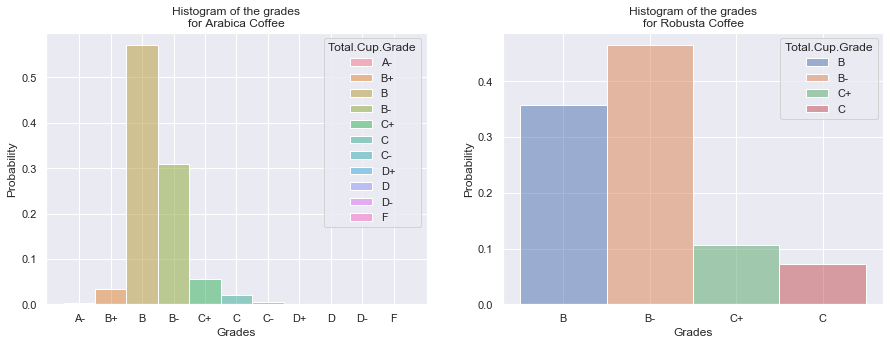
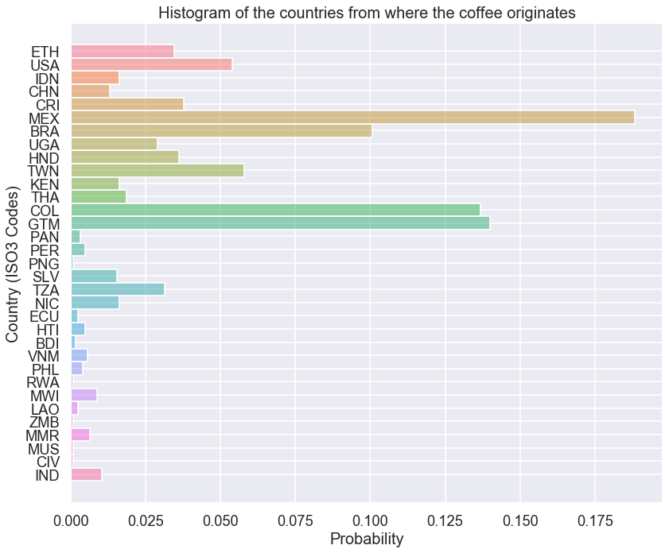
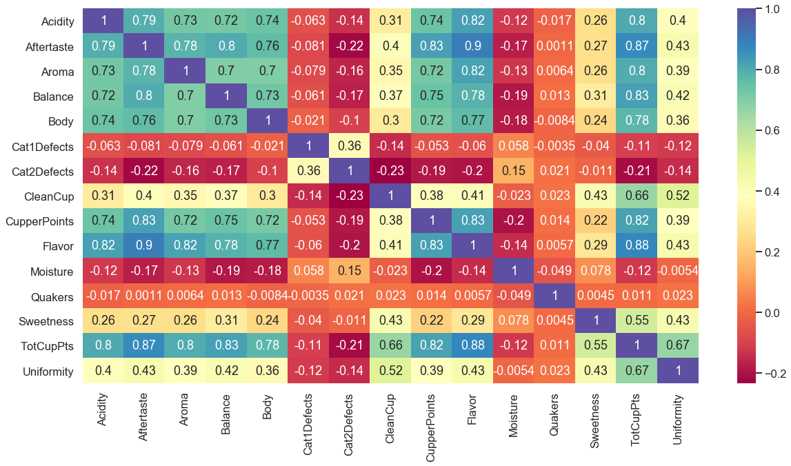

## Part 2: Exploratory Data Analysis

First let's see if the previous conditions worked by looking at the grades.


```python
# plot side by side
fig, ax = plt.subplots(1,2, sharey = False, figsize=(15,5))

# create a histogram of grades for arabica coffee
plot_arabica_grades = sns.histplot(
    data = df_arabica,
    x = "Total.Cup.Grade",
    hue = "Total.Cup.Grade",
    ax = ax[0],
    stat = "probability"
)

# create a histogram of grades for robusta coffee
plot_robusta_grades = sns.histplot(
    data = df_robusta,
    x = "Total.Cup.Grade",
    hue = "Total.Cup.Grade",
    ax = ax[1],
    stat = "probability"
)

# set plot labels
plot_arabica_grades.set(
    title = "Histogram of the grades\nfor Arabica Coffee",
    xlabel = "Grades"
)
plot_robusta_grades.set(
    title = "Histogram of the grades\nfor Robusta Coffee",
    xlabel = "Grades"
)

# show the plot
plt.show()
```





It seems that robusta coffee only got a grade of B or C, with 80% of the robusta coffe getting a B/B-. For the arabica coffee we have all possible grades A-F, but B grade (B+, B, B-) is roughly ~85% of the data. This means that most coffee is pretty good but not great, and if you want a good cup of coffee then you'll need to get an arabica coffee. Arabica coffee are the only ones to get A-/B+ grades. But we'll have to look further.

I'm going to look at the categorical variable of the country of origin.


```python
sns.set_context("talk", font_scale = 1)

figure(num=None, figsize=(12, 10), dpi=80, facecolor='w', edgecolor='k')

# create a histogram of grades for arabica coffee
plot_country = sns.histplot(
    data = df_combined_cleaned,
    y = "CountryISO3",
    hue = "CountryISO3",
    stat = "probability",
    legend = False
)

# set plot labels
plot_country.set(
    title = "Histogram of the countries from where the coffee originates",
    ylabel = "Country (ISO3 Codes)"
)

# rotate the x axis tick marks
#plot_country.axes.set_xticklabels(
#        plot_country.axes.get_xticklabels(),
#        rotation = 90
#    )

# show the plot
plt.show()
```





```python
# correlation matrix
plt.figure(figsize=(20,10))
c = df_combined_cleaned.corr()
sns.heatmap(c, cmap="Spectral", annot=True)
c
```


<div>
<style scoped>
    .dataframe tbody tr th:only-of-type {
        vertical-align: middle;
    }

    .dataframe tbody tr th {
        vertical-align: top;
    }

    .dataframe thead th {
        text-align: right;
    }
</style>
<table border="1" class="dataframe">
  <thead>
    <tr style="text-align: right;">
      <th></th>
      <th>Acidity</th>
      <th>Aftertaste</th>
      <th>Aroma</th>
      <th>Balance</th>
      <th>Body</th>
      <th>Cat1Defects</th>
      <th>Cat2Defects</th>
      <th>CleanCup</th>
      <th>CupperPoints</th>
      <th>Flavor</th>
      <th>Moisture</th>
      <th>Quakers</th>
      <th>Sweetness</th>
      <th>TotCupPts</th>
      <th>Uniformity</th>
    </tr>
  </thead>
  <tbody>
    <tr>
      <th>Acidity</th>
      <td>1.000000</td>
      <td>0.793344</td>
      <td>0.727770</td>
      <td>0.724988</td>
      <td>0.742785</td>
      <td>-0.062547</td>
      <td>-0.137391</td>
      <td>0.310594</td>
      <td>0.740274</td>
      <td>0.822946</td>
      <td>-0.122896</td>
      <td>-0.016868</td>
      <td>0.259232</td>
      <td>0.802984</td>
      <td>0.396396</td>
    </tr>
    <tr>
      <th>Aftertaste</th>
      <td>0.793344</td>
      <td>1.000000</td>
      <td>0.779840</td>
      <td>0.801405</td>
      <td>0.763181</td>
      <td>-0.081281</td>
      <td>-0.216709</td>
      <td>0.402529</td>
      <td>0.825058</td>
      <td>0.896447</td>
      <td>-0.173758</td>
      <td>0.001080</td>
      <td>0.265616</td>
      <td>0.867210</td>
      <td>0.430874</td>
    </tr>
    <tr>
      <th>Aroma</th>
      <td>0.727770</td>
      <td>0.779840</td>
      <td>1.000000</td>
      <td>0.704957</td>
      <td>0.703961</td>
      <td>-0.079338</td>
      <td>-0.158682</td>
      <td>0.349522</td>
      <td>0.723425</td>
      <td>0.818745</td>
      <td>-0.126047</td>
      <td>0.006357</td>
      <td>0.261949</td>
      <td>0.800627</td>
      <td>0.391390</td>
    </tr>
    <tr>
      <th>Balance</th>
      <td>0.724988</td>
      <td>0.801405</td>
      <td>0.704957</td>
      <td>1.000000</td>
      <td>0.734520</td>
      <td>-0.061105</td>
      <td>-0.170645</td>
      <td>0.373552</td>
      <td>0.747807</td>
      <td>0.784476</td>
      <td>-0.186317</td>
      <td>0.013447</td>
      <td>0.309706</td>
      <td>0.826063</td>
      <td>0.415083</td>
    </tr>
    <tr>
      <th>Body</th>
      <td>0.742785</td>
      <td>0.763181</td>
      <td>0.703961</td>
      <td>0.734520</td>
      <td>1.000000</td>
      <td>-0.021391</td>
      <td>-0.099822</td>
      <td>0.297834</td>
      <td>0.716201</td>
      <td>0.765929</td>
      <td>-0.178478</td>
      <td>-0.008426</td>
      <td>0.242451</td>
      <td>0.775655</td>
      <td>0.360084</td>
    </tr>
    <tr>
      <th>Cat1Defects</th>
      <td>-0.062547</td>
      <td>-0.081281</td>
      <td>-0.079338</td>
      <td>-0.061105</td>
      <td>-0.021391</td>
      <td>1.000000</td>
      <td>0.359069</td>
      <td>-0.142758</td>
      <td>-0.053130</td>
      <td>-0.059526</td>
      <td>0.057624</td>
      <td>-0.003466</td>
      <td>-0.039930</td>
      <td>-0.106256</td>
      <td>-0.117008</td>
    </tr>
    <tr>
      <th>Cat2Defects</th>
      <td>-0.137391</td>
      <td>-0.216709</td>
      <td>-0.158682</td>
      <td>-0.170645</td>
      <td>-0.099822</td>
      <td>0.359069</td>
      <td>1.000000</td>
      <td>-0.233876</td>
      <td>-0.189402</td>
      <td>-0.195007</td>
      <td>0.148900</td>
      <td>0.021026</td>
      <td>-0.010961</td>
      <td>-0.210043</td>
      <td>-0.143487</td>
    </tr>
    <tr>
      <th>CleanCup</th>
      <td>0.310594</td>
      <td>0.402529</td>
      <td>0.349522</td>
      <td>0.373552</td>
      <td>0.297834</td>
      <td>-0.142758</td>
      <td>-0.233876</td>
      <td>1.000000</td>
      <td>0.375545</td>
      <td>0.406394</td>
      <td>-0.022666</td>
      <td>0.022599</td>
      <td>0.425608</td>
      <td>0.661929</td>
      <td>0.517351</td>
    </tr>
    <tr>
      <th>CupperPoints</th>
      <td>0.740274</td>
      <td>0.825058</td>
      <td>0.723425</td>
      <td>0.747807</td>
      <td>0.716201</td>
      <td>-0.053130</td>
      <td>-0.189402</td>
      <td>0.375545</td>
      <td>1.000000</td>
      <td>0.825150</td>
      <td>-0.197484</td>
      <td>0.013542</td>
      <td>0.219767</td>
      <td>0.817928</td>
      <td>0.386805</td>
    </tr>
    <tr>
      <th>Flavor</th>
      <td>0.822946</td>
      <td>0.896447</td>
      <td>0.818745</td>
      <td>0.784476</td>
      <td>0.765929</td>
      <td>-0.059526</td>
      <td>-0.195007</td>
      <td>0.406394</td>
      <td>0.825150</td>
      <td>1.000000</td>
      <td>-0.142875</td>
      <td>0.005724</td>
      <td>0.288754</td>
      <td>0.877383</td>
      <td>0.429437</td>
    </tr>
    <tr>
      <th>Moisture</th>
      <td>-0.122896</td>
      <td>-0.173758</td>
      <td>-0.126047</td>
      <td>-0.186317</td>
      <td>-0.178478</td>
      <td>0.057624</td>
      <td>0.148900</td>
      <td>-0.022666</td>
      <td>-0.197484</td>
      <td>-0.142875</td>
      <td>1.000000</td>
      <td>-0.048538</td>
      <td>0.078123</td>
      <td>-0.120556</td>
      <td>-0.005425</td>
    </tr>
    <tr>
      <th>Quakers</th>
      <td>-0.016868</td>
      <td>0.001080</td>
      <td>0.006357</td>
      <td>0.013447</td>
      <td>-0.008426</td>
      <td>-0.003466</td>
      <td>0.021026</td>
      <td>0.022599</td>
      <td>0.013542</td>
      <td>0.005724</td>
      <td>-0.048538</td>
      <td>1.000000</td>
      <td>0.004533</td>
      <td>0.011390</td>
      <td>0.022671</td>
    </tr>
    <tr>
      <th>Sweetness</th>
      <td>0.259232</td>
      <td>0.265616</td>
      <td>0.261949</td>
      <td>0.309706</td>
      <td>0.242451</td>
      <td>-0.039930</td>
      <td>-0.010961</td>
      <td>0.425608</td>
      <td>0.219767</td>
      <td>0.288754</td>
      <td>0.078123</td>
      <td>0.004533</td>
      <td>1.000000</td>
      <td>0.546976</td>
      <td>0.428832</td>
    </tr>
    <tr>
      <th>TotCupPts</th>
      <td>0.802984</td>
      <td>0.867210</td>
      <td>0.800627</td>
      <td>0.826063</td>
      <td>0.775655</td>
      <td>-0.106256</td>
      <td>-0.210043</td>
      <td>0.661929</td>
      <td>0.817928</td>
      <td>0.877383</td>
      <td>-0.120556</td>
      <td>0.011390</td>
      <td>0.546976</td>
      <td>1.000000</td>
      <td>0.665193</td>
    </tr>
    <tr>
      <th>Uniformity</th>
      <td>0.396396</td>
      <td>0.430874</td>
      <td>0.391390</td>
      <td>0.415083</td>
      <td>0.360084</td>
      <td>-0.117008</td>
      <td>-0.143487</td>
      <td>0.517351</td>
      <td>0.386805</td>
      <td>0.429437</td>
      <td>-0.005425</td>
      <td>0.022671</td>
      <td>0.428832</td>
      <td>0.665193</td>
      <td>1.000000</td>
    </tr>
  </tbody>
</table>
</div>





We can see that the values for `Quakers` and `altitude` are not overly much correlated with any other variables. These will most likely not help with our model. It seems that the highly correlated values are all the variables for the taste aspects of the coffee.


```python
df_combined_cleaned.describe()
```


<div>
<style scoped>
    .dataframe tbody tr th:only-of-type {
        vertical-align: middle;
    }

    .dataframe tbody tr th {
        vertical-align: top;
    }

    .dataframe thead th {
        text-align: right;
    }
</style>
<table border="1" class="dataframe">
  <thead>
    <tr style="text-align: right;">
      <th></th>
      <th>Acidity</th>
      <th>Aftertaste</th>
      <th>Aroma</th>
      <th>Balance</th>
      <th>Body</th>
      <th>Cat1Defects</th>
      <th>Cat2Defects</th>
      <th>CleanCup</th>
      <th>CupperPoints</th>
      <th>Flavor</th>
      <th>Moisture</th>
      <th>Quakers</th>
      <th>Sweetness</th>
      <th>TotCupPts</th>
      <th>Uniformity</th>
    </tr>
  </thead>
  <tbody>
    <tr>
      <th>count</th>
      <td>1243.000000</td>
      <td>1243.000000</td>
      <td>1243.000000</td>
      <td>1243.000000</td>
      <td>1243.000000</td>
      <td>1243.000000</td>
      <td>1243.000000</td>
      <td>1243.000000</td>
      <td>1243.000000</td>
      <td>1243.000000</td>
      <td>1243.000000</td>
      <td>1243.000000</td>
      <td>1243.000000</td>
      <td>1243.000000</td>
      <td>1243.000000</td>
    </tr>
    <tr>
      <th>mean</th>
      <td>7.535382</td>
      <td>7.396516</td>
      <td>7.565953</td>
      <td>7.513073</td>
      <td>7.517289</td>
      <td>0.409493</td>
      <td>3.616251</td>
      <td>9.836331</td>
      <td>7.492285</td>
      <td>7.518608</td>
      <td>0.089759</td>
      <td>0.169751</td>
      <td>9.856710</td>
      <td>82.070024</td>
      <td>9.837691</td>
    </tr>
    <tr>
      <th>std</th>
      <td>0.382273</td>
      <td>0.406371</td>
      <td>0.380819</td>
      <td>0.421253</td>
      <td>0.361576</td>
      <td>1.822778</td>
      <td>5.394722</td>
      <td>0.778128</td>
      <td>0.463193</td>
      <td>0.402209</td>
      <td>0.046934</td>
      <td>0.816093</td>
      <td>0.632045</td>
      <td>3.557775</td>
      <td>0.559074</td>
    </tr>
    <tr>
      <th>min</th>
      <td>0.000000</td>
      <td>0.000000</td>
      <td>0.000000</td>
      <td>0.000000</td>
      <td>0.000000</td>
      <td>0.000000</td>
      <td>0.000000</td>
      <td>0.000000</td>
      <td>0.000000</td>
      <td>0.000000</td>
      <td>0.000000</td>
      <td>0.000000</td>
      <td>0.000000</td>
      <td>0.000000</td>
      <td>0.000000</td>
    </tr>
    <tr>
      <th>25%</th>
      <td>7.330000</td>
      <td>7.250000</td>
      <td>7.420000</td>
      <td>7.330000</td>
      <td>7.330000</td>
      <td>0.000000</td>
      <td>0.000000</td>
      <td>10.000000</td>
      <td>7.250000</td>
      <td>7.330000</td>
      <td>0.095000</td>
      <td>0.000000</td>
      <td>10.000000</td>
      <td>81.080000</td>
      <td>10.000000</td>
    </tr>
    <tr>
      <th>50%</th>
      <td>7.580000</td>
      <td>7.420000</td>
      <td>7.580000</td>
      <td>7.500000</td>
      <td>7.500000</td>
      <td>0.000000</td>
      <td>2.000000</td>
      <td>10.000000</td>
      <td>7.500000</td>
      <td>7.580000</td>
      <td>0.110000</td>
      <td>0.000000</td>
      <td>10.000000</td>
      <td>82.500000</td>
      <td>10.000000</td>
    </tr>
    <tr>
      <th>75%</th>
      <td>7.750000</td>
      <td>7.580000</td>
      <td>7.750000</td>
      <td>7.750000</td>
      <td>7.670000</td>
      <td>0.000000</td>
      <td>4.000000</td>
      <td>10.000000</td>
      <td>7.750000</td>
      <td>7.750000</td>
      <td>0.120000</td>
      <td>0.000000</td>
      <td>10.000000</td>
      <td>83.670000</td>
      <td>10.000000</td>
    </tr>
    <tr>
      <th>max</th>
      <td>8.750000</td>
      <td>8.670000</td>
      <td>8.750000</td>
      <td>8.750000</td>
      <td>8.580000</td>
      <td>31.000000</td>
      <td>55.000000</td>
      <td>10.000000</td>
      <td>10.000000</td>
      <td>8.830000</td>
      <td>0.200000</td>
      <td>11.000000</td>
      <td>10.000000</td>
      <td>90.580000</td>
      <td>10.000000</td>
    </tr>
  </tbody>
</table>
</div>


This was a little check to see what the data looks like. We see the mean and standard deviation for each category, as well as the first, second, and third quartile.
